# Week 1 - Utilize Data

This week we'll learn the basics of creating a project in *Android Studio* and
how to write code and display output in an Android application. We'll also
begin to use GitHub to store our work.

## Corresponding Text

*Learn Java for Android Development*, pp. 1-11, 37-70

## Android Studio

Android Studio is an integrated development environment (IDE) used to develop
Android applications.  Android Studio is based on IntelliJ IDEA, a popular
Java integrated development environment (IDE), Most of Android Studio's
features are available as an IntelliJ IDEA plugin.

### Download and Installation

Android Studio can be downloaded from https://developer.android.com/studio. The
Android Studio download page will provide installation instructions, which vary
depending on the operating system of the computer.

### Initial Configuration

After installing Android Studio, there is some initial configuration that must
be done before we can begin writing Android applications.

When you start Android Studio for the first time, you will be presented with
the *Android Studio Setup Wizard*

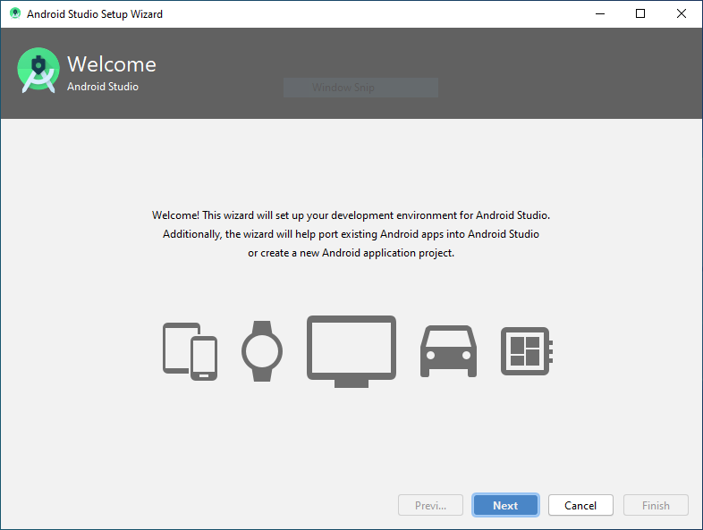

Click **Next** to begin the setup process.

Next, we're asked to choose the installation type.

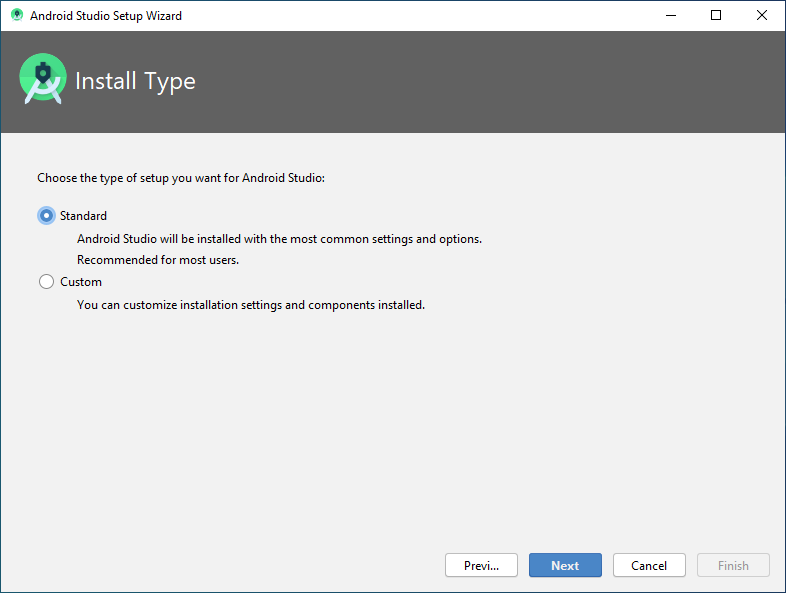

We'll use the standard settings. With **Standard** selected, click **Next**.

Android Studio has includes a light and dark theme.

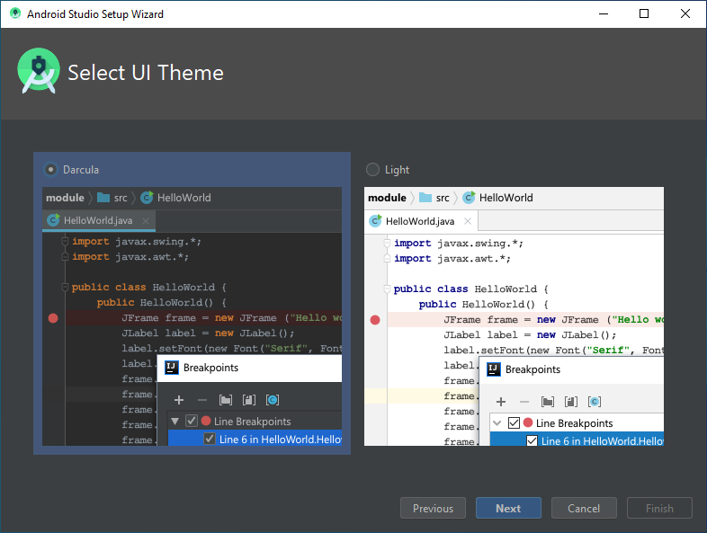

Select the theme you prefer and click **Next**.

As a final step, verify Android Studio's Settings.

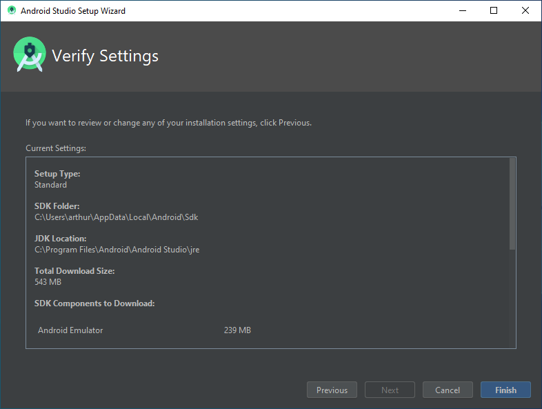

Click **Finish** to confirm settings and begin downloading and installing the
required components including the Android software development kit (SDK).  When
installation is complete, click **Finish** again.

### Creating an Android App


The first step in creating a new Android app is to select
**Start a new Android Studio Project** from the Android Studio welcome screen.

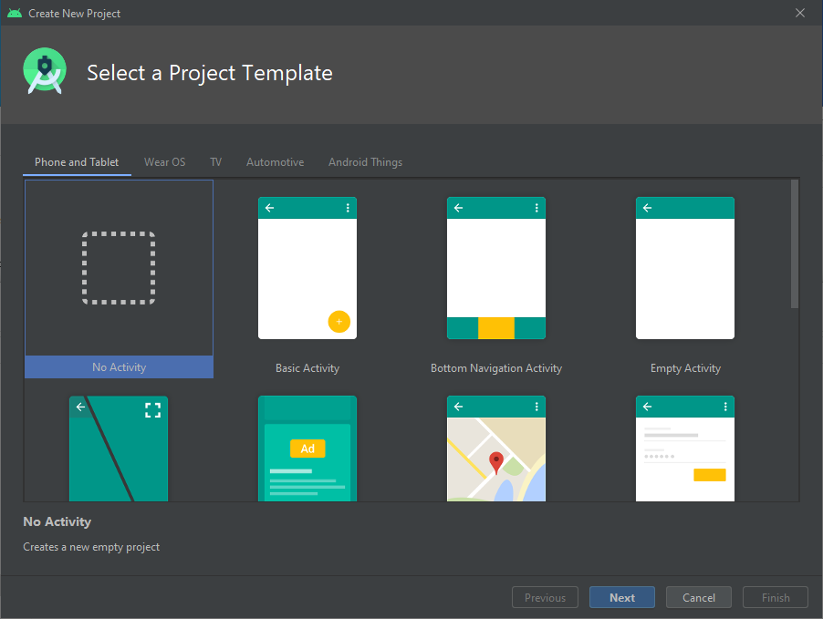

This course will introduce important concepts of Java programming that are
relevant to Android development. While we will work with graphical user
interface (GUI) elements to help us explore Java, we won't explore the
interface too much in this course.  For our first project, we'll start a
simple template. Select **Empty Activity** and click **Next**.

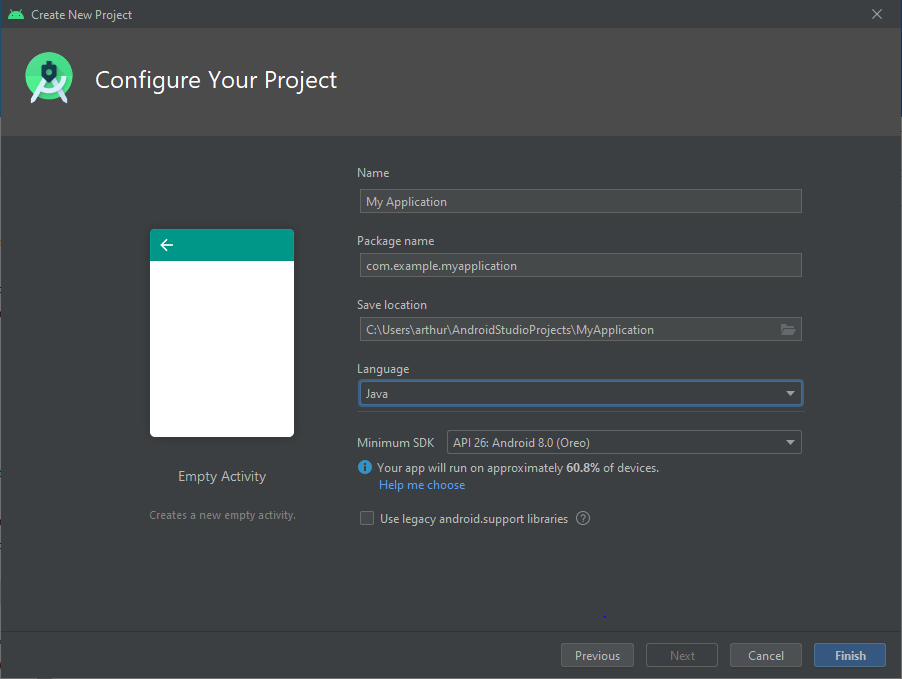

Next, we have to give our App a name and specify a package name. The
package name is usually based on a domain name (like those used in website
addresses) and the company name - for example, *com.myname.myapplication*.

Android Studio supports two programming languages, Java and Kotlin. For this
course, we'll use Java. Select *Java* from the *Language* menu.

We can also choose the minimum version of Android that will be required to run
our application. Choosing a lower API version will allow our app to target more
devices but will prevent us from using newer features.  For now, let's select
*API 26: Android 8.0 (Oreo)*.

With *Name*, *Package name*, *Language*, and *Minimum SDK* specified, click
**Finish**.

Android Studio will download any additional components that are required. Once
the download completes, click **Finish**.

Android Studio will now generate all the files necessary for our first
application. Once generation is complete, we'll be presented with a window
that shows the structure of our project as well as some initial code.

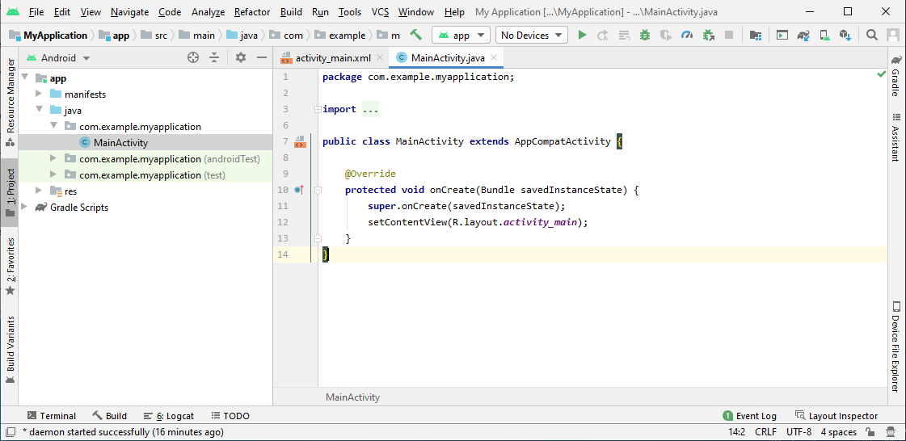

We can open the *Project* pane and examine the project's directory structure.
Two import files are `MainActivity.java` and `activity_main.xml`.  The Java
file contains the code that will be executed when our application is run.  The
XML file contains information about how graphical elements are displayed.

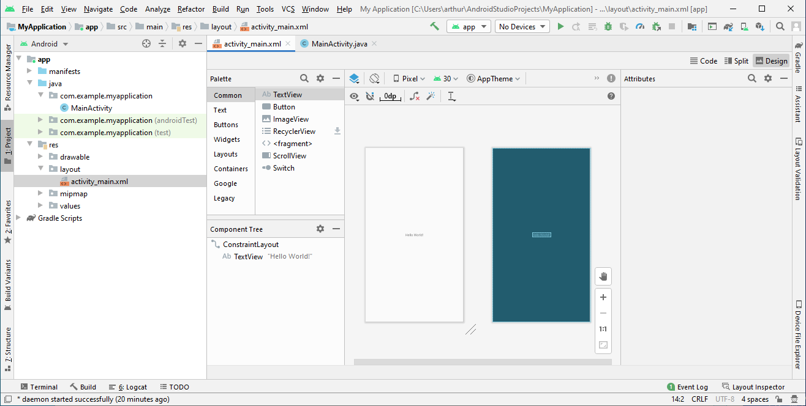

Notice in layout view that the *Component Tree* lists two items: a
*ConstraintLayout* and a *TextView*. Theses are UI components that we will
discuss in more detail later but for now the important thing to know is that
we can access and modify them from code we write in `MainActivity.java`. To
make it easier to access the *TextView*, we need to assign an *id*. In the
*Component Tree*, select the *TextView*. Notice that information about the
*TextView* appears on the right. In the *Attributes* area, set *id* to
`output`.

To modify the text in the output *TextView*, open `MainActivity.java` and
modify the code to look like this:

``` java
package com.myname.myapplication;

import androidx.appcompat.app.AppCompatActivity;

import android.os.Bundle;
import android.widget.TextView;

public class MainActivity extends AppCompatActivity {

    @Override
    protected void onCreate(Bundle savedInstanceState) {
        super.onCreate(savedInstanceState);
        setContentView(R.layout.activity_main);

        TextView output = (TextView) findViewById((R.id.output));
        output.setText("Hello from Android!");
    }
}
```

If error message or red lines appear under `TextView` in the code, right-click
`TextView`, select *Show context actions*, and choose *Import class*.

The code we added does two things. First, it finds the *TextView* in the layout
using the ID we specified. Then, the text is updated. We'll talk more about
the specific components of each line as the course progresses but for now the
important thing to know is that we have a *TextView* in interface and the code
above can be used to modify its text.

We'll discuss other parts of the code like `package`, `import`, `class` and
`onCreate` later in this course and the next course.

### Running an App

Using Android Studio we can run apps either on an separate Android device or
on an emulated virtual device running on a computer. We have to create a virtual
device before we can use it.

Open the *Tools* menu and select *AVD Manager*. The
*Android Virtual Device Manager* window should appear.


Click *Create Virtual Device*. We'll use the default hardware settings. In
the picture below, the *Pixel 2* was selected as the hardware device but the
device might be different on your computer.

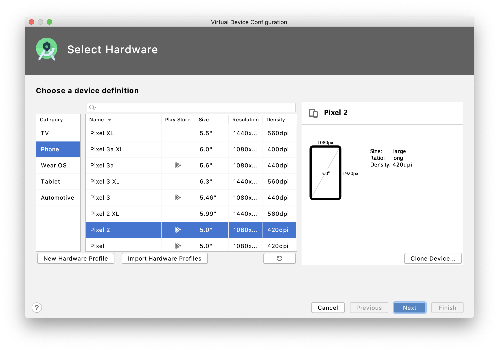

Click *Next* to advance to the *System Image* settings. Here, we can select
the version of Android that will run on the virtual device.  We previously
indicated that we'd be developing our application with compatibility for
Android 8.0 (API level 26); select it from the list of system images.

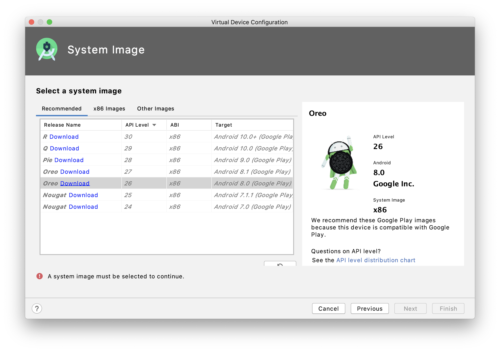

The image has to be downloaded before it can be used. If a *Download* link
appears next to the name, click the link. A license window will appear. Accept
the license and click *Next*. Once the download and installation of the image
completes, click *Finish*.

With the desired system image selected, click *Next*.

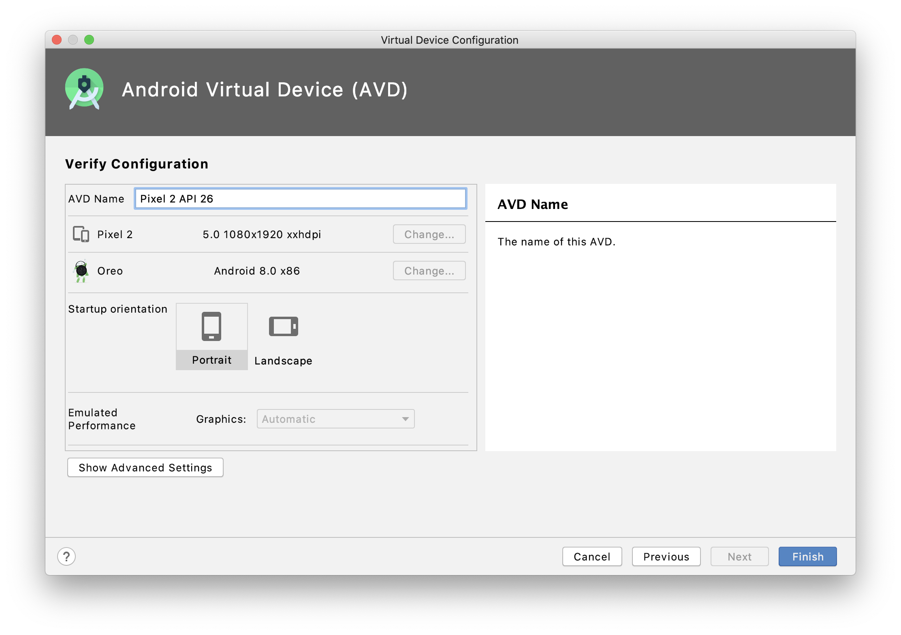

Finally, we can set the device name and configure some additional properties.
We'll use the default values so click *Finish* and close the
*Android Virtual Device Manager*.

Now that we've created a virtual device, we can run our app.  Click the
*Run app* button in the toolbar; the button has green play arrow icon.
Android Studio will start the Android virtual device, build the app, copy the
app to the virtual device, and start the app. We should now be able to see
our app running on the virtual device.

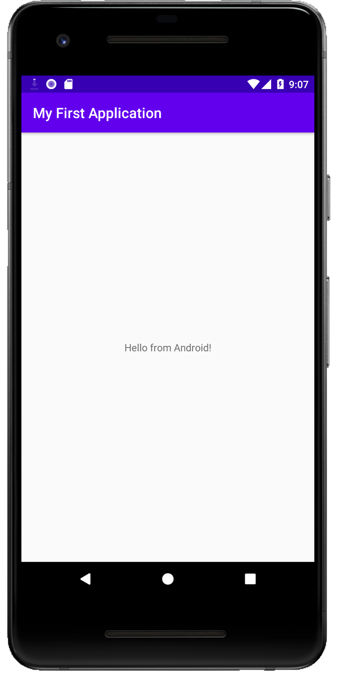

As we begin working with Android and the Java language, we'll explore langugage
features using this simple app and the *TextView* to display output from code
we write. Before we proceed there are two concepts we should be familiar with:
using *append()* with *TextView* and displaying multi-line text.

In our example, we used *setText()* to replace any existing text in the
*TextView*. We can use *append()* to add additional text. For example, if
we add a line to our app like this and run our app, the *TextView* will contain
"Hello from Android!Goodbye from Android.".

``` java
public class MainActivity extends AppCompatActivity {

    @Override
    protected void onCreate(Bundle savedInstanceState) {
        super.onCreate(savedInstanceState);
        setContentView(R.layout.activity_main);

        TextView output = (TextView) findViewById((R.id.output));
        output.setText("Hello from Android!");
        output.append("Goodbye from Android.");
    }
}
```

To split the text across two lines, we can add a line separator, also known
as a new line character. Line separators can differ from one operating system to
another so Java has a built-in way of using the correct new line character,
`System.lineSeparator()`.  By adding a line separator after the first line of
text and before the second line, the output will appear on two lines. If make
the following change to the app, we should see the text appear on two line when
we run it.

``` java
public class MainActivity extends AppCompatActivity {

    @Override
    protected void onCreate(Bundle savedInstanceState) {
        super.onCreate(savedInstanceState);
        setContentView(R.layout.activity_main);

        TextView output = (TextView) findViewById((R.id.output));
        output.setText("Hello from Android!");
        output.append(System.lineSeparator());
        output.append("Goodbye from Android.");
    }
}
```

Using *append()* with *TextView* has some limitations. For example, we can't
use append to display a number like *5* or *2.3*. We could put those numbers
inside double quotes and *append()* would work just fine but that becomes
cumbersome as we try to display more complex output.  An alternative is
to use a *StringBuilder*.  A *StringBuilder* let's use build up a sequence
of text one part at a time.  Like *TextView*, *StringBuilder* has an *append()*
but unlike *TextView*, the *StringBuilder* *append()* will let us use numbers
without requiring extra double quotes.  Our last program rewritten to use
*StringBuilder* would look like this.

``` java
public class MainActivity extends AppCompatActivity {

    @Override
    protected void onCreate(Bundle savedInstanceState) {
        super.onCreate(savedInstanceState);
        setContentView(R.layout.activity_main);

        TextView output = (TextView) findViewById((R.id.output));

        StringBuilder builder = new StringBuilder();

        builder.append("Hello from Android!");
        builder.append(System.lineSeparator());
        builder.append("Goodbye from Android.");

        output.setText(builder);
    }
}
```

We'll use *StringBuilder* to construct output for most of the examples we look
at.


## Variables and Java Data Types

Now that we have a simple working app, we can use it to begin exploring the
Java language.

A **variable** is a named location in the computer's memory used to
conveniently store a value. The type of data stored in a variable is
determined by the variable's data type. A **data type** is a classification of
data items and specifies its possible values. Java has eight primitive data
types. A primitive data type is a type whose values are not objects, which we
will discuss later. The eight primitive data types are

- **boolean**: has only two possible values: true and false
- **char**: a single Unicode character such as "A", "z", "5", or "%" with
  integer value between 0 and 65,535
- **byte**: an integer value between -128 and 127, uses 8 bits of memory
- **short**: an integer value between -32,786 and 32,767, uses 16 bits of
  memory
- **int**: an integer value between -2,147,483,648 and 2,147,483,647, uses
  32 bits of memory
- **long**: an integer value between -9,223,372,036,854,775,808 and
  9,223,372,036,854,775,807, uses 64 bits of memory
- **float**: a 32-bit value used to represent numbers with fractional parts
- **double**: a 64-bit value used to represent numbers with fractional parts

It is important to note that floats and doubles are floating point data types.
While floating point values are useful for representing numbers with fractional
parts, on computers there is a limit to the number of decimal places that can
be accurately represented.

In addition to the primitive data types there are user-defined types. We will
talk about user-defined types more later. There is one commonly used
user-defined type, String, that we looked at briefly earlier and that that
we'll use often but will explore further later. The **String** data type is
used to store a sequence of characters.

User-defined types are also known as reference types. A variable with a
**reference type** stores a reference, a memory address, to the location in
memory that stores the value associated with the variable. A primitive type
stores the value directly. For example, if *3* is assigned to a variable of
type *int*, the variable stores *3*. However, if the string *hello* is stored
in a variable of type *String*, the string *hello* is stored somewhere in the
computer's memory and the address of that location is stored in the variable.

### Creating variables and storing values

Recall that variables are named storage locations for data. Storing data and
accessing it later is important in nearly all computer programs. In Java,
a variable name can be any collection of letters, digits, "\_", or "$" as long
as it doesn't begin with a digit. Typically, variable names begin with a
letter and describe the value being stored.

Variables must be declared before they can be used. To declare a variable, we
must specify at least the variables data type and its name. The following are
examples of variables being declared.

``` java
float temperature;
int zipCode;
boolean isRaining;
String city;
```

We've declared four variables: one named *temperature* that will have a float
value, one named *zipCode* that will store an integer, one named *isRaining*
that will store a boolean value (true or false), and one named *city* that can
be used to store a String (a sequence of characters). Note that we had to end
each declaration with a semicolon (;).

Suppose we wanted to declare several variables of the same type. We could
write something like this:

```java
float temperature;
float humidity;
float pressure;
```

With Java, however, we can declare multiple variables of the same type at once.
Rather than write three separate lines, we can declare our three variables on
one line like this:

```java
float temperature, humidity, pressure;
```

In addition to using a variable to store a single value of a type, we can use
a single variable to store multiple values of a type. **Array types** are
reference types that allow us to store values in equal-sized, contiguous
locations in memory. The individual values of an array are called
**elements**. Brackets, `[` and `]`, are used to declare arrays. For example,
we can declare an array of integers:

```java
int[] dailyHighs;
```

In this example, we declared a one-dimensional array of integers. Notice that
we can place the brackets next to the type or the variable.
Typically, we'll see the brackets placed next to the type unless multiple
variables are being declared like this:

```java
float currentTemperature, forecastHighs[], forecastLows[];
```

The following is a syntactically valid Java program consisting only of the code
that Android Studio automatically created and variable declarations :

``` java
public class MainActivity extends AppCompatActivity {

    @Override
    protected void onCreate(Bundle savedInstanceState) {
        super.onCreate(savedInstanceState);
        setContentView(R.layout.activity_main);

        float temperature, humidity, pressure;
        int zipCode;
        boolean isRaining;
        String city;
        int[] dailyHighs;    }
}
```

The program doesn't do much. So far, we've declared variables but haven't
assigned any values to them. Depending on the type, the declared variables
will have a default initial value or be uninitialized depending on the data
types of the variables. We'll look at this later. For now, let's look at
assigning values to variables and working with the variables.

### Expressions

In Java, an **expression** is a combination of literals, variable names, method
calls, and operators. A **literal** is a value expressed verbatim like *123*
or *"Hello"*. In Java, there are several kinds of literals: a character, a
string (a sequence of characters), an integer, a floating-point value, the
boolean values *true* and *false*, and *null*. The *null* literal is used with
reference variables to indicate that the variable doesn't refer to an object.
We'll talk about operators soon and discuss method calls later.

The following are examples of literals.

| Data Type    | Examples                                     |
|:-------------|:---------------------------------------------|
| char         | '1', 'A', '?'                                |
| String       | "Hello", "Goodbye", "The weather is lovely." |
| int          | 1, -20, 1234                                 |
| float/double | 1, 2.0, 0.8392, -12923.1023                  |
| boolean      | true, false                                  |

A **simple expression** is an individual literal, variable name, or method
call (we'll discuss method calls more later). All of the example literals
above are examples are simple expressions.

A **compound expression** is a sequence of simple expressions and operators.
An **operator** is a symbolically represented instruction used to transform
data values, the operands, into another value. For example, `5  + 6` is a
compound expression consisting of two integer literals (5 and 6) and the
addition operator (+).

Java provides many operators. Operators can be classified by the number of
operands they take: a **unary operator** takes one operand, a **binary
operator** takes two operands, a **ternary operator** takes three operands, and
so on. Java has only one ternary operator, the rest are unary and binary.

Operators can also be classified based on their position relative to the
operands. **Prefix operators** appear before the operands (in -3, the -
operator is both an example of a prefix and unary operator),
**postfix operators** appear after the operands (x++), and **infix operators**
appear between two or more operands (2 + 4).

While there are many operators that we'll work with, we'll start by focusing
on the arithmetic operators.

| Operator                      | Symbol | Description                                                             |
|:------------------------------|:-------|:------------------------------------------------------------------------|
| Addition/String concatenation | `+`    | Returns the sum of two numeric operands or the concatenation of strings |
| Division                      | `/`    | Returns the quotient of two numeric operands                            |
| Multiplication                | `*`    | Returns the product of two numeric operands                             |
| Subtraction                   | `-`    | Returns the difference of two numeric operands                          |
| Unary plus                    | `+`    | Returns the numeric operand                                             |
| Unary minus                   | `-`    | Returns the arithmetic negative of operand                              |
| Increment                     | `++`   | Add one to the operand, prefix and postfix operator                     |
| Decrement                     | `--`   | Subtract one from the operand, prefix and postfix operator              |

In addition to arithmetic operators there are a few more operators of interest.
As we continue exploring Java, we'll discuss other operators.

| Operator            | Symbol                     | Description                                                                                                                                                                                                    |
|:--------------------|:---------------------------|:---------------------------------------------------------------------------------------------------------------------------------------------------------------------------------------------------------------|
| Array index         | `[]`                       | Given `variable[index]`, where *index* is an integer, return or store the value in *variable's* storage at index                                                                                               |
| Assignment          | `=`                        | Given `variable = operand`, store *operand* in *variable*                                                                                                                                                      |
| Compound Assignment | `+=`, `-=`, `*=`, `/=`     | Given `variable operator operand`, perform the operation using the existing value of *variable* and *operand*, store the result in *variable*                                                                  |
| Comparison          | `==`, `<`, `<=`, `>`, `>=` | Given `operand1 operator operand2`, compare both operands, return *true* or *false* depending on the comparison; includes equality, less than, less than or equal to, greater than, greater than or equal to | |
| Object Creation     | `new`                      | Given `new identifier[integer size]`, allocate a one-dimensional array of values with type *identifier*                                                                                                        |

Here's Java code that demonstrates some of these operators. This code contains
comments. Comments are not evaluated and serve to document code. In this
example, comments are preceded by two forward slashes, `//`.  Notice we've also
added the code to use the *TextView*.

```java
package com.myname.myapplication;

import androidx.appcompat.app.AppCompatActivity;

import android.os.Bundle;
import android.widget.TextView;

public class MainActivity extends AppCompatActivity {

    @Override
    protected void onCreate(Bundle savedInstanceState) {
        super.onCreate(savedInstanceState);
        setContentView(R.layout.activity_main);

        TextView output = (TextView) findViewById((R.id.output));
        StringBuilder builder = new StringBuilder();

        //Initialize variables using the assignment operator
        int currentTemperature = 50;
        int tomorrowTemperature = 68;

        double currentHumidity = 0.55;
        double tomorrowHumidity = 0.68;

        String cityName = "Columbus";

        char fahrenheit = 'F';
        char celsius = 'C';

        //Addition
        builder.append("Addition");
        builder.append(System.lineSeparator());

        builder.append(currentTemperature + tomorrowTemperature); //two integers
        builder.append(System.lineSeparator());

        builder.append("The current city is: " + cityName); //two strings
        builder.append(System.lineSeparator());

        builder.append(fahrenheit + celsius);
        builder.append(System.lineSeparator());


        //Subtraction
        builder.append("Subtraction");
        builder.append(System.lineSeparator());

        builder.append(tomorrowHumidity - currentHumidity); //two floats
        builder.append(System.lineSeparator());


        //Unary plus and unary minus
        builder.append("Unary plus and unary minus");
        builder.append(System.lineSeparator());

        builder.append(+currentTemperature);
        builder.append(System.lineSeparator());

        builder.append(-currentTemperature);
        builder.append(System.lineSeparator());

        output.setText(builder);
    }
}
```

If we run this program, the output should be:

``` text
Addition
118
The current city is: Columbus
137
Subtraction
0.13
Unary plus and unary minus
50
-50
```

For numerical values, the output is what we'd expect. With strings, the
addition operator results in a string that is the two operand strings joined
together. For characters, the operation is performed on the integer values
corresponding to the characters.

Lets looks at some more examples of operators.

``` java
package com.myname.myapplication;

import androidx.appcompat.app.AppCompatActivity;

import android.os.Bundle;
import android.widget.TextView;

public class MainActivity extends AppCompatActivity {

    @Override
    protected void onCreate(Bundle savedInstanceState) {
        super.onCreate(savedInstanceState);
        setContentView(R.layout.activity_main);

        TextView output = (TextView) findViewById((R.id.output));
        StringBuilder builder = new StringBuilder();

        int currentTemperature = 50;
        int highTemperature = 68;
        double currentHumidity = 0.55;
        double highHumidity = 0.75;
        String cityName = "Columbus";

        //Compound assignment
        highHumidity += 0.1; //add to existing value
        currentHumidity /= 2; //divide existing value

        builder.append(highHumidity);
        builder.append(System.lineSeparator());

        builder.append(currentHumidity);
        builder.append(System.lineSeparator());


        //Unary increment and decrement
        int tomorrowHighTemperature = ++highTemperature; //prefix increment
        int tomorrowLowTemperature = currentTemperature--; //postfix decrement

        builder.append(tomorrowHighTemperature);
        builder.append(System.lineSeparator());

        builder.append(tomorrowLowTemperature);
        builder.append(System.lineSeparator());


        /*
        Comparison
        compare two numeric values; if the values are the same, isHigh will be true
        if the values are different, isHigh will be false
        */
        boolean isHigh = currentTemperature == highTemperature;

        //compare the content of two strings
        boolean isColumbus = cityName == "Columbus";

        builder.append(isHigh);
        builder.append(System.lineSeparator());

        builder.append(isColumbus);
        builder.append(System.lineSeparator());

        output.setText(builder);
    }
}
```

The output should be:

``` text
0.85
0.275
69
50
false
true
```

Notice that the value of *tomorrowLowTemperature* is the same value of
**currentTemperature**. The postfix increment and decrement unary operators
assign the current value to the variable on the left-hand side of the
assignment operator then perform the increment or decrement operation on the
operand variable on the right-hand side.

Finally, let's look at the array index operator. For this example, we'll
initialize an array with some values using braces.

``` java
package com.myname.myapplication;

import androidx.appcompat.app.AppCompatActivity;

import android.os.Bundle;
import android.widget.TextView;

public class MainActivity extends AppCompatActivity {

    @Override
    protected void onCreate(Bundle savedInstanceState) {
        super.onCreate(savedInstanceState);
        setContentView(R.layout.activity_main);

        TextView output = (TextView) findViewById((R.id.output));
        StringBuilder builder = new StringBuilder();

        int[] forecastHighs = {50, 60, 55, 45, 30};

        //Display each element from the array
        builder.append(forecastHighs[0]);
        builder.append(System.lineSeparator());

        builder.append(forecastHighs[1]);
        builder.append(System.lineSeparator());

        builder.append(forecastHighs[2]);
        builder.append(System.lineSeparator());

        builder.append(forecastHighs[3]);
        builder.append(System.lineSeparator());

        builder.append(forecastHighs[4]);
        builder.append(System.lineSeparator());

        //Replace the last value in the array
        forecastHighs[4] = 100;
        builder.append(forecastHighs[4]);
        builder.append(System.lineSeparator());

        output.setText(builder);
    }
}
```

The output is:

``` text
50
60
55
45
30
100
```

In the previous example, we created an array using an integer literal to specify
the size and immediately assigned values to its elements. What if we didn't
have values at the time the array is declared? What if we wanted to use a
variable to specify the length?  We can use the *new* operator to do this. For
example, we can set the length of an array of strings using a variable with
an integer value and then assign values to each element in the array.

```java
package com.myname.myapplication;

import androidx.appcompat.app.AppCompatActivity;

import android.os.Bundle;
import android.widget.TextView;

public class MainActivity extends AppCompatActivity {

    @Override
    protected void onCreate(Bundle savedInstanceState) {
        super.onCreate(savedInstanceState);
        setContentView(R.layout.activity_main);

        TextView output = (TextView) findViewById((R.id.output));
        StringBuilder builder = new StringBuilder();

        int numberOfAnimals = 3;
        String[] animals = new String[numberOfAnimals];
        animals[0] = "cat";
        animals[1] = "dog";
        animals[2] = "chicken";

        builder.append(animals[1]);

        output.setText(builder);
    }
}
```

The output is:

``` text
dog
```

With the assignment operator, the value on the right-hand side will be
evaluated before the value is stored in the variable on the left-hand side.
Pay special attention to the value that is being calculated on the right-hand
side and the type of the variable on the left-hand side.

Consider the following:

```java
int sum = 2 + 3;
```

First, the values *2* and *3* are added and their sum, *5*, is stored in the
variable *sum*. Since *2* and *3* are integers, we expect their sum to be an
integer.

What happens in the following?

```java
int quotient = 10 / 4
```

The value of quotient is *2*. If we were to divide 10 by 4 by hand, we would
see that the quotient is 2.5. Since the left hand side is an integer and 2.5
is not an integer, the value is truncated and the integer *2* is stored in
*quotient*.

## Using GitHub

For this class, we'll use GitHub to save and share our work.

### Git and GitHub

GitHub is built on Git, a version control system allowing us to keep track of
changes to your code at various points in time as snapshots. When working with
Git on your computer, there are three distinct stages in which data resides:
the working directory, the staging area, and the local repository. The working
directory is where data we are modifying exists; the working directory
consists of the files that we will make changes to as we develop our
programs. The staging area stores information about what data will be part of
the next snapshot we store. The repository is a store of all the snapshots
we've taken; we can use the repository to compare different snapshots and
even revert your data to the state it was in a previous snapshot.

A basic Git work flow consists of making changes to files in the working
directory, adding them to a new snapshot in the staging area, and committing
the snapshot to the repository. All this can take place on your own computer.
Git is also able to easily update a repository on another computer based on
changes you've made on your computer. GitHub can be used to host a remote
repository and we can push changes from our local repository to a GitHub
repository. Similarly, we can pull changes from a remote repository to your
local repository and into your working directory.

Git-it, an application available at https://github.com/jlord/git-it-electron,
provides an interactive tutorial on using Git and GitHub.

If you don't have a GitHub account, go to https://github.com and create one.
We'll work with creating repositories from Android Studio.

### Working with GitHub in Android Studio

With our existing project, we can create a new repository by selecting
**VCS -> Import into Version Control -> Share Project on GitHub** from
the menu bar. If this is the first time using GitHub with Android Studio, you
will be prompted to enter your GitHub credentials.

You will be prompted to enter a repository name, a remote name, and a
description; leave the remote name set to *origin*.

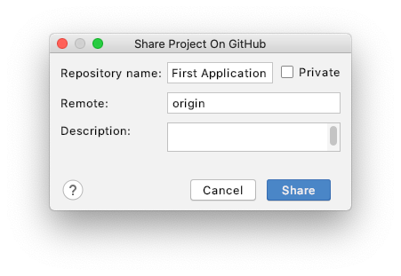

After clicking **Share**, you will be prompted to select the files to add.
For now, we can add the default set of files.

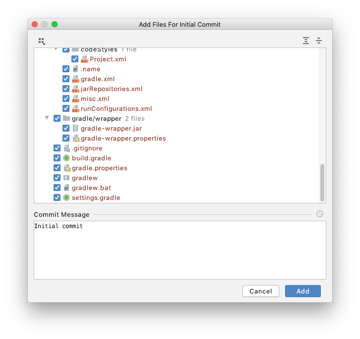

Once we have committed our files to the local repository, we can push the
changes to the remote repository on GitHub by selecting **VCS -> Git -> Push**
from the menus. Click **Push** to copy the commit and associated files to
GitHub.

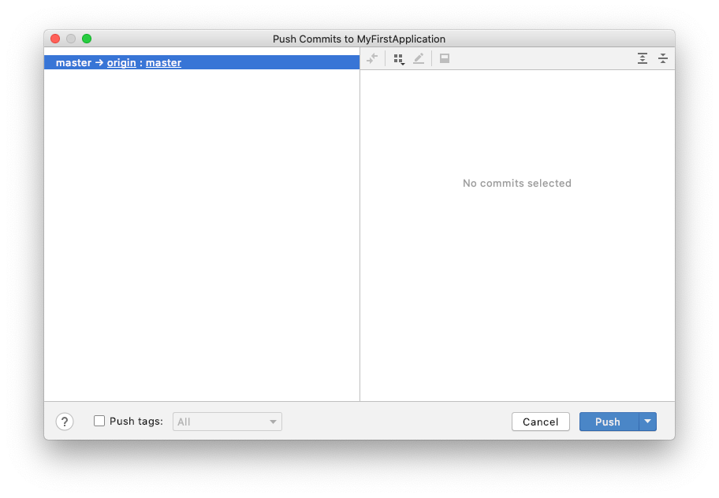

When we modify, add, or remove files in the future, we can
use the commit menu option; this combines steps of adding files to staging and
committing them to the local repository. We will use the push menu option to
copy our changes to GitHub.

## Exercise

**Write a program that stores a city name as a string, the city's zip code as an
integer, and the high temperature for the next five days in an array. The
program should calculate the average high temperature for the next five days
and store the value in a variable. Finally, the program should display the
city name, the zip code, and the average high temperature.**

The average of a collection of values is the sum of all the values divided by
the number of values.

For example, if the city is Columbus; the zip code is 43215; and the high
temperatures for the next five days are 32, 25, 27, 40, and 45, the output of
the program might be:

``` text
City: Columbus
Zip Code: 43215
Average High Temperature 33.8
```

When computing the average high temperature, was the value stored as an
integer value or a floating-point value? What happens to the computed average
with either data type?

Be sure to commit your code and push it to GitHub.
