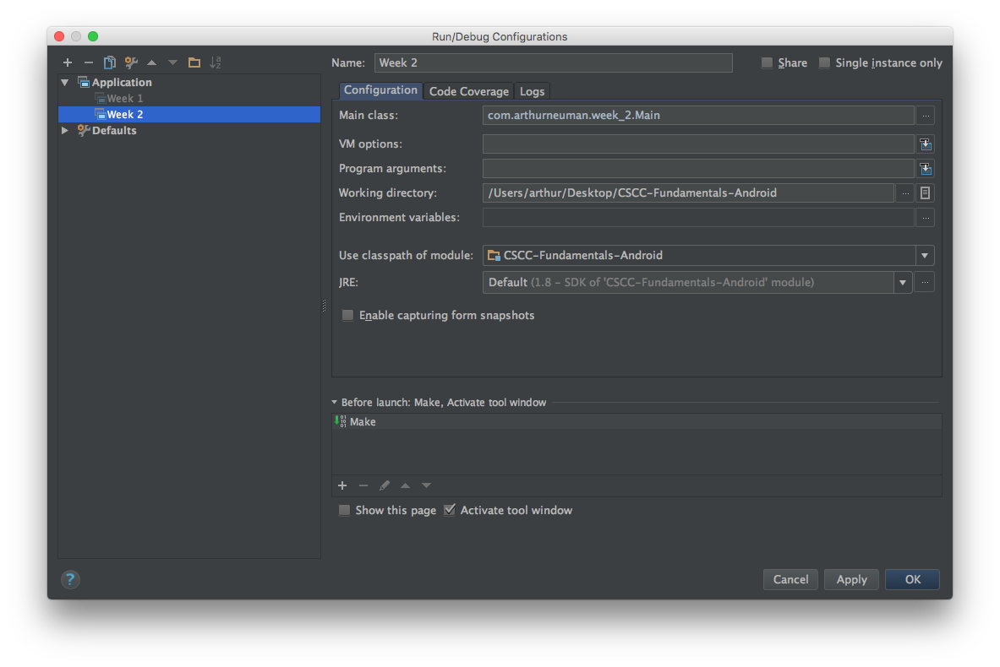

# Week 2 - Flow Control

## Corresponding Text
*Learn Java for Android Development*, pp. 71-84

## Adding to Your Repository
After the work from the last week, your IntelliJ project should look similar
to the one pictured below. In your **src** directory should be a folder with a
name similar to **com.myname.week_1** and a file named **Main** within that
folder.


Rather than creating a new IntelliJ project and GitHub repository for each
week's work, we can add to our existing project and repository.  To add a
folder for this week's work, right-click on the **src** folder and select
**New** and **Package** from the context menu. Name the package something
similar to *com.myname.week_2*, replacing *myname* with your name.

Now that we have a new folder for this week's work, we'll need to create a file
where we can write code. Right-click on the newly created week_2 folder and
select **New** and **Java Class**.  Let's call this new Java class *Main*.
We'll talk about classes more later but typically each file corresponds to a
class in Java. IntelliJ should automatically open the newly created file.

Notice that near the top of the file is a block comment; this is automatically
added to newly created files based on a template. IntelliJ will present a
warning about the comment until you change the default template.  To do this,
place your pointer over part of the text until a light bulb icon appears.
Click the light bulb and select **Edit Template**.


Modify the template and click **Ok**; this will prevent the editor from
presenting a warning in the future.

Our new file just needs one more thing for us to work with.  We need to add a
`main` method to the code so it looks similar to this:

```
package com.myname.week_2;

public class Main {
    public static void main(String[] args) {
        System.out.println("Week 2!");
    }

}
```

To run our week_2 code, we can right-click on *Main* in the *com.myname.week_2*
package and select *Run Main.main()*.


We can also configure IntelliJ so that we can push the play/run button in the
toolbar to run our week_2 code.  To do this, click the arrow next to *Main* and
select *Edit Configurations*.


The Run/Debug Configurations window will appear.


Let's rename the existing *Main* configuration by selecting it on the left, and
replacing it's name with something like *Week 1*.

We can create a new configuration by clicking the plus icon in the upper left
corner of the window and selecting *Application*. Let's name this configuration
*Week 2*. We also have to specify the main class and working directory.  The
main class is *com.myname.week_2.Main*, with *myname* replaced with your name.
The working directory can be copied and pasted from the *Week 1* configuration.
The configuration should now look similar to this:



Click "Ok" and you should see that *Week 2* is now selected in the drop down
box in the toolbar; pressing the play/run button now will run the code in the
*week_2* package.

You can commit commit the new file to your local repository now by selecting
**VCS -> Git -> Commit File...** from the menu bar.  If you'd like to push the
changes to the remote GitHub repository, select **VCS -> Git -> Push** from the
menu bar.

## Boolean Operators
Last week we looked at some operators that could be used to make compound
expressions.  Let's look at a few more operators.

| Operator             | Symbol                    | Description                                                                                                                                                                                                                          |
|:---------------------|:--------------------------|:-------------------------------------------------------------------------------------------------------------------------------------------------------------------------------------------------------------------------------------|
| Conditional AND      | `&&`                      | Given `operand1 && operand2` where *operand1* and *operand2* are both of Boolean type, return *true* when both operands are true, return *false* otherwise; if *operand1* is *false*, *operand2* is not examined                     |
| Conditional OR       | <code>&#124;&#124;</code> | Given <code>operand1 &#124;&#124; operand2</code> where *operand1* and *operand2* are both of Boolean type, return *true* when either operand is true, return *false* otherwise; if *operand1* is *true*, *operand2* is not examined |
| Logical AND          | `&`                       | Given `operand1 & operand2` where *operand1* and *operand2* are both of Boolean type, return *true* when both operands are true, return *false* otherwise                                                                            |
| Logical complement   | `!`                       | Given `!operand` where *operand* is of Boolean type, return the opposite Boolean value                                                                                                                                               |
| Logical exclusive OR | `^`                       | Given `operand1 ^ operand2` where *operand1* and *operand2* are both of Boolean type, return *true* when one operand is *true* and the other is *false*, return *false* otherwise                                                    |
| Logical inclusive OR | <code>&#124;</code>       | Given <code>operand1 &#124; operand2</code> where *operand1* and *operand2* are both of Boolean type, return *true* when either operand is true, return *false* otherwise                                                            |

Notice that there are situations when using conditional AND (`&&`) and
conditional OR (`||`) when the second operand does not need to be examined;
this is known as *short-ciruiting*.  The corresponding logical operators will
always examine the second operand.

Let's look at a simple example.

```
package com.myname.week_2;

public class Main {
    public static void main(String[] args) {
        //There are four possible combinations of two Boolean values
        //The four combinations with conditional AND
        Boolean result = true && true;
        System.out.println("true && true: " + result);

        result = true && false;
        System.out.println("true && false: " + result);

        result = false && true;
        System.out.println("false && true: " + result);

        result = false && false;
        System.out.println("false && false: " + result);


        //The four combinations with logical inclusive OR
        result = true | true;
        System.out.println("true | true: " + result);

        result = true | false;
        System.out.println("true | false: " + result);

        result = false | true;
        System.out.println("false | true: " + result);

        result = false | false;
        System.out.println("false | false: " + result);
    }
}
```

Running this code should give the following output:

```
true && true: true
true && false: false
false && true: false
false && false: false
true | true: true
true | false: true
false | true: true
false | false: false
```

Modifying the code to use logical AND will give the same result in this case
as conditional AND.  Similarly, conditional OR will give the same result as
logical inclusive OR in this case.

Let's look at an example of where the conditional and logical operators differ.

```
package com.myname.week_2;

public class Main {
    public static void main(String[] args) {
        int lowTemperature = 32;
        int highTemperature = 50;

        //Conditional OR
        System.out.println(true || ++lowTemperature > 0);
        System.out.println(lowTemperature);

        //Logical inclusive OR
        System.out.println(true | ++highTemperature > 0);
        System.out.println(highTemperature);

    }
}
```
The output is:

```
true
32
true
51
```

Notice that the value of *lowTemperature* remained unchanged after the
comparison but the value of *highTemperature* was incremented.  This is due to
the fact that the conditional operators allow short-cutting; because the first
operand in a conditional OR expression was *true*, the second operand was not
evaluated.  Both operands are always evaluated when using logical operators.

## Decision Statements
Decision statements can be used to chose between two or more sets of
statements based on the evaluation of a Boolean expression.

### If and If-Else Statements
The **if statement** evaluates a Boolean expression and executes another
statement if the expression is true.  The if statement has the following
syntax:

```
if (Boolean expression)
    statement
```

Here, *statement* will only be executed if *Boolean expression* evaluates to
true.  Here's an example:

```
package com.myname.week_2;

public class Main {
    public static void main(String[] args) {
        int currentTemperature = 32;
        int warmThreshold = 60;

        if (currentTemperature > warmThreshold)
            System.out.println("It's warm outside!");
    }
}
```

This program will produce no output.  The *System.out.println()* statement will
only be executed if the Boolean expression *currentTemperature > warmThreshold*
evaluates to true. In this case, since *currentTemperature* is not greater
than *warmThreshold*, the Boolean expression evaluates to false and the
*System.out.println()* statement is not executed.  Let's change the current
temperature and see what happens.

```
package com.arthurneuman.week_2;

public class Main {
    public static void main(String[] args) {
        int currentTemperature = 82;
        int warmThreshold = 60;

        if (currentTemperature > warmThreshold)
            System.out.println("It's warm outside!");
    }
}
```

The output is now:

```
It's warm outside!
```

When we changed *currentTemperature* to a value greater than *warmThreshold*,
the Boolean expression *currentTemperature > warmThreshold* evaluated to true
and the statement

In the previous examples, we only had one statement to execute when the Boolean
expression evaluated to true. Often, there's more than one statement that we'd
like to evaluate.  We can do this by grouping statements together using
braces, `{` and `}`.

```
package com.myname.week_2;

public class Main {
    public static void main(String[] args) {
        int currentTemperature = 82;
        int warmThreshold = 60;

        if (currentTemperature > warmThreshold)
        {
            System.out.println("The temperature is " + currentTemperature);
            System.out.println("It's warm outside!");
        }
    }
}

```

In this example, the program will execute two statements if the Boolean
expression evaluates to true.  The output is:

```
The temperature is 82
It's warm outside!
```

Suppose we wanted to print a message if the day's high temperature is above
some value and the there's no chance of rain.  Our boolean expression can be
a compound expression consisting of boolean expressions.

```
package com.myname.week_2;

public class Main {
    public static void main(String[] args) {
        int highTemperature = 82;
        double precipitationProbability = .05;

        int warmThreshold = 60;
        double precipitationThreshold = 0.5;

        if ((highTemperature > warmThreshold)
                && (precipitationProbabilityy < precipitationThreshold))
        {
            System.out.println("It's going to be a great day!");
        }
    }
}
```

In this example, we used combined two Boolean expressions, *highTemperature >
warmThreshold* and *precipitationProbabily > precipitationThreshold* using
the conditional AND operator.  Notice, we can also split the Boolean expression
across multiple lines, if necessary.

So far we've looked at executing statements if the Boolean expression evaluates
to true. What if we want to execute one set of statements if the Boolean
expression evaluates to true and another set when the expression is false?
We can use the reserved word *else*. An **if-else** statement has the following
form:

```
if (Boolean expression)
    statement1
else
    statement2
```

If *Boolean expression* evaluates to true, *statement1* will be executed; if
*Boolean expression* evaluates to false, *statement2* will be executed.

Building on a previous example, we can output text if a condition is true and
output alternate text if the condition is false.

```
package com.myname.week_2;

public class Main {
    public static void main(String[] args) {
        int currentTemperature = 30;
        int warmThreshold = 60;


        if (currentTemperature > warmThreshold) {
            System.out.println("It's warm outside!");
        }
        else {
            System.out.println("It's cold outside!");
        }
    }
}
```

Depending on the values of *currentTemperature* and *warmThreshold*, this code
will display either `It's warm outside!` or `It's cold outside!`.

Java's single ternary operator, allows us to write simple if-else statements
on one line.

| Operator    | Symbol | Description                                                                                                                                                                                                                            |
|:------------|:-------|:---------------------------------------------------------------------------------------------------------------------------------------------------------------------------------------------------------------------------------------|
| Conditional | `?:`   | Given `operand1 ? operand2 : operand3` where *operand1* is of Boolean type and *operand2* and *operand3* are of the same type, return *operand2* if *operand1* evaluates to *true* or *operand3* if *operand1* evaluates to *false*  | |

We can use the conditional operator to rewrite the previous example.

```
package com.myname.week_2;

public class Main {
    public static void main(String[] args) {
        int currentTemperature = 30;
        int warmThreshold = 60;

        System.out.println(currentTemperature > warmThreshold
            ? "It's warm outside!" : "It's cold outside!");
    }
}
```

Suppose we wanted to display a message if the current temperature were below
one value, a different message if the current temperature were above another
value, and something else if the current temperature were between the two
values?

We could do write separate if statements like this:

```
package com.myname.week_2;

public class Main {
    public static void main(String[] args) {
        int coldThreshold = 60;
        int hotThreshold = 75;
        int currentTemperature = 65;

        if (currentTemperature < coldThreshold) {
            System.out.println("It's too cold!");
        }

        if (currentTemperature > hotThreshold) {
            System.out.println("It's too hot!");
        }

        if ((currentTemperature >= coldThreshold) && (currentTemperature <= hotThreshold)) {
            System.out.println("It's just right!");
        }
    }
}
```

The problem with this approach is that the program will check each Boolean
expression to see if it evaluates to true.  While that doesn't seem so bad for
this example, as our programs become larger and more complex, we'd like to
avoid any unnecessary statement evaluations.

One alternative to multiple if statements is to chain if-else statements like
this:

```
package com.myname.week_2;

public class Main {
    public static void main(String[] args) {
        int coldThreshold = 60;
        int hotThreshold = 75;
        int currentTemperature = 65;

        if (currentTemperature < coldThreshold) {
            System.out.println("It's too cold!");
        }

        else {
            if (currentTemperature > hotThreshold) {
                System.out.println("It's too hot!");
            }

            else {
                System.out.println("It's just right!");
            }
        }
    }
}
```

Let's examine how this might be a better solution.  Using the value assigned to
*currentTemperature*, 65, the *currentTemperature < coldThreshold* will
evaluate to false, so the program will go to the else statement - another
if-else statement.  The program will now evaluate the Boolean expression
*currentTemperature > hotThreshold*.  Since the expression evaluates to false,
the else statement will be executed.  Notice that we don't need the third
boolean expression from the prior example because if neither of the first two
expressions are true, the third must be true.  When *currentTemperature* is 65,
we only had to evaluate two boolean expressions rather than three.  What if
*currentTemperature* is 30?  Only one boolean expression has to be evaluated.

We can also write the previous example in the following form, which might be
easier to read:

```
package com.myname.week_2;

public class Main {
    public static void main(String[] args) {
        int coldThreshold = 60;
        int hotThreshold = 75;
        int currentTemperature = 65;

        if (currentTemperature < coldThreshold) {
            System.out.println("It's too cold!");
        }

        else if (currentTemperature > hotThreshold) {
            System.out.println("It's too hot!");
        }

        else {
            System.out.println("It's just right!");
        }
    }
}
```

### Switch Statement
The **switch statement** let's us choose from among several different execution
paths in a more efficient manner than using chained if-else statements. The
switch statement has the following syntax where content in brackets (`[`, `]`)
are optional:

```
switch (selector expression)
{
    case value1: statement1 [break;]
    case value2: statement2 [break;]
    ...
    case valueN: statementN [break;]
    [default: statement]
}
```

The statement begins with the reserved word *switch* and is followed by an
expression that is evaluated.  Next are a collection of cases where each case
begins with the reserved word *case* and a literal value followed by a colon,
the statement to execute, and an optional *break;* statement.  If the
*selector expression* matches a value for one of the cases, the case's
statement is executed.  Optionally, a default case can be specified and will be
executed if none of the prior cases match the *selector expression*.

The following is an example using the switch statement:

```
package com.myname.week_2;

public class Main {
    public static void main(String[] args) {
        String windDirection= "west";
        switch (windDirection) {
            case "north":
                System.out.println("The wind is blowing from the north.");
                break;
            case "south":
                System.out.println("The wind is blowing from the south.");
                break;
            case "west":
                System.out.println("The wind is blowing from the west.");
                break;
            case "east":
                System.out.println("The wind is blowing from the east.");
                break;
            default:
                System.out.println("I don't know where the wind is blowing from.");
        }
    }
}
```

The example will display a message about the direction from which the wind is
blowing if the value of *windDirection* matches one of four values; if the
value does not match, the message "I don't know where the wind is blowing
from." is displayed.

What happens if we remove the break statements?

```
package com.myname.week_2;

public class Main {
    public static void main(String[] args) {
        String windDirection= "west";
        switch (windDirection) {
            case "north":
                System.out.println("The wind is blowing from the north.");
            case "south":
                System.out.println("The wind is blowing from the south.");
            case "west":
                System.out.println("The wind is blowing from the west.");
            case "east":
                System.out.println("The wind is blowing from the east.");
            default:
                System.out.println("I don't know where the wind is blowing from.");
        }
    }
}
```

The output of this code is:

```
The wind is blowing from the west.
The wind is blowing from the east.
I don't know where the wind is blowing from.
```

Notice that every statement that is part of the matching case and those cases
that occur after the matching case are executed.  

## Loops
### For Statement
### For-Each Statement
### While Statement
### Do-While Statement

## Break and Continue Statements
### Break and Labeled Break Statements
### Continue and Labeled Continue Statements

## Exercise
