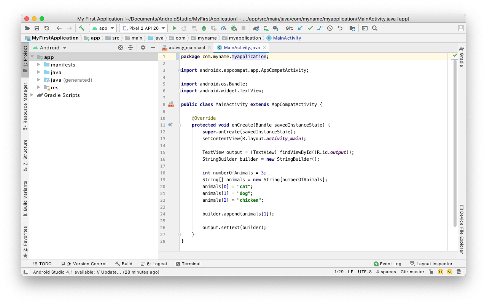

# Week 2 - Flow Control

## Corresponding Text
*Learn Java for Android Development*, pp. 71-84

## Adding to Your Repository
After the work from the last week, your IntelliJ project should look similar
to the one pictured below. In your **src** directory should be a folder with a
name similar to **com.myname.week_1** and a file named **Main** within that
folder.



Typically, we would create a new project when we start new work but rather than
creating a new IntelliJ project and GitHub repository for each week's work, we
will add to our existing project and repository.  To add a folder for this
week's work, right-click on the `java` directory in `src/main` and select 
**New** and **Package** from the context menu. Name the new module something 
like *com.myname.week_02*.

Now that we have a new package for this week's work, we'll need to create a 
file where we can write code. Right-click on the newly created week_2 package 
and select **New** and **Java Class**.  Let's call this new Java class *Main*.
We'll talk about classes more later but typically each file corresponds to a
class in Java. IntelliJ should automatically open the newly created file.

Notice that near the top of the file is a block comment; this is automatically
added to newly created files based on a template. IntelliJ will present a
warning about the comment until you change the default template.  To do this,
place your pointer over part of the text until a light bulb icon appears.
Click the light bulb and select **Edit Template**.


Modify the template and click **Ok**; this will prevent the editor from
presenting a warning in the future.

Our new file just needs one more thing for us to work with.  We need to add a
`main` method to the code so it looks similar to this:

```java
package com.myname.week_02;

public class Main {
    public static void main(String[] args) {
        System.out.println("Week 2!");
    }

}
```

To run our week_2 code, we can right-click on *Main* in the *com.myname.week_02*
package and select *Run Main.main()*.


We can also configure IntelliJ so that we can push the play/run button in the
toolbar to run our week_2 code.  To do this, click the arrow next to *Main* and
select *Edit Configurations*.


The Run/Debug Configurations window will appear.

Let's rename the existing *Main* configuration by selecting it on the left, and
replacing it's name with something like *Week 1*. You will also have to
update the "Use classpath of module" field to point to the new module we
created for the old code.

We can create a new configuration by clicking the plus icon in the upper left
corner of the window and selecting *Application*. Let's name this configuration
*Week 2*. We also have to specify the main class and working directory.  The
main class is *com.myname.week_02.Main*, with *myname* replaced with your name.
The working directory can be copied and pasted from the *Week 1* configuration.
The configuration should now look similar to this:


Click "Ok" and you should see that *Week 2* is now selected in the drop down
box in the toolbar; pressing the play/run button now will run the code in the
*week_2* package.

You can commit commit the new file to your local repository now by selecting
**VCS -> Git -> Commit File...** from the menu bar.  If you'd like to push the
changes to the remote GitHub repository, select **VCS -> Git -> Push** from the
menu bar.

## Boolean Operators
Last week we looked at some operators that could be used to make compound
expressions.  Let's look at a few more operators.

| Operator             | Symbol                    | Description                                                                                                                                                                                                                          |
|:---------------------|:--------------------------|:-------------------------------------------------------------------------------------------------------------------------------------------------------------------------------------------------------------------------------------|
| Conditional AND      | `&&`                      | Given `operand1 && operand2` where *operand1* and *operand2* are both of Boolean type, return *true* when both operands are true, return *false* otherwise; if *operand1* is *false*, *operand2* is not examined                     |
| Conditional OR       | <code>&#124;&#124;</code> | Given <code>operand1 &#124;&#124; operand2</code> where *operand1* and *operand2* are both of Boolean type, return *true* when either operand is true, return *false* otherwise; if *operand1* is *true*, *operand2* is not examined |
| Logical AND          | `&`                       | Given `operand1 & operand2` where *operand1* and *operand2* are both of Boolean type, return *true* when both operands are true, return *false* otherwise                                                                            |
| Logical complement   | `!`                       | Given `!operand` where *operand* is of Boolean type, return the opposite Boolean value                                                                                                                                               |
| Logical exclusive OR | `^`                       | Given `operand1 ^ operand2` where *operand1* and *operand2* are both of Boolean type, return *true* when one operand is *true* and the other is *false*, return *false* otherwise                                                    |
| Logical inclusive OR | <code>&#124;</code>       | Given <code>operand1 &#124; operand2</code> where *operand1* and *operand2* are both of Boolean type, return *true* when either operand is true, return *false* otherwise                                                            |

Notice that there are situations when using conditional AND (`&&`) and
conditional OR (`||`) when the second operand does not need to be examined;
this is known as *short-ciruiting*.  The corresponding logical operators will
always examine the second operand.

Let's look at a simple example.

```java
package com.myname.week_02;

public class Main {
    public static void main(String[] args) {
        //There are four possible combinations of two Boolean values
        //The four combinations with conditional AND
        boolean result = true && true;
        System.out.println("true && true: " + result);

        result = true && false;
        System.out.println("true && false: " + result);

        result = false && true;
        System.out.println("false && true: " + result);

        result = false && false;
        System.out.println("false && false: " + result);


        //The four combinations with logical inclusive OR
        result = true | true;
        System.out.println("true | true: " + result);

        result = true | false;
        System.out.println("true | false: " + result);

        result = false | true;
        System.out.println("false | true: " + result);

        result = false | false;
        System.out.println("false | false: " + result);
    }
}
```

Running this code should give the following output:

```
true && true: true
true && false: false
false && true: false
false && false: false
true | true: true
true | false: true
false | true: true
false | false: false
```

Modifying the code to use logical AND will give the same result in this case
as conditional AND.  Similarly, conditional OR will give the same result as
logical inclusive OR in this case.

Let's look at an example of where the conditional and logical operators differ.

```java
package com.myname.week_02;

public class Main {
    public static void main(String[] args) {
        int lowTemperature = 32;
        int highTemperature = 50;

        //Conditional OR
        System.out.println(true || ++lowTemperature > 0);
        System.out.println(lowTemperature);

        //Logical inclusive OR
        System.out.println(true | ++highTemperature > 0);
        System.out.println(highTemperature);

    }
}
```
The output is:

```
true
32
true
51
```

Notice that the value of *lowTemperature* remained unchanged after the
comparison but the value of *highTemperature* was incremented.  This is due to
the fact that the conditional operators allow short-cutting; because the first
operand in a conditional OR expression was *true*, the second operand was not
evaluated.  Both operands are always evaluated when using logical operators.

## Decision Statements
Decision statements can be used to choose between two or more sets of
statements based on the evaluation of a Boolean expression.

### If and If-Else Statements
The **if statement** evaluates a Boolean expression and executes another
statement if the expression is true.  The if statement has the following
syntax:

```
if (Boolean expression)
    statement
```

Here, *statement* will only be executed if *Boolean expression* evaluates to
true.  Here's an example:

```java
package com.myname.week_02;

public class Main {
    public static void main(String[] args) {
        int currentTemperature = 32;
        int warmThreshold = 60;

        if (currentTemperature > warmThreshold)
            System.out.println("It's warm outside!");
    }
}
```

This program will produce no output.  The *System.out.println()* statement will
only be executed if the Boolean expression `currentTemperature > warmThreshold`
evaluates to true. In this case, since *currentTemperature* is not greater
than *warmThreshold*, the Boolean expression evaluates to false and the
*System.out.println()* statement is not executed.  Let's change the current
temperature and see what happens.

```java
package com.myname.week_2;

public class Main {
    public static void main(String[] args) {
        int currentTemperature = 82;
        int warmThreshold = 60;

        if (currentTemperature > warmThreshold)
            System.out.println("It's warm outside!");
    }
}
```

The output is now:

```
It's warm outside!
```

When we changed *currentTemperature* to a value greater than *warmThreshold*,
the Boolean expression `currentTemperature > warmThreshold` evaluated to true
and the statement

In the previous examples, we only had one statement to execute when the Boolean
expression evaluated to true. Often, there's more than one statement that we'd
like to evaluate.  We can do this by grouping statements together using
braces, `{` and `}`.

```java
package com.myname.week_02;

public class Main {
    public static void main(String[] args) {
        int currentTemperature = 82;
        int warmThreshold = 60;

        if (currentTemperature > warmThreshold)
        {
            System.out.println("The temperature is " + currentTemperature);
            System.out.println("It's warm outside!");
        }
    }
}

```

In this example, the program will execute two statements if the Boolean
expression evaluates to true.  The output is:

```
The temperature is 82
It's warm outside!
```

Suppose we wanted to print a message if the day's high temperature is above
some value and the there's no chance of rain.  Our Boolean expression can be
a compound expression consisting of Boolean expressions.

```java
package com.myname.week_02;

public class Main {
    public static void main(String[] args) {
        int highTemperature = 82;
        double precipitationProbability = .05;

        int warmThreshold = 60;
        double precipitationThreshold = 0.5;

        if ((highTemperature > warmThreshold)
                && (precipitationProbabilityy < precipitationThreshold))
        {
            System.out.println("It's going to be a great day!");
        }
    }
}
```

In this example, we used combined two Boolean expressions, `highTemperature >
warmThreshold` and `precipitationProbabily > precipitationThreshold` using
the conditional AND operator.  Notice, we can also split the Boolean expression
across multiple lines, if necessary.

So far we've looked at executing statements if the Boolean expression evaluates
to true. What if we want to execute one set of statements if the Boolean
expression evaluates to true and another set when the expression is false?
We can use the reserved word *else*. An **if-else** statement has the following
form:

```
if (Boolean expression)
    statement1
else
    statement2
```

If *Boolean expression* evaluates to true, *statement1* will be executed; if
*Boolean expression* evaluates to false, *statement2* will be executed.

Building on a previous example, we can output text if a condition is true and
output alternate text if the condition is false.

```java
package com.myname.week_02;

public class Main {
    public static void main(String[] args) {
        int currentTemperature = 30;
        int warmThreshold = 60;


        if (currentTemperature > warmThreshold) {
            System.out.println("It's warm outside!");
        }
        else {
            System.out.println("It's cold outside!");
        }
    }
}
```

Depending on the values of *currentTemperature* and *warmThreshold*, this will display either `It's warm outside!` or `It's cold outside!`

Java's single ternary operator, allows us to write simple if-else statements on
one line.

| Operator    | Symbol | Description                                                                                                                                                                                                                         |
|-------------|--------|-------------------------------------------------------------------------------------------------------------------------------------------------------------------------------------------------------------------------------------|
| Conditional | `?:`   | Given `operand1 ? operand2 : operand3` where *operand1* is of Boolean type and *operand2* and *operand3* are of the same type, return *operand2* if *operand1* evaluates to *true* or *operand3* if *operand1* evaluates to *false* |

We can use the conditional operator to rewrite the previous example.

```java
package com.myname.week_02;

public class Main {
    public static void main(String[] args) {
        int currentTemperature = 30;
        int warmThreshold = 60;

        System.out.println(currentTemperature > warmThreshold
            ? "It's warm outside!" : "It's cold outside!");
    }
}
```

Suppose we wanted to display a message if the current temperature were below
one value, a different message if the current temperature were above another
value, and something else if the current temperature were between the two
values?

We could do write separate if statements like this:

```java
package com.myname.week_02;

public class Main {
    public static void main(String[] args) {
        int coldThreshold = 60;
        int hotThreshold = 75;
        int currentTemperature = 65;

        if (currentTemperature < coldThreshold) {
            System.out.println("It's too cold!");
        }

        if (currentTemperature > hotThreshold) {
            System.out.println("It's too hot!");
        }

        if ((currentTemperature >= coldThreshold) && (currentTemperature <= hotThreshold)) {
            System.out.println("It's just right!");
        }
    }
}
```

The problem with this approach is that the program will check each Boolean
expression to see if it evaluates to true.  While that doesn't seem so bad for
this example, as our programs become larger and more complex, we'd like to
avoid any unnecessary statement evaluations.

One alternative to multiple if statements is to chain if-else statements like
this:

```java
package com.myname.week_02;

public class Main {
    public static void main(String[] args) {
        int coldThreshold = 60;
        int hotThreshold = 75;
        int currentTemperature = 65;

        if (currentTemperature < coldThreshold) {
            System.out.println("It's too cold!");
        }

        else {
            if (currentTemperature > hotThreshold) {
                System.out.println("It's too hot!");
            }

            else {
                System.out.println("It's just right!");
            }
        }
    }
}
```

Let's examine how this might be a better solution.  Using the value assigned to
*currentTemperature*, 65, the `currentTemperature < coldThreshold` will
evaluate to false, so the program will go to the else statement - another
if-else statement.  The program will now evaluate the Boolean expression
`currentTemperature > hotThreshold`.  Since the expression evaluates to false,
the else statement will be executed.  Notice that we don't need the third
Boolean expression from the prior example because if neither of the first two
expressions are true, the third must be true.  When *currentTemperature* is 65,
we only had to evaluate two Boolean expressions rather than three.  What if
*currentTemperature* is 30?  Only one Boolean expression has to be evaluated.

We can also write the previous example in the following form, which might be
easier to read:

```java
package com.myname.week_02;

public class Main {
    public static void main(String[] args) {
        int coldThreshold = 60;
        int hotThreshold = 75;
        int currentTemperature = 65;

        if (currentTemperature < coldThreshold) {
            System.out.println("It's too cold!");
        }

        else if (currentTemperature > hotThreshold) {
            System.out.println("It's too hot!");
        }

        else {
            System.out.println("It's just right!");
        }
    }
}
```

### Switch Statement
The **switch statement** let's us choose from among several different execution
paths in a more efficient manner than using chained if-else statements. The
switch statement has the following syntax where content in brackets (`[`, `]`)
are optional:

```
switch (selector expression)
{
    case value1: statement1 [break;]
    case value2: statement2 [break;]
    ...
    case valueN: statementN [break;]
    [default: statement]
}
```

The statement begins with the reserved word *switch* and is followed by an
expression that is evaluated.  Next are a collection of cases where each case
begins with the reserved word *case* and a literal value followed by a colon,
the statement to execute, and an optional *break;* statement.  If the
*selector expression* matches a value for one of the cases, the case's
statement is executed.  Optionally, a default case can be specified and will be
executed if none of the prior cases match the *selector expression*.

The following is an example using the switch statement:

```java
package com.myname.week_02;

public class Main {
    public static void main(String[] args) {
        String windDirection= "west";
        switch (windDirection) {
            case "north":
                System.out.println("The wind is blowing from the north.");
                break;
            case "south":
                System.out.println("The wind is blowing from the south.");
                break;
            case "west":
                System.out.println("The wind is blowing from the west.");
                break;
            case "east":
                System.out.println("The wind is blowing from the east.");
                break;
            default:
                System.out.println("I don't know where the wind is blowing from.");
        }
    }
}
```

The example will display a message about the direction from which the wind is
blowing if the value of *windDirection* matches one of four values; if the
value does not match, the message "I don't know where the wind is blowing
from." is displayed.

What happens if we remove the break statements?

```java
package com.myname.week_02;

public class Main {
    public static void main(String[] args) {
        String windDirection= "west";
        switch (windDirection) {
            case "north":
                System.out.println("The wind is blowing from the north.");
            case "south":
                System.out.println("The wind is blowing from the south.");
            case "west":
                System.out.println("The wind is blowing from the west.");
            case "east":
                System.out.println("The wind is blowing from the east.");
            default:
                System.out.println("I don't know where the wind is blowing from.");
        }
    }
}
```

The output of this code is:

```
The wind is blowing from the west.
The wind is blowing from the east.
I don't know where the wind is blowing from.
```

Notice that every statement that is part of the matching case and those cases
that occur after the matching case are executed.  

## Loops
Often, there's a need to repeatedly execute a statement multiple times; this
repeated execution is called a **loop**.  Java provides several kinds of loop
statements.

### For and For-Each Statements
The **for statement** lets us loop over a statement a specific number of times
or indefinitely; it has the following syntax:

```
for ([initialize]; [test]; [update])
    statement
```

The statement consists of the reserved word *for* followed by a header enclosed
in parentheses and the statement to execute.  The header consists of three
optional parts: *initialize*, *test*, and *update*; the semicolon separating
each part is required regardless of whether the part is present or not. The
*initialize* part consists of a comma-separated list of declarations or
assignments.  Some, if not all, of the variables in the initialize part are
**loop-control variables**, that is, they are used to control the duration of
the loop.

The *test* part is a Boolean expression that is also used to determine the
duration of the loop; often the *test* will make use of loop-control variables.
The loop will continue to execute as long as the Boolean expression evaluates
to true.

The *update* section consists of a comma-separated list of expressions that are
evaluated after each execution of a loop.  These expressions are often used to
modify the value of the loop-control variables.

Let's look at a simple example:

```java
package com.myname.week_02;

public class Main {
    public static void main(String[] args) {
        for (int i = 0; i < 10; i++) {
            System.out.println("My favorite number is " + i + "!");
        }
    }
}
```

The output of this example is:

```
My favorite number is 0!
My favorite number is 1!
My favorite number is 2!
My favorite number is 3!
My favorite number is 4!
My favorite number is 5!
My favorite number is 6!
My favorite number is 7!
My favorite number is 8!
My favorite number is 9!
```

Let's examine what happened.  We have a for loop that executes a
`System.out.println()` statement through each iteration of the loop.  In this
for loop, the initialize section is simply the statement `int i=0`, which
initializes a new integer-valued variable to 0.  The variable *i* is a
loop-control variable in this case.  The test section consists of the Boolean
expression `i<10` which mean the loop will continue to run as long as the
loop-control variable has a value less than ten.  Finally, the update section
is `i++`, which mean that the value of *i* will be incremented through each
iteration of the loop.  From the output, we can see that the value of *i* start
at 0 (as indicated by the initialize section), increments each time through the
loop (as indicated by the update section), and continues to increase as long
as the value is less than 10 (as indicated by the test section).

Remember, each of the sections is optional.  Consider this example:

```java
package com.myname.week_02;

public class Main {
    public static void main(String[] args) {
        int i = 0;
        for (; i <= 10;) {
            System.out.println(i + "*" + i + " = " + i*i);
            i++;
        }
    }
}
```

The output is:

```
0*0 = 0
1*1 = 1
2*2 = 4
3*3 = 9
4*4 = 16
5*5 = 25
6*6 = 36
7*7 = 49
8*8 = 64
9*9 = 81
10*10 = 100
```

In this example, we did not specify an initial section or an update section
in the for statement.  We Initialized the loop-control variable before the for
statement and part of the statement executed through each iteration of the loop
updated the control variable.

Here's another example:

```java
package com.myname.week_02;

public class Main {
    public static void main(String[] args) {
        String[] words = {"hello", "how", "are", "you"};
        for (int i = 0; i < words.length; i++) {
            System.out.println(words[i]);
        }
    }
}
```

The output is:

```
hello
how
are
you
```

This example makes use of the *length* property of arrays, which is an integer
indicating the number of elements contained in a given array.  We start with
an array of strings, *words*, and use a for loop to display each work.  Since
arrays in Java are zero-indexed (the first element is indexed by the number
zero and not one), we initialize our loop-control variable to 0 and use it
to access array elements.  Our test is `i<words.length` because we can't access
elements beyond the length of the array and because the last element's position
in the array is given by *length - 1* (since the array is zero-indexed).  After
each iteration of the loop, we increase the index/loop-control variable by 1.

There is another type of for loop that we can use to iterate over elements
in an array and similar structures.  This type of for loop is commonly known
as a **for-each loop**.  Here's the previous example rewritten to use a
for-each loop:

```java
public class Main {
    public static void main(String[] args) {
        String[] words = {"hello", "how", "are", "you"};
        for (String word: words) {
            System.out.println(word);
        }
    }
}
```

The for-each loop has this syntax:

```
for (item: collection)
    statement
```

*Collection* is some structure with elements of some type, for example, an
array. *Item* is a variable of the same type as the elements of *collection*;
item is initially the first element of *collection* and is updated to be the
next element of through each iteration of the loop. The loop terminates when
there are no more *elements* remaining in *collection* to be assigned to
*item*.

### While and Do-While Statements
The **while statement** repeatedly executes another statement as long as a
Boolean expression evaluates to true.  The syntax of the while statement is

```
while (Boolean expression)
    statement
```

The statement begins with the reserved word *while* followed by a Boolean
expression in parentheses and the statement to be executed repeatedly.  

Let's look at an example.

```java
package com.myname.week_02;

public class Main {
    public static void main(String[] args) {
        int i = 0;
        while (i < 10) {
            System.out.println(i);
            i += 2;
        }
    }
}
```

The output is:

```
0
2
4
6
8
```

We began by initializing an integer, *i*, to 0.  Next we construct a while loop
that will repeatedly execute as long as its Boolean expression, `i<10`,
evaluates to true.  Each time through the loop, we display the value of *i* and
then increase its value by two.  Eventually, the value in *i* becomes 10 and
the loop stops.

Notice that we could have written this with a for statement:

```java
package com.myname.week_02;

public class Main {
    public static void main(String[] args) {
        for (int i = 0; i < 10; ) {
            System.out.println(i);
            i += 2;
        }
    }
}
```

In general, while statements can be written as for statements and vice versa.
Usually, we use for loops when we know how many iterations of the loop will be
done ahead of time and while loops when we don't necessarily know this.

In Java, there is also the **do-while statement** which will always execute its
statement at least once.  Its syntax is

```
do
    statement
while (Boolean expression);
```

The do-while loop will always execute the statement before evaluating the
boolean expression; it will continue to execute the statement as long as the
Boolean expression is true.

Here's an example:

```java
package com.myname.week_02;

public class Main {
    public static void main(String[] args) {
        int i = 100;
        do {
            System.out.println(i);
            i += 2;
        }
        while (i<10);
    }
}
```

The output of this program is `100`.  Note that there is output even though
the Boolean expression evaluates to false.  Again, the do-while loop will
execute the statement before evaluating the Boolean expression.  Do-while loops
are useful if we want to guarantee at least one execution of the statement
inside the loop but are generally less readable than while loops.

The book gives examples of reading user input.  Because of how Java is executed
in the IDE, these examples will not work as written. Specifically,
`System.in.read()` will not work as expected.  We can read user input into
strings using the following code:

```java
java.util.Scanner scanner = new java.util.Scanner(System.in);
String input = scanner.nextLine();
```

Let's look at an example similar to one in the book using this code.

```java
package com.myname.week_02;

public class Main {
    public static void main(String[] args) {
        java.util.Scanner scanner = new java.util.Scanner(System.in);
        String input = "";
        while (!input.equals("C") && !input.equals("c"))
        {
            System.out.println("Enter C or c to continue.");
            input = scanner.nextline();
        }
    }
}
```

This program will repeat the text `Enter C or c to continue` as long as the
user enters something other than *C* or *c* and presses enter or return.  There
are two things to notice about the code that we'll discuss in depth later.  
First, the line `java.util.Scanner scanner = new java.util.Scanner(System.in);`
is outside the while loop.  For now, think of this line as creating a new
scanner used to look for input; we can reuse the same scanner over and over
again rather than make a new one every time through the loop.  This saves us
some time while the program is running.  

The second thing to note is that when we compare strings, we typically cannot
simply use the `==` operator.  The `==` operator will work to compare the
values of primitive types. Recall that String is a reference type and that it
stores a memory address to the location of its value. The `==` operator
compares these memory addresses for reference types and we have to use
`.equals`.  We will discuss this further later.

## Break and Continue Statements
Sometimes its useful to stop a loop's execution or to skip the execution of
a statement and move on to the next iteration of a loop.  The break and continue
statements allow us to do these things.

### Break Statements
The **break statement** terminates execution of a loop or evaluation of a
switch statement (as we saw saw earlier) and transfers execution to the first
statement following the loop or switch statement.

A common scenario in which you might use a break statement is when searching
for a specific value.  As a simple example, suppose we have an array of
integers and want to display the first negative integer in the array.

```java
package com.myname.week_02;

public class Main {
    public static void main(String[] args) {
        int[] integers = {1,2,3,4,-1,-2, 10};
        boolean foundNegative = false;

        for (int i = 0; i < integers.length; i++) {
            if (integers[i] < 0) {
                System.out.println("Negative found: " + integers[i]);
                foundNegative = true;
                break;
            }
        }

        if (!foundNegative) {
            System.out.println("No negative found.");
        }
    }
}
```

Here, we have an array of integers that contain both positive and negative
values.  We can use a for loop to examine each element in the array and
determine whether it's positive or negative.  Since we are only interested
in finding the first negative, we can terminate the search once a negative is
found - there's no point in continuing to examine the array elements.  To do
this, we use the break statement as part of the set of statements to execute
when a negative is found.  In this example, we also use a Boolean variable to
keep track of whether we found a negative or not; this allows us to indicate
that no negatives were found if the array contained only non-negative values.

### Continue Statements
The **continue statement** skips the remainder of a loop's current iteration,
re-evaluates the loop's Boolean expression, and performs the next iteration
if the Boolean expression is true or terminates the loop.

As an example, suppose we had two arrays: one containing the names of cities
and another with the current temperature of each city.  The arrays are ordered
such that the first temperature corresponds to the first city, the second
temperature corresponds to the second city, and so on.  Suppose we only want
to display the names of cities with negative temperatures.

```java
package com.myname.week_02;

public class Main {
    public static void main(String[] args) {
        String[] cityNames = {"Columbus", "Cleveland", "Cincinnati", "Dayton"};
        int[] currentTemperatures = {-10, -20, 5, -1};
        System.out.println("Cities with negative temperatures:");

        for (int i = 0; i < cityNames.length; i++) {
            if (currentTemperatures[i] >= 0) {
                continue;
            }
            System.out.println(cityNames[i]);
        }
    }
}
```

Here we use a for loop to iterate through both arrays.  If the current
temperature is greater than or equal to zero, we use the continue statement to
move on to the next iteration of the loop (or stop if there are no more loop
iterations).  In this case, we could have changed the Boolean expression in
the if statement to achieve the same results but there are often situations
where it's more convenient to use continue statements.  

## Scope
A variable's **scope** is where, in code, that variable exists and is
accessible. All variables aren't accessible from any part of a program.

For example, consider this simple code that _will not run_:

```java
package com.myname.week_02;

public class Main {
    public static void main(String[] args) {
        for (int i = 1; i <= 10; i++){
            System.out.println(i);
        }
        System.out.println(i);
    }
}
```

The reason that this program will not run is that the variable *i* used in
the last `System.out.prinln(i);` is not defined; IntelliJ will indicate that
java cannot find the symbol if you try to run this code.  The reason that *i*
is not defined is that it was declared as part of the for loop and its scope
is the for loop, that is, it only exists and is accessible from within the for
loop.

One situation where you might run into problems related to scope is with the
switch statement.  For example, this code _will not run_:

```java
package com.myname.week_02;

public class Main {
    public static void main(String[] args) {
        String choice = "a";
        switch (choice) {
            case "a":
                int result = 10;
                break;
            case "b":
                int result = 20;
                break;
            default:
                int result = 0;
        }
    }
}
```

The problem is that the scope within a switch statement includes all its cases.
So, once we initialize the variable *result* in the first case, we do not need
to declare it again in the remaining cases as it is already in scope.  There
are two ways to fix this code: we can initialize *result* once or we can create
nested scopes for each case using braces.  Using the first method, we'd have
the following code:

```java
package com.myname.week_02;

public class Main {
    public static void main(String[] args) {
        String choice = "a";
        switch (choice) {
            case "a":
                int result = 10;
                break;
            case "b":
                result = 20;
                break;
            default:
                result = 0;
        }
    }
}
```

Using nested scopes, we'd have:

```java
package com.myname.week_02;

public class Main {
    public static void main(String[] args) {
        String choice = "a";
        switch (choice) {
            case "a": {
                int result = 10;
                break;
            }
            case "b": {
                int result = 20;
                break;
            }
            default: {
                int result = 0;
            }
        }
    }
}
```

Note that even with nested scopes, we still need break statements.

## Exercise
Suppose the high temperature (in degrees Fahrenheit) for each of next week's
days are 45, 29, 10, 22, 41, 28, and 33 and the probability of precipitation
for each of the next five days is 95%, 60%, 25%, 5%, 0%, 75%, and 90%.  Write
a program using a loop that displays the day of the week if that day's
high temperature is less than or equal to 32 and the probability of
precipitation is greater than 50% (meaning it's likely to snow).
