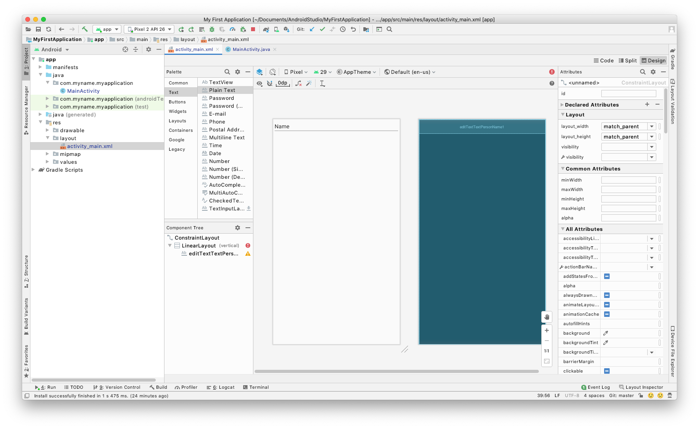
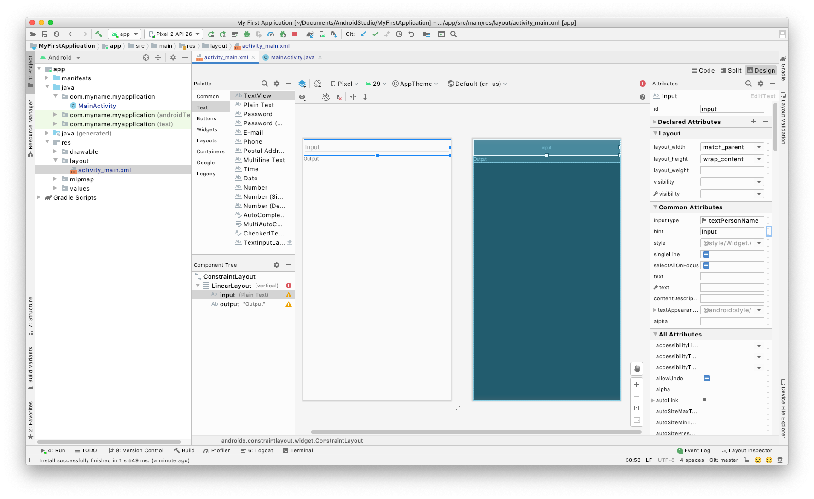
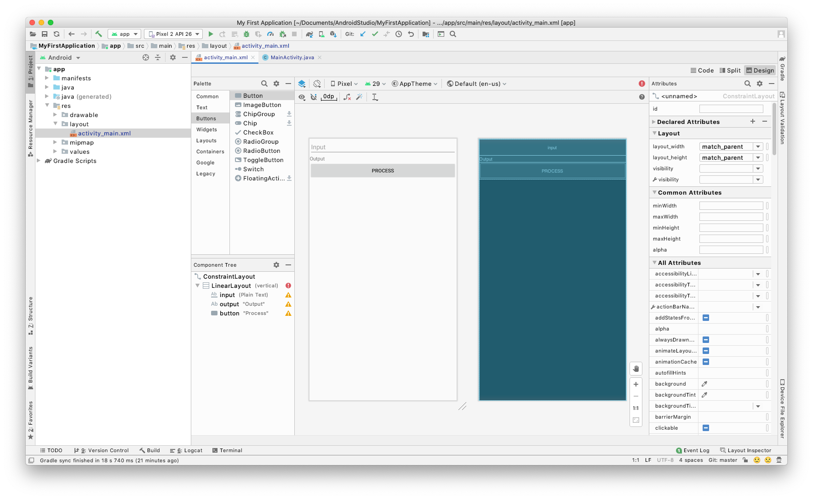
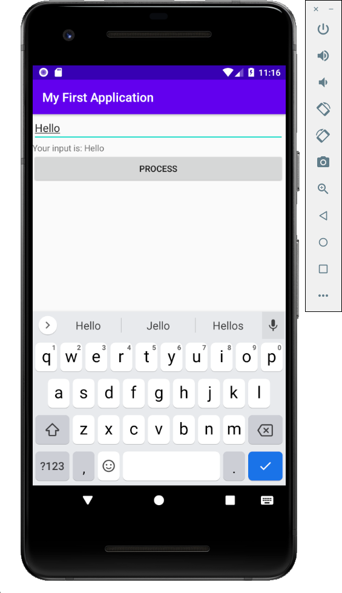

# Week 3 - Introduction to Methods, Enumerations, and User Input

Methods, enumerations, and user input.

## Corresponding Text

*Learn Java for Android Development*, pp. 107-124, 275-276

## Methods

As our programs become more complex, it becomes important to divide and
organize our code in a meaningful way.  For example, if we perform the same set
of steps by executing similar sets of statements, we might want to be able to
group those steps together and write them only once rather than writing them
over and over again.  Often we can do this sort of grouping using looping
statements. Another way to group parts of our code is by behavior.
**Behaviors** refer to some sequence of code that performs a certain task.  In
addition to this week's discussion, we'll talk more about behaviors when we
discuss classes and objects.

Java represents behavior using methods.  **Methods** are named blocks of code.
In your reading, you will see references to class methods and instance methods.
For now, we'll only be looking at class methods but we'll talk about both again
later. For the remainder of this week's discussion, method will technically
refer to class methods.

Before we start working with methods, let's look at the following code and
think of how we can improve it:

``` java
package com.myname.myapplication;

import androidx.appcompat.app.AppCompatActivity;

import android.os.Bundle;
import android.widget.TextView;

public class MainActivity extends AppCompatActivity {

    @Override
    protected void onCreate(Bundle savedInstanceState) {
        super.onCreate(savedInstanceState);
        setContentView(R.layout.activity_main);

        TextView output = (TextView) findViewById((R.id.output));
        StringBuilder builder = new StringBuilder();

        //convert Celsius to Fahrenheit using F = 1.8 * C + 32

        double celsiusLowTemperature = 0.0;
        double celsiusHighTemperature = 9.3;
        double fahrenheitLowTemperature = 1.8 * celsiusLowTemperature + 32;
        double fahrenheitHighTemperature = 1.8 * celsiusHighTemperature + 32;
        builder.append("The low will be " + fahrenheitLowTemperature
                + " and the high will be " + fahrenheitHighTemperature + ".");
        builder.append(System.lineSeparator());

        celsiusLowTemperature = -2.4;
        celsiusHighTemperature = 8.3;
        fahrenheitLowTemperature = 1.8 * celsiusLowTemperature + 32;
        fahrenheitHighTemperature = 1.8 * celsiusHighTemperature + 32;
        builder.append("The low will be " + fahrenheitLowTemperature
                + " and the high will be " + fahrenheitHighTemperature + ".");
        builder.append(System.lineSeparator());

        celsiusLowTemperature = 7.7;
        celsiusHighTemperature = 16.8;
        fahrenheitLowTemperature = 1.8 * celsiusLowTemperature + 32;
        fahrenheitHighTemperature = 1.8 * celsiusHighTemperature + 32;
        builder.append("The low will be " + fahrenheitLowTemperature
                + " and the high will be " + fahrenheitHighTemperature + ".");
        builder.append(System.lineSeparator());

        celsiusLowTemperature = 14.4;
        celsiusHighTemperature = 26.2;
        fahrenheitLowTemperature = 1.8 * celsiusLowTemperature + 32;
        fahrenheitHighTemperature = 1.8 * celsiusHighTemperature + 32;
        builder.append("The low will be " + fahrenheitLowTemperature
                + " and the high will be " + fahrenheitHighTemperature + ".");
        builder.append(System.lineSeparator());

        output.setText(builder);
    }
}
```

Here, we're converting some low and high temperatures for four days from
Celsius to Fahrenheit.  One way to improve this code is by using what we know
about loop statements.  For example, we can use a for loop.

``` java
package com.myname.myapplication;

import androidx.appcompat.app.AppCompatActivity;

import android.os.Bundle;
import android.widget.TextView;

public class MainActivity extends AppCompatActivity {

    @Override
    protected void onCreate(Bundle savedInstanceState) {
        super.onCreate(savedInstanceState);
        setContentView(R.layout.activity_main);

        TextView output = (TextView) findViewById((R.id.output));
        StringBuilder builder = new StringBuilder();

        //convert Celsius to Fahrenheit using F = 1.8 * C + 32

        double[] celsiusLowTemperatures = {0.0, -2.4, 7.7, 14.4};
        double[] celsiusHighTemperatures = {9.3, 8.3, 16.8, 26.3};
        double fahrenheitLowTemperature;
        double fahrenheitHighTemperature;

        for (int i = 0; i < celsiusLowTemperatures.length; i++) {
            fahrenheitLowTemperature = 1.8 * celsiusLowTemperatures[i] + 32;
            fahrenheitHighTemperature = 1.8 * celsiusHighTemperatures[i] + 32;
            builder.append("The low will be " + fahrenheitLowTemperature
                    + " and the high will be " + fahrenheitHighTemperature
                    + ".");
            builder.append(System.lineSeparator());
        }
        output.setText(builder);
    }
}
```

Using a for loop certainly made the code shorter and easier to read.  We can
still improve this code though.  Notice that we've basically written the same
calculation for converting Celsius to Fahrenheit.  Having the code for the
actual calculation written once would be an improvement.  One reason it would
be an improvement is that it makes the code easier to maintain.  Suppose we
made a mistake or what to change the calculation.  If the calculation was
written a single time, we'd only have to make the change in one place rather
than in multiple places.  But how can we do this?  We can use methods.

The syntax for declaring a method (specifically, a class method) is:

``` text
static return_type name(parameter_list) {
    statements_to_execute
}
```

A method (technically, a class method) starts with the reserved word *static*.
Next, the data type of the method's return value is given by *return_type*;
the return type is a primitive type, a reference type, or `void` when the
method does not return a value.  After the return type, the methods name is
specified.  Following the name and enclosed in parentheses is a list of
parameters, *parameter_list* that lists the kinds of of data items that are
passed to the method.  We'll talk about each of these parts in more detail
soon.  A method's name and the number, types, and order of its parameters are
known as the method's **signature**.  The reserved word *static*, the return
type, and the method's signature are known as the **method header**; the set
of statements within a method, *statements_to_execute*, are known as the
**method body**.

Let's look at how we can move the conversion of Celsius to Fahrenheit to a
method.  We're going to change the output of our program for now.

``` java
package com.myname.myapplication;

import androidx.appcompat.app.AppCompatActivity;

import android.os.Bundle;
import android.widget.TextView;

public class MainActivity extends AppCompatActivity {
    static void celsiusToFahrenheit(double celsiusValue, StringBuilder aBuilder) {
        double fahrenheitValue = 1.8 * celsiusValue + 32;
        aBuilder.append(celsiusValue + " degrees Celsius is equal to "
                + fahrenheitValue + " degrees Fahrenheit.");
        aBuilder.append(System.lineSeparator());
    }

    @Override
    protected void onCreate(Bundle savedInstanceState) {
        super.onCreate(savedInstanceState);
        setContentView(R.layout.activity_main);

        TextView output = (TextView) findViewById((R.id.output));
        StringBuilder builder = new StringBuilder();

        //convert Celsius to Fahrenheit using F = 9/5 * C + 32

        double[] celsiusLowTemperatures = {0.0, -2.4, 7.7, 14.4};
        double[] celsiusHighTemperatures = {9.3, 8.3, 16.8, 26.3};

        for (int i = 0; i < celsiusLowTemperatures.length; i++) {
            celsiusToFahrenheit(celsiusLowTemperatures[i], builder);
            celsiusToFahrenheit(celsiusHighTemperatures[i], builder);
        }

        output.setText(builder);
    }
}
```

We've created a method with the header
`static void celsiusToFahrenheit(double celsiusValue, StringBuilder aBuilder)`,
where `void` indicates that the method will not return a value,
`celsiusToFahrenheit` is the method's name, and `double celsiusValue` and
`StringBuilder aBuilder` are the method's parameters. The method's
name, parameter types, and parameter order,
`celsiusToFahrenheit(double, StringBuilder)`, are the method's signature.  The
body of the method consists of the calculation to convert a Celsius temperature
to Fahrenheit and a statement to display both the Celsius and Fahrenheit
values.  In the *main* method, we call, or make use of the
*celsiusToFahrenheit* method twice per iteration of the for loop, once to
convert a low temperature and again to convert a high temperature.  Notice the
syntax used to call or invoke the method: the methods name followed by
parentheses containing any values that take the place of the method's
parameters.  Here, instead of doing the temperature conversion in multiple
places, we've been able to write it once; if we ever need to change, it we only
have to change it in one place.  We've also captured the temperature-conversion
behavior in the method.

### Passing Arguments to Methods

In the previous example, our *celsiusToFahrenheit* method took two arguments,
*celsiusValue* and *aBuilder*.  A method can take zero or more arguments which
are specified within parentheses in the method header.  In the method header, a
parameter's type and its name within the method are specified.  The scope of
the parameter names is limited to the method body, that is, they generally
cannot be used outside the method.  In the previous example, the scope of
*celsiusValue* and *aBbulder* were limited to the *celsiusToFahrenheit* method
so any attempt to use them outside the method would have resulted in an error.
Similarly, variables declared within a method body have a scope limited to the
method.  The variable *fahrenheitValue*, is only accessible from within the
method.

Arguments are passed to functions in a style known as pass-by-value.
**Pass-by-value** passes the value of a variable to the method.  In the case
of primitive types, the value associated with the variable is passed to the
method. In the case of reference variables, the value associated with the
variable is a memory location, so that location is passed to the variable.
Let's look at an example of why this distinction is important.

``` java
package com.myname.myapplication;

import androidx.appcompat.app.AppCompatActivity;

import android.os.Bundle;
import android.widget.TextView;

public class MainActivity extends AppCompatActivity {
    static void methodExample(int integerValue, int[] integerArray) {
        integerValue += 1000;
        integerArray[0] = -integerArray[0];
    }

    @Override
    protected void onCreate(Bundle savedInstanceState) {
        super.onCreate(savedInstanceState);
        setContentView(R.layout.activity_main);

        TextView output = (TextView) findViewById((R.id.output));
        StringBuilder builder = new StringBuilder();

        int anInteger = 10;
        int anIntegerArray[] = {10, 20};

        builder.append("Initial integer: " + anInteger);
        builder.append(System.lineSeparator());
        builder.append("The first element of an integer array: " + anIntegerArray[0]);
        builder.append(System.lineSeparator());

        methodExample(anInteger, anIntegerArray);

        builder.append("Integer after method call: " + anInteger);
        builder.append(System.lineSeparator());
        builder.append("First element after method call: " + anIntegerArray[0]);
        builder.append(System.lineSeparator());

        output.setText(builder);
    }
}
```

The output of this program is:

``` text
Initial integer: 10
The first element of an integer array: 10
Integer after method call: 10
First element after method call: -10
```

If we follow the program's execution starting in *onCreate()*, we see that we
start with two variables: *anInteger*, an integer, and *anIntegerArray*, an
array of integers. Recall that the *int* type is a primitive type so it's value
is the associated integer assigned to it. Arrays are reference types so the
value stored in the variable is actually a location in memory where the array's
values are stored. When we call the *methodExample* method, the values of the
parameters, *anInteger* and *anIntegerArray*, are passed to the method - the
values are copied and made available to the method. Because *anInteger* is a
primitive data type, the copied value *10* is associated with the variable
*integerValue* in the method body. A change to *integerValue* doesn't affect
*anInteger*. The variable *anIntegerArray*, is different.  It's value is a
memory location of the integer values that constitute the array. Because
*integerArray* and *anIntegerArray* both have values that correspond to the
same memory location, changes to *anIntegerArray* within the method will affect
the *integerArray* variable outside the method.

While strings are reference types, they are immutable in Java. So, they don't
exhibit the same behavior as arrays.

### Returning a Value from a Method

In a previous example, our method signature header was
`static void celsiusToFahrenheit`.  Recall that `void` specified the return
type of the method.  In addition to being able to pass values into a method, we
can also have the method produce a value to the method's caller. This is done
using the `return` statement.  In addition to using the return statement, we
must also specify the appropriate return type when defining the method.  Let's
look at an example that includes a temperature conversion method that returns
the calculated value.

``` java
package com.myname.myapplication;

import androidx.appcompat.app.AppCompatActivity;

import android.os.Bundle;
import android.widget.TextView;

public class MainActivity extends AppCompatActivity {
    static double celsiusToFahrenheit(double celsiusValue) {
        double fahrenheitValue = 1.8 * celsiusValue + 32;
        return fahrenheitValue;
    }

    static void displayTemperatures(double[] celsiusLows,
                                    double[] celsiusHighs,
                                    StringBuilder aBuilder) {
        for (int i = 0; i < celsiusLows.length; i++) {
            double fahrenheitLow = celsiusToFahrenheit(celsiusLows[i]);
            double fahrenheitHigh = celsiusToFahrenheit(celsiusHighs[i]);

            aBuilder.append("The low will be " + fahrenheitLow
                    + " and the high will be " + fahrenheitHigh + ".");

            aBuilder.append(System.lineSeparator());
        }
    }

    @Override
    protected void onCreate(Bundle savedInstanceState) {
        super.onCreate(savedInstanceState);
        setContentView(R.layout.activity_main);

        TextView output = (TextView) findViewById((R.id.output));
        StringBuilder builder = new StringBuilder();

        double[] celsiusLowTemperatures = {0.0, -2.4, 7.7, 14.4};
        double[] celsiusHighTemperatures = {9.3, 8.3, 16.8, 26.3};

        displayTemperatures(celsiusLowTemperatures,
                celsiusHighTemperatures, builder);

        output.setText(builder);
    }
}
```

In this example, the method to convert units not only calculates the Fahrenheit
value but also returns that value.  This allows us to use the value outside the
method.  Notice that the method header now has the word `double` where `void`
appeared in previous methods.  This indicates that the method will return a
value and the data type of that value will be `double`.  The `return` statement
can also be used to control the flow of execution within a method.  This
example also demonstrates that we can call methods from other methods besides
the *onCreate()* method.

We can return any type from a method. In the next example, we create a method
that returns a boolean value.

``` java
package com.myname.myapplication;

import androidx.appcompat.app.AppCompatActivity;

import android.os.Bundle;
import android.widget.TextView;

public class MainActivity extends AppCompatActivity {
    static boolean willSnow(double temperature,
                            double probabilityPrecipitation) {
        return (temperature <= 32 && probabilityPrecipitation > 0.5);
    }

    static void displayLikelihood(double[] temps,
                                         double[] precipitation,
                                         StringBuilder aBuilder) {
        for (int i = 0; i < temps.length; i++) {
            String snowy = willSnow(temps[i], precipitation[i])
                    ? "likely" : "unlikely";

            aBuilder.append("When the temperature is " + temps[i]
                    + " and the probability of precipitation is "
                    + precipitation[i] + ", it is " + snowy + " to snow.");

            aBuilder.append(System.lineSeparator());
            aBuilder.append(System.lineSeparator());
        }
    }

    @Override
    protected void onCreate(Bundle savedInstanceState) {
        super.onCreate(savedInstanceState);
        setContentView(R.layout.activity_main);

        TextView output = (TextView) findViewById((R.id.output));
        StringBuilder builder = new StringBuilder();

        double[] temperatures = {28, 31, 46, 37};
        double[] probabilities = {.3, .9, .4, .7};

        displayLikelihood(temperatures, probabilities, builder);

        output.setText(builder);
    }
}
```

The return statement can also be used for flow control when the method's return
type is `void`.  This is done by simply using `return;` with no value.

### Method Overloading

Java allows us to define methods with the same names but with different
parameter lists.  This allows us to use the same name for a collection of
methods that exhibit the same behavior but use different types of data.

``` java
package com.myname.myapplication;

import androidx.appcompat.app.AppCompatActivity;

import android.os.Bundle;
import android.widget.TextView;

public class MainActivity extends AppCompatActivity {
    static int add(int a, int b) {
        return a + b;
    }

    static int add(int a, int b, int c) {
        return a + b + c;
    }

    static double add(double a, double b) {
        return a + b;
    }

    static String add(String a, String b) {
        return a + b;
    }

    @Override
    protected void onCreate(Bundle savedInstanceState) {
        super.onCreate(savedInstanceState);
        setContentView(R.layout.activity_main);

        TextView output = (TextView) findViewById((R.id.output));
        StringBuilder builder = new StringBuilder();

        builder.append("Adding two integers: 2, 3");
        builder.append(System.lineSeparator());
        int firstSum = add(2, 3);
        builder.append(firstSum);
        builder.append(System.lineSeparator());

        builder.append("Adding three integers: 2, 3, 4");
        builder.append(System.lineSeparator());
        int secondSum = add(2, 3, 4);
        builder.append(secondSum);
        builder.append(System.lineSeparator());

        builder.append("Adding two doubles: 2.0, 4.5");
        builder.append(System.lineSeparator());
        double thirdSum = add(2.0, 4.5);
        builder.append(thirdSum);
        builder.append(System.lineSeparator());

        builder.append("Adding two strings: Hello, World");
        builder.append(System.lineSeparator());
        String fourthSum = add("Hello", "World");
        builder.append(fourthSum);
        builder.append(System.lineSeparator());

        output.setText(builder);
    }
}
```

The output is:

``` text
Adding two integers: 2, 3
5
Adding three integers: 2, 3, 4
9
Adding two doubles: 2.0, 4.5
6.5
Adding two strings: Hello, World
HelloWorld
```

In this example, we created three methods that did something similar: added
numeric values and another that concatenated (or added) two strings.
Each was different in types or number of parameters they took.
Recall that the method signature is given by a method's name and the number,
type, and order of the method's parameters.  When defining methods, the
method's signature must be unique.  There are additional factors that affect
this but we will discuss them later.  For example, the following is not
valid:

``` java
package com.myname.myapplication;

import androidx.appcompat.app.AppCompatActivity;

import android.os.Bundle;
import android.widget.TextView;

public class MainActivity extends AppCompatActivity {
    static int add(int a, int b) {
        return a + b;
    }

    static long add(int c, int d) {
        return a + b;
    }

    @Override
    protected void onCreate(Bundle savedInstanceState) {
        super.onCreate(savedInstanceState);
        setContentView(R.layout.activity_main);

        TextView output = (TextView) findViewById((R.id.output));
        StringBuilder builder = new StringBuilder();

        builder.append("Adding two integers: 2, 3");
        builder.append(System.lineSeparator());

        int firstSum = add(2, 3);
        builder.append(firstSum);
        builder.append(System.lineSeparator());

        long secondSum = add(2,3);
        builder.append(secondSum);
        builder.append(System.lineSeparator());

        output.setText(builder);
    }
}
```

Even though they have different return types and names for parameters, the two
`add` methods above have the same method signatures.

## The Java Standard Library

The standard library is a collection of features including methods that are
included with Java for convenience.  As we continue to explore Java, we'll
make extensive use of the standard library.

An example of one method that might be of interest to us is one that allows us
to convert strings to integers.

``` java
package com.myname.myapplication;

import androidx.appcompat.app.AppCompatActivity;

import android.os.Bundle;
import android.widget.TextView;

public class MainActivity extends AppCompatActivity {
    @Override
    protected void onCreate(Bundle savedInstanceState) {
        super.onCreate(savedInstanceState);
        setContentView(R.layout.activity_main);

        TextView output = (TextView) findViewById((R.id.output));
        StringBuilder builder = new StringBuilder();

        String userInput = "1234";
        int intValue = Integer.parseInt(userInput);
        builder.append(intValue + 4321);
        builder.append(System.lineSeparator());

        output.setText(builder);
    }
}
```

The method `Integer.parseInt()` takes a string parameter and returns an int.
Be careful when using methods that convert from one type to another as errors
can occur.  We will talk about handling these errors later.

## Enumerations

Sometimes it's convenient to specify a set of related values as possible
values. An **enumeration** is a data type consisting of a set of named values
of the type.  The syntax for creating an enumeration in Java is:

``` java
enum name {value1, value2, ..., valueN};
```

where *name* is the name of the enumeration and each of *value1* through
*valueN* are the possible values associated with the enumeration.

``` java
package com.myname.myapplication;

import androidx.appcompat.app.AppCompatActivity;

import android.os.Bundle;
import android.widget.TextView;

public class MainActivity extends AppCompatActivity {
    enum DIRECTION {NORTH, WEST, EAST, SOUTH};

    static String describeWind(DIRECTION windDirection) {
        String description;

        switch (windDirection) {
            case NORTH:
                description = "The wind is blowing from the north.";
                break;
            case WEST:
                description = "The wind is blowing from the west.";
                break;
            case EAST:
                description = "The wind is blowing from the east.";
                break;
            case SOUTH:
                description = "The wind is blowing from the south.";
                break;
            default:
                description= "The wind is not blowing.";
        }

        return description;
    }

    @Override
    protected void onCreate(Bundle savedInstanceState) {
        super.onCreate(savedInstanceState);
        setContentView(R.layout.activity_main);

        TextView output = (TextView) findViewById((R.id.output));
        StringBuilder builder = new StringBuilder();

        DIRECTION measuredWindDirection = DIRECTION.EAST;
        builder.append(describeWind(measuredWindDirection));

        output.setText(builder);
    }
}
```

In this example, we define an enumeration of possible wind directions: north,
west, east, and south.  We also have a method that describes which direction
the wind is blowing depending on the argument's value.  We use a switch
statement that works with the enumeration's possible values.  While we could
have achieved the same effect using strings or integers with each direction
corresponding to a direction, the enumeration makes our code more readable and
maintainable. Because we've used an enumeration, we know precisely what values
are possible for variables like *measuredWindDirection*.

## Introduction to Packages

A **package** is a unique namespace that can contain classes and sub-packages.
Packages allow us to organize our code in meaningful ways similar to how
folders and subfolders let us organize files in general on a computer.

For example, consider the last code we ran.  Near the top, we have this line of
code:

``` java
package com.myname.myapplication
```

This tells Java that all the code in this file belongs to the
`com.myname.myapplication` package.

We can use code from other packages using the packages' names.  Consider this
example that sets the text of the *TextView* object to `Hello`.

``` java
package com.myname.myapplication;

import androidx.appcompat.app.AppCompatActivity;
import android.os.Bundle;

public class MainActivity extends AppCompatActivity {

    @Override
    protected void onCreate(Bundle savedInstanceState) {
        super.onCreate(savedInstanceState);
        setContentView(R.layout.activity_main);

        android.widget.TextView output =
                (android.widget.TextView) findViewById((R.id.output));

        output.setText("Hello");
    }
}
```

We've accessed the *TextView* class/type using it's full name including the
package it resides in by writing `android.widget.TextView`.  This is not
how we've been using *TextView* so far.  Instead, we can *import* the package
and class near the beginning of our code to tell Java exactly where to look
for the class or type we're using.  This allows us to avoid having to write the
full name of the class or type.

``` java
package com.myname.myapplication;

import androidx.appcompat.app.AppCompatActivity;
import android.os.Bundle;
import android.widget.TextView;

public class MainActivity extends AppCompatActivity {

    @Override
    protected void onCreate(Bundle savedInstanceState) {
        super.onCreate(savedInstanceState);
        setContentView(R.layout.activity_main);

        TextView output =
                (TextView) findViewById((R.id.output));

        output.setText("Hello");
    }
}
```

## User Input

To collect user input, we need to modify our layout.  Right now, the layout
contains one component, a *TextView* object used to display text.  We'll modify
the layout to include a *TextView* object, an *EditText* object, and a *Button*
object - the *EditText* object will allow us to collect input and the *Button*
will allow us to process the input. We'll also add a *LinearLayout* to organize
 the UI components.

To start modifying the UI, we first need to open the layout file,
`activity_main.xml`, in the `res/layout` folders. The layout contains the
single *EditText* object we've been using to display output.


Delete the existing *TextView*, the object with the text *Hello, World!*.  To
help organize our UI, we can use a variety of layout components - we'll use
a vertical *LinearLayout* which will allow us to stack our components
vertically.  To add the *LinearLayout*, select *Layouts* in the *Palette*
tool and drag and drop the *LinearLayout (vertical)* to the layout
preview.

Next, select *Text* from the *Palette* tool and drag and drop a *Plain Text*
item to the layout preview - this adds an *EditText* object to our layout.



Click the *EditText* item we just added and modify the following attributes to
have the listed values.

| Attribute |  Value  |
| --------- | ------- |
| *id*      | `input` |
| *hint*    | `Input` |
| *text*    | *Empty* |

From the *Palette* tool, drag and drop a *TextView* object below the existing
*EditText* object.  Modify its attributes to have the following values:

| Attribute |  Value   |
| --------- | -------- |
| *id*      | `output` |



Finally, drag and drop a *Button* object from the *Palette* tool below the
*TextView*.  Modify it's attributes to have the following values:

| Attribute |  Value  |
| --------- | ------- |
| *text*      | `Process` |



Near the top, right corner of the Android Studio window, you should an option
to toggle to view between *Code*, *Split*, and *Design*.  We've been working
in the design view.  If you select *Code*, you should see something similar to
the following XML that defines the layout.

``` xml
<?xml version="1.0" encoding="utf-8"?>
<androidx.constraintlayout.widget.ConstraintLayout xmlns:android="http://schemas.android.com/apk/res/android"
xmlns:app="http://schemas.android.com/apk/res-auto"
xmlns:tools="http://schemas.android.com/tools"
android:layout_width="match_parent"
android:layout_height="match_parent"
tools:context=".MainActivity">

<LinearLayout
    android:layout_width="409dp"
    android:layout_height="729dp"
    android:orientation="vertical"
    tools:layout_editor_absoluteX="1dp"
    tools:layout_editor_absoluteY="1dp">

    <EditText
        android:id="@+id/input"
        android:layout_width="match_parent"
        android:layout_height="wrap_content"
        android:ems="10"
        android:hint="Input"
        android:inputType="textPersonName" />

    <TextView
        android:id="@+id/output"
        android:layout_width="match_parent"
        android:layout_height="wrap_content"
        android:text="Output" />

    <Button
        android:id="@+id/button"
        android:layout_width="match_parent"
        android:layout_height="wrap_content"
        android:text="Process" />
</LinearLayout>
</androidx.constraintlayout.widget.ConstraintLayout>
```

In order to use the *EditText* and *Button* objects, we'll need to modify our
code. The Android framework relies on **events** to process user interaction
with the interface.  For example, when a user taps on a button, it creates a
*click* event. An event is handled by a **listener** that captures details of
the event and executes some specified code.  To process the *click* event
associated with the *Button* object, we have to assign a listener using the
*Button.setOnClickListener()* method.  As an argument to the method, we have
to specify an *OnClickLister* object.  We typically do this by creating an
**anonymous class** with an *OnClick()* method.  We'll talk more about
events, listeners, and anonymous classes later in the course.  For now,
use the following code in *MainActivity.java*.

``` java
package com.myname.myapplication;

import androidx.appcompat.app.AppCompatActivity;

import android.os.Bundle;
import android.view.View;
import android.widget.Button;
import android.widget.EditText;
import android.widget.TextView;

public class MainActivity extends AppCompatActivity {
    @Override
    protected void onCreate(Bundle savedInstanceState) {
        super.onCreate(savedInstanceState);
        setContentView(R.layout.activity_main);

        final TextView output = (TextView) findViewById((R.id.output));
        final EditText input = (EditText) findViewById(R.id.input);
        Button button = (Button) findViewById(R.id.button);

        button.setOnClickListener(new View.OnClickListener() {
            @Override
            public void onClick(View view) {
                output.setText("Your input is: " + input.getText());
            }
        });
    }
}
```

If you run the app, you can enter text in the input *EditText* and click the
process *Button*.  The text in the *TextView* should update to include the
text you entered.



## Exercise

Write a program that prompts a user to enter a temperature in Fahrenheit,
converts it to Celsius, and displays the Celsius temperature.
