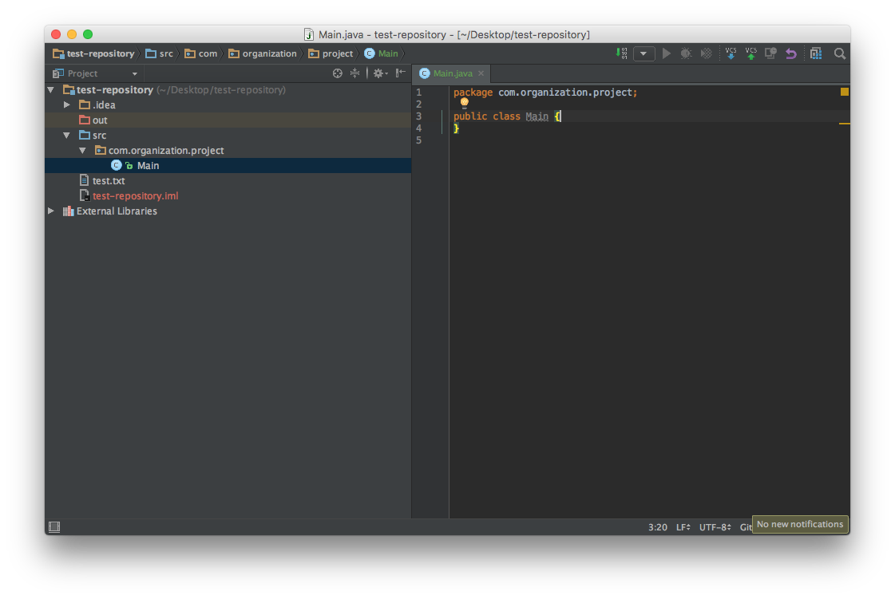

# Week 4 - Collection Types

## Corresponding Text
*Learn Java for Android Development*, pp. 305-318, 411-425, 448-456

## Collaborating using GitHub
In addition to providing a publically-accessible place to host our
repositories, GitHub also provides functionality that is helpful when working
with others.  There are several ways multiple people can work together when
using Git and GitHub.  The simplest way is for everyone to pull from and
push to the same repository directly.  Another way to collaborate is by
creating branches within a repository where one branch is dedicated to a
specific feature or to a specific developer and changes made to these branches
are ultimately merged into another branch that consists of the code that is
used for the release or final version of the software.  A third method of
collaboration is to use GitHub's *fork* and *pull request* features.

### Forks
A **fork** of a repository is simply a copy. When you fork someone else's
repository you are simply creating a copy of that repository in your own
collection of repositories.  When forking a repository, GitHub keeps track
of the **upstream**, or original, repository.  To fork a repository, simply
browse to the repository's page on GitHub and click the *fork* button near
the upper right of the page.


If you belong to any organizations on GitHub, GitHub will ask you if you'd like
to fork the repository to your personal account or the organization's.  For our
class, choose your personal account. After a few moments, you should a copy of
the repository in your account.

In these examples, we'll be working with repository with few files.  The
repository you fork might be more complicated.

### Importing a project into IntelliJ
The first time we load a project into IntelliJ, we can choose *Check out from
Version Control* and *GitHub* from the start up screen.  If you have a project
open, you can choose these options from the *File -> New* menus. We can then
choose the appropriate repository and local destination to store the
repository. IntelliJ will prompt you to create a new project using the
repository.  When prompted to choose files to add, make sure the `.idea` and
any files ending in `.iml` are not selected - these files are unique to your
installation of IntelliJ and will cause conflicts if you share them in a
repository that is used for collaboration.

If there are no Java files in the repository, create a new folder to store
source code.  To do this, right-click on the top-level repository folder and
select *New* followed by *Directory*.  The new directory should have a name
like *src*.  After creating the directory, right-click the new directory and
select *Mark Directory As* and *Sources Root*.  This indicates to IntelliJ that
our source code will be stored in this folder.  In the repository directory,
create another directory named something like *out* to store our output files.

Next, we can create a new package by right-clicking on the source directory we
created and selecting *New* and *Package*.  Give the new package a name like
*com.organization.project*.  In this new package, create a new Java class by
right-clicking on the package and selecting *New* and *Java Class*.  When
prompted to add the new class to the repository, select yes.  If no SDK is
defined, choose *Setup SDK* and choose the JDK.  You should now have a project
that looks like this:



Let's add some code so that our *Main.java* file looks like this:

```java
package com.organization.project;

public class Main {
    public static void main(String args[]) {
        System.out.println("Hello, forked repo!");
    }
}
```

### .gitignore
Git provides the option of specifying a list of files or patterns of files that
should not be added to our repository.  This file is named `.gitignore` and is
stored in the root directory of the repository.  To add it to our fork, we can
right-click on the repository folder in IntelliJ and click *New* and *File*.  
It is important that the file be named `.gitignore`.  After you create the
file, IntelliJ will ask if the file should be added to the repository; select
*Yes*.  You might have the option to install a plugin for use with .gitignore
files; you can install it if you'd like.  

We can add IntelliJ-generated files to our .gitignore file to prevent adding
these to the repository. Add the following to your .gitignore file:

```
.idea/
*.iml
```

Now, we can add, commit, and push our changes to GitHub.  Select *VCS*, *Git*,
and *Commit File...* from the menus.  Make sure both the new *Main.java* and
*.gitignore* files are selected, enter a commit message, and click *Commit*.
Next, push the code to GitHub by selecting *VCS*, *Git*, *Push*.  You should
now be able to see your changes on the GitHub page of your fork of the repo.  

### Pull Requests
After we've made changes to our fork, we can request that the owner of the
original repository incorporate the changes with their copy.  To do this, we
create a **pull request** on GitHub.  To create the pull request, browse to the
GitHub page for your fork and click the *New pull request* button.


GitHub will load a page summarizing the changes made to your fork that will
constitute the pull request.  Notice the comparison settings.


On the left, we have the repository to which changes will be made if the pull
request is accepted.  On the right we have the source of the changes that make
up the pull request.

Once we click *Create pull request*, we have the option to summarize our
changes and create a comment.  Clicking *Create pull request* again will create
the pull request and give the repository owner a chance to accept or reject
our request.  If the owner merges our pull request, our changes will be
incorporated in the original repository.

We can also use pull requests when changes are made to the original repository
and we'd like to update our fork to include those changes.

On the GitHub page for our fork, we can click "New pull request".  Notice that
if our fork doesn't have any new changes, the page indicates that there isn't
anything to compare.  We have to change what is being compared.  Click the
*switching the base* link to change the comparison.  


Now, the *base fork*, the destination of the changes, is our own repo and the
*head fork*, the source of the changes, is the original repo.  Create the
pull request.  Because this is an update to a repo we own, we are able to merge
the pull request by clicking *Merge pull request*.


You and people you work with can repeat variations of this process to work
together on a project.

## Primitive Type Wrappers
### Boolean
### Character
### Float and Double
### Integer, Long, Short, and Byte

## Exploring String

## Lists
### ArrayList
### LinkedList

## Sets
### TreeSet
### HashSet
### Sorted Sets

## Maps
### TreeMap
### HashMap
### Sorted Maps

## Exercise
