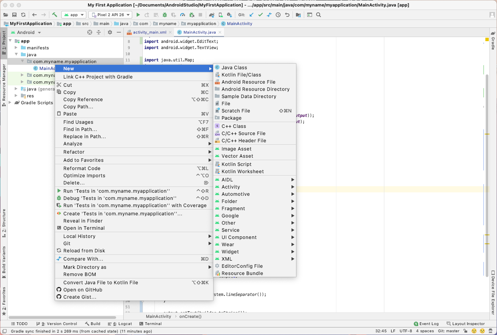

# Week 5 - Classes and Objects

An introduction to classes and objects

## Corresponding Text

*Learn Java for Android Development*, pp. 89-107, 124-137

## Classes and Objects

Last week, we discussed working with objects in Java by creating instances of
classes in the standard library.  For example, we created an ArrayList using
code like `new ArrayList<String>()`.  We described classes as defining the
structure of the objects created from them, describing data attributes
representing state and methods representing behaviors related to that state.
In Java, like other object-oriented languages, we can create our own classes.

### Declaring Classes

In all the examples we've worked with so far, we've relied on a class named
*MainActivity* specified by code that looks like this:

``` java
public class MainActivity {
    //additional Java code
}
```

This code declares a class named *MainActivity* and the code associated with
it is written between the two braces. The minimal syntax required for declaring
a class is:

``` java
class Name {
    //class member declarations
}
```

A class is declared by first using the reserved word *class* followed by the
name of the class. The name of the class is often written with the first
letter of every word capitalized (compare this to methods where the first
letter of the first word is lower case and the first letter of subsequent words
is capitalized).  After the name, we specify the code associated with the
class, defining its attributes and methods, between a set of braces.  Again,
this is the minimally required syntax and we'll build upon it as we learn about
additional language features.

Continuing with the weather theme of previous weeks, let's create a class
that represents weather data at a specific time for a specific location.

The convention in Java is that each class should be stored in its own file.
Before we create a new class, let's create a file for that class.  In
Android Studio, expand the folders in the *Project* view until you see
`app/java/com.myname.myapplication` - *myname* might be your name. Right-click
on `com.myname.myapplication`, select *New*, then select *Java Class*.



When prompted for a name, enter `WeatherData`.  When prompted to add the file
to Git, click *Add*.

Notice that Android studio automatically added some code to the new class
including the package it belongs to and the minimal code required to create
a class.

---

WeatherData.java

``` java
package com.myname.myapplication;

public class WeatherData {
}
```

---

We now have two classes in two files: *WeatherData* and *MainActivity*.  Recall
that our code begins executing in the the *MainActivity.onCreate()* method.
We'll continue to use this as the starting point of our code. We can create
instances of *WeatherData* in the *MainActivity.onCreate()* method but there's
not much to our WeatherData class right now besides its name.

### Constructing Objects

Often when we create an instance of a class, there is some code that we'd like
to execute to do things like set an instance's state.  One way we can do this
is by using a constructor.  A class's **constructor** is a method used to
allocate memory for an object when the *new* operator is used to create an
instance. Once memory is allocated, the constructor is called (or invoked) to
initialize the object.  Once execution of the constructor is complete, the new
operator returns the memory location of the newly created object (classes
define reference types).  The constructor doesn't have a name itself but uses
the name of the class that it belongs to. When declaring a constructor,
the class's name is followed by parentheses containing a comma-separated
parameter list that can be used when the constructor is called.  Let's look
at an example.

---

WeatherData.java

``` java
package com.myname.myapplication;

import android.widget.TextView;

public class WeatherData {
    // constructor
    WeatherData(TextView textView, String city, double temp) {
        StringBuilder builder = new StringBuilder();

        builder.append("WeatherData city: " + city);
        builder.append(System.lineSeparator());

        builder.append("WeatherData temperature: " + temperature);
        builder.append(System.lineSeparator());

        textView.append(builder.toString());
    }
}
```

---

MainActivity.java

``` java
package com.myname.myapplication;

import androidx.appcompat.app.AppCompatActivity;

import android.os.Bundle;
import android.view.View;
import android.widget.TextView;

public class MainActivity extends AppCompatActivity {
    @Override
    protected void onCreate(Bundle savedInstanceState) {
        super.onCreate(savedInstanceState);
        setContentView(R.layout.activity_main);

        final TextView output = (TextView) findViewById((R.id.output));

        // new instance
        WeatherData weatherData = new WeatherData(output, "Columbus", 40);

    }
}
```

---

If you run this program, the output should be:

``` text
WeatherData city: Columbus
WeatherData temperature: 40.0
```

We've added a constructor to our WeatherData class.  After indicating that
the method is a constructor by using the class's name, we specified that
the constructor took four parameters: a TextView, a string, and two doubles.
The constructor then displayed some information using the parameters.  When we
ran the program, execution began in in the *MainActivity* class with the
*onCreate()* method. In this method, we constructed a new instance of the
*WeatherData* class using the *new* operator.  The *new* operator first
allocated sufficient memory for a *WeatherData* object, then called the
constructor with the values we specified, and finally returned the memory
location of the new object which was stored in the *weatherData* variable.

What does the *new* operator do when we don't declare a constructor?  Java
created a default constructor.  A **default constructor** is used to when no
other constructor is specified.  It takes no arguments.  The default
constructor for the *WeatherData* class would be equivalent to

---

WeatherData.java

``` java
package com.myname.myapplication;

import android.widget.TextView;

public class WeatherData {
    WeatherData() {}
}
```

The default constructor doesn't execute any additional code when an instance
is created. Once we explicitly define a constructor, the default constructor is
no longer available.  Java allows us to specify multiple constructors, so we
could add the default constructor (and others) if we'd like.

---

WeatherData.java

``` java
package com.myname.myapplication;

import android.widget.TextView;

public class WeatherData {
    // constructor
    WeatherData() {}

    //constructor
    WeatherData(TextView textView, String city) {
        StringBuilder builder = new StringBuilder();

        builder.append("WeatherData city: " + city);
        builder.append(System.lineSeparator());

        textView.append(builder.toString());

    }

    //constructor
    WeatherData(TextView textView, String city, double temp) {
        StringBuilder builder = new StringBuilder();

        builder.append("WeatherData city: " + city);
        builder.append(System.lineSeparator());

        builder.append("WeatherData temperature: " + temp);
        builder.append(System.lineSeparator());

        textView.append(builder.toString());
    }
}
```

---

MainActivity.java

``` java
package com.myname.myapplication;

import androidx.appcompat.app.AppCompatActivity;

import android.os.Bundle;
import android.view.View;
import android.widget.TextView;

public class MainActivity extends AppCompatActivity {
    @Override
    protected void onCreate(Bundle savedInstanceState) {
        super.onCreate(savedInstanceState);
        setContentView(R.layout.activity_main);

        final TextView output = (TextView) findViewById((R.id.output));

        WeatherData weatherData1 = new WeatherData(output, "Columbus", 40, 45);
        WeatherData weatherData2 = new WeatherData(output, "Cleveland");
        WeatherData weatherData3 = new WeatherData();  // nothing displayed
    }
}
```

---

In this example, we have two constructors for the WeatherData class: one that
takes only a TextView parameter and a String parameter, and one that takes a
TextView parameter, a String parameter, and two double parameters.
Constructors, like methods, must have unique signatures.

### Encapsulation

Previously, we described classes as combining related state information
(data attributes) with behaviors that make use of or modify that state
information. Combining state information with related behaviors in one data
structure is known as **encapsulation**.  Encapsulation is also sometimes used
to describe restrictions on access to behaviors and state information to avoid
misuse or interference.  We'll begin by looking at how we define behaviors and
state information and then look at restricting access to these items.

#### Fields

A class field stores an attribute that is associated with a class.  A class
field is shared by all objects created by the class (using the new operator).
If one object modifies a class field, another object created from the same
class will "see" the new value.

Within a class declaration, a class field is declared using the following
syntax:

``` java
static type_name variable_name [ = expression ] ;
```

A class field is specified using the reserved word *static* followed by the
data type of the field, the name of the field, and an initial value, which is
optional.  If a value is specified, we call the value the class field
initializer. If no initial value is specified, the field is initialized to 0,
0.0, false, null, etc, depending on the. field's type.

In our WeatherData class, we can add class fields for values that we would want
to share with all objects created from the class.

We can effectively make a class field a constant by using the reserved word
*final*.  This will prevent changes to the field.  A convention is to write
variable names with all capital letters when they represent constants.

In the following example, we'll also create a new method in the
*MainActivity()* class named *addText()*. This method combines the steps of
appending text to a StringBuilder and adding a line separator so we don't have
to repeatedly add the line separator ourselves.

---

WeatherData.java

``` java
package com.myname.myapplication;

public class WeatherData {
    // class fields
    final static String TEMP_UNIT = "F";
    final static String PRECIPITATION_UNIT = "%";
    final static int FREEZING_TEMP = 32;

    static int counter = 0;

    // constructor
    WeatherData(String city, double temperature, double precipitation) {
        counter++;
    }
}
```

---

MainActivity.java

``` java
package com.myname.myapplication;

import androidx.appcompat.app.AppCompatActivity;

import android.os.Bundle;
import android.view.View;
import android.widget.TextView;

public class MainActivity extends AppCompatActivity {
    public void addText(StringBuilder builder, String text){
        builder.append(text);
        builder.append(System.lineSeparator());
    }

    @Override
    protected void onCreate(Bundle savedInstanceState) {
        super.onCreate(savedInstanceState);
        setContentView(R.layout.activity_main);

        final TextView output = (TextView) findViewById((R.id.output));
        StringBuilder builder = new StringBuilder();

        addText(builder,"Temp unit: " + WeatherData.TEMP_UNIT);
        addText(builder,"Counter: " + WeatherData.counter);

        WeatherData columbus = new WeatherData("Columbus", 50, 30);
        addText(builder, "Counter: " + WeatherData.counter);

        WeatherData cleveland = new WeatherData("Cleveland", 45, 30);
        addText(builder, "Counter: " + WeatherData.counter);

        addText(builder, "Counter: " + columbus.counter);
        addText(builder, "Counter: " + cleveland.counter);

        output.setText(builder.toString());
    }
}
```

In this example, we've added five fields *TEMP_UNIT*, *PRECIPITATION_UNIT*,
*FREEZING_TEMP*, and *counter*.  The first four are marked final so they will
act like constants. If you run this example, the output should be:

``` text
Temp unit: F
Counter: 0
Counter: 1
Counter: 2
Counter: 2
Counter: 2
```

Notice that the value of *counter* increases each time a WeatherData object
is created.  This is consistent with the code in the constructor.  Each
WeatherData object also has access to the updated value since *counter* is
a class field.  While we were able to use the objects we created in
*onCreate()* to access the counter class field (`cleveland.counter` and
`columbus.counter`), we typically use the class name to access a class field
(`WeatherData.counter`).

An **instance field** stores an attribute associated with an object where each
instance of a class maintains a separate value. The syntax for the declaration
is:

``` java
type_name variable_name [ = expression ];
```

Here, *type_name* is the data type of the instance field, *variable_name* is
the name of the field, and *expression* is the optional value to set the field
to.  If an initial value is specified by *expression*, we call the value the
*instance field initializer*.  If no initial value is specified, the value
will be set to default value, depending on the type, when an instance is
created.  Notice that the primary difference between an instance field and a
class field is that a class field requires the use of the reserved word
*static*.

Let's add some instance fields to our WeatherData class.

---

WeatherData.java

``` java
package com.myname.myapplication;

class WeatherData {
    // class fields
    final static String TEMP_UNIT = "F";
    final static String PRECIPITATION_UNIT = "%";
    final static int FREEZING_TEMP = 32;

    // instance fields
    String cityName;
    double temperature;
    double precipitation;

    // constructor
    WeatherData(String city, double temperature, double precipitation) {
        cityName = city;
        this.temperature = temperature;
        this.precipitation = precipitation;
    }
}
```

---

MainActivity.java

``` java
package com.myname.myapplication;

import androidx.appcompat.app.AppCompatActivity;

import android.os.Bundle;
import android.view.View;
import android.widget.TextView;

public class MainActivity extends AppCompatActivity {
    public void addText(StringBuilder builder, String text){
        builder.append(text);
        builder.append(System.lineSeparator());
    }

    @Override
    protected void onCreate(Bundle savedInstanceState) {
        super.onCreate(savedInstanceState);
        setContentView(R.layout.activity_main);

        final TextView output = (TextView) findViewById((R.id.output));
        StringBuilder builder = new StringBuilder();

        WeatherData columbus = new WeatherData("Columbus", 50, 30);
        addText(builder, "City name: " + columbus.cityName);
        addText(builder, "Temperature: " + columbus.temperature + WeatherData.TEMP_UNIT);
        addText(builder, "Chance of precipitation: " + columbus.precipitation
                + WeatherData.PRECIPITATION_UNIT);

        output.setText(builder.toString());
    }
}
```

---

If we run this program, the output is:

``` text
City name: Columbus
Temperature: 50.0F
Chance of precipitation: 30.0%
```

After declaring and initializing the class fields, we declared four instance
methods: *cityName*, *temperature*, and *precipitation*.  In the
constructor, we assign values to these fields using the values passed to the
constructor.  Notice the use of *this* when the field name was the same
as the parameter name.  *this* is a reference to the current instance of a
class that we're working with and allows us to be explicit when accessing the
instance field.  If we had written `temperature = temperature` instead of
`this.temperature = temperature`, Java would assume that we were reassigning
the value of the parameter *temperature* to itself.  So, we have to be explicit
and use *this*.

#### Methods

We've explored class methods in an earlier lecture.  Recall that methods can be
used to represent behavior.  Behavior associated with a class can be written
as class methods.  Class methods, like class fields, can be accessed using the
class's name and without creating an instance.  While class methods can
access and modify class fields, the cannot access or modify instance fields.

Recall that class methods have the following syntax:

``` java
static return_type name(parameter_list) {
    //statements to execute
}
```

where *return_type* is the data type of any value returned by the method
(*void* if no value is returned), *name* is the method's name, and
*parameter_list* is a list of comma-separated types and names for values
passed to the method.  Class methods require the reserved word *static* be
a part of their method headers.

Let's add some class methods to our WeatherData class.

---

WeatherData.java

``` java
package com.myname.myapplication;

class WeatherData {
    // class fields
    final static String TEMP_UNIT = "F";
    final static String PRECIPITATION_UNIT = "%";
    final static int FREEZING_TEMP = 32;

    // instance fields
    String cityName;
    double temperature;
    double precipitation;

    // constructor
    WeatherData(String city, double temperature, double precipitation) {
        cityName = city;
        this.temperature = temperature;
        this.precipitation = precipitation;
    }

    // class methods
    static double tempFtoC(double fahrenheit) {
        return 0.56 * (fahrenheit - 32);
    }

    static double tempCtoF(double celsius) {
        return 1.8 * celsius + 32;
    }

    static String getFreezingTemp() {
        return FREEZING_TEMP + TEMP_UNIT;
    }
}
```

---

MainActivity.java

``` java
package com.myname.myapplication;

import androidx.appcompat.app.AppCompatActivity;

import android.os.Bundle;
import android.view.View;
import android.widget.TextView;

public class MainActivity extends AppCompatActivity {
    public void addText(StringBuilder builder, String text){
        builder.append(text);
        builder.append(System.lineSeparator());
    }

    @Override
    protected void onCreate(Bundle savedInstanceState) {
        super.onCreate(savedInstanceState);
        setContentView(R.layout.activity_main);

        final TextView output = (TextView) findViewById((R.id.output));
        StringBuilder builder = new StringBuilder();

        String temp1 = String.valueOf(WeatherData.tempCtoF(100));
        addText(builder, temp1);

        String temp2 = String.valueOf(WeatherData.tempFtoC(32));
        addText(builder, temp2);

        addText(builder, WeatherData.getFreezingTemp());

        output.setText(builder.toString());
    }
}
```

We've added three class methods: *tempFtoC*, *tempCtoF*, and
*getFreezingTemp*.  Notice that none of these class methods access or modify
instance fields but *getFreezingTemp* does access two class fields.  Also,
when we access class fields from within the class, we can drop the class name
as long as what we are trying to access is unambiguous; if it is ambiguous, we
have to use the class name like `WeatherData.FREEZING_TEMP`. We did not have
to create an instance of the WeatherData class using *new* to use the class
methods.

When we wanted to display the value returned by the *WeatherData.tempCtoF()*
and *WeatherData.tempFtoC()* methods, we had to convert the value from
a double to a String since the *MainActivity.addText()* method requires a
string as a parameter. To do this conversion, we relied on a class method
of the String class, specifically *String.valueOf()*.

An **instance method** represents a behavior associated with an object and
can access/modify an object's instance fields.

The syntax for declaring an instance method is:

``` java
return_type name(parameter_list) {
    //statements to execute
}
```

The key difference in the declaration between a class and instance method is
the use of *static* for class methods and its absence with instance methods.
Like a class method, the method's signature is given by the method's name and
the number, order, and types of the the parameters in *parameter_list*.  Class
and instance methods must be unique in their classes based on their signatures.

Let's add some instance methods to our program.

---

WeatherData.java

``` java
package com.myname.myapplication;

class WeatherData {
    // class fields
    final static String TEMP_UNIT = "F";
    final static String PRECIPITATION_UNIT = "%";
    final static int FREEZING_TEMP = 32;

    // instance fields
    String cityName;
    double temperature;
    double precipitation;

    // constructor
    WeatherData(String city, double temperature, double precipitation) {
        cityName = city;
        this.temperature = temperature;
        this.precipitation = precipitation;
    }

    // class methods
    static double tempFtoC(double fahrenheit) {
        return 0.56 * (fahrenheit - 32);
    }

    static double tempCtoF(double celsius) {
        return 1.8 * celsius + 32;
    }

    static String getFreezingTemp() {
        return FREEZING_TEMP + TEMP_UNIT;
    }

    // instance methods
    boolean willSnow() {
        return (temperature <= FREEZING_TEMP) && (precipitation >= 50);
    }

    String getWeatherReport() {
        String temp = temperature + TEMP_UNIT;
        String precip = precipitation + PRECIPITATION_UNIT;
        String snowLikely = willSnow() ? "likely" : "unlikely";

        return ("The current temperature in " + cityName + " is " + temp
                + ". The current chance of precipitation is " + precip
                + ". It is " + snowLikely + " to snow.");
    }
}
```

---

MainActivity.java

``` java
package com.myname.myapplication;

import androidx.appcompat.app.AppCompatActivity;

import android.os.Bundle;
import android.view.View;
import android.widget.TextView;

public class MainActivity extends AppCompatActivity {
    public void addText(StringBuilder builder, String text){
        builder.append(text);
        builder.append(System.lineSeparator());
    }

    @Override
    protected void onCreate(Bundle savedInstanceState) {
        super.onCreate(savedInstanceState);
        setContentView(R.layout.activity_main);

        final TextView output = (TextView) findViewById((R.id.output));
        StringBuilder builder = new StringBuilder();

        WeatherData columbus = new WeatherData("Columbus", 30, 75);

        addText(builder, columbus.getWeatherReport());

        output.setText(builder.toString());
    }
}
```

We've added two instance methods: *willSnow* and *getWeatherReport*.  The
*willSnow* instance method returns a boolean value that depends on the value
of the instance fields *temperature* and *precipitation*.  The
*displayWeatherReport* makes use of class fields, instance fields, and another
instance method.  The output of the program is:

`The current temperature in Columbus is 30.0F. The current chance of precipitation is 75.0%. It is likely to snow.`

### Access Control

A class exposes an *interface*, constructors, methods, and fields that can be
accessed from outside the class.  An interface acts like a contract between a
class and other objects that might communicate with it or instances of it.  In
some ways, the contract is an agreement that the class won't change the methods
and fields that other things depend on.

A class also provides an *implementation* that consists of code that supports
the interface including helper methods that assist exposed methods but probably
shouldn't be publicly accessible themselves. Hiding the implementation details
makes it easier to make changes to code - we only have to make sure that the
interface remains the same to avoid breaking code that uses our classes but we
are free to make modifications to the implementation.

Java provides four levels of control for methods and fields: *public*,
*protected*, *private*, and *package-private*. We can indicate that a method
or field is *public*, *protected*, or *private* by prefixing the declaration
with `public`, `protected`, or `private`.

A field, method, or constructor that is declared **public** is accessible from
anywhere.  Classes can also be declared public and public classes must be
declared in files whose names match the classes' names.

A **protected** field or method is accessible from all classes in the same
package as the the field's or method's class as well as any subclasses of the
class. We'll talk more about subclasses later.

A **private** field or method cannot be accessed from outside the class in
which it is declared.

If no access control is specified, the method, field, or class is
**package-private**, meaning that it is only accessible to classes within the
same package but not any classes (including subclasses) in other packages.

Often, instance fields are declared *private* and special methods known as
*getters* and *setters* are defined for accessing or modifying their values.
Usually, class fields are declared *public* but can be made private to hide
unnecessary details.

Let's declare the access control levels of our fields and methods in
WeatherData and create getters and setters for the instance fields.

---

WeatherData.java

``` java
package com.myname.myapplication;

class WeatherData {
    // class fields
    private final static String TEMP_UNIT = "F";
    private final static String PRECIPITATION_UNIT = "%";
    private final static int FREEZING_TEMP = 32;

    // instance fields
    private String cityName;
    private double temperature;
    private double precipitation;

    // getters and setters
    public String getCityName() {
        return cityName;
    }

    public void setCityName(String cityName) {
        this.cityName = cityName;
    }

    public double getTemperature() {
        return temperature;
    }

    public void setTemperature(double temperature) {
        this.temperature = temperature;
    }

    public double getPrecipitation() {
        return precipitation;
    }

    public void setPrecipitation(double precipitation) {
        this.precipitation = precipitation;
    }

    // constructors
    public WeatherData() {}

    public WeatherData(String city, double temperature, double precipitation) {
        cityName = city;
        this.temperature = temperature;
        this.precipitation = precipitation;
    }

    // class methods
    public static double tempFtoC(double fahrenheit) {
        return 0.56 * (fahrenheit - 32);
    }

    public static double tempCtoF(double celsius) {
        return 1.8 * celsius + 32;
    }

    public static String getFreezingTemp() {
        return FREEZING_TEMP + TEMP_UNIT;
    }

    // instance methods
    private boolean willSnow() {
        return (temperature <= FREEZING_TEMP) && (precipitation >= 50);
    }

    public String getWeatherReport() {
        String temp = temperature + TEMP_UNIT;
        String precip = precipitation + PRECIPITATION_UNIT;
        String snowLikely = willSnow() ? "likely" : "unlikely";

        return ("The current temperature in " + cityName + " is " + temp
                + ". The current chance of precipitation is " + precip
                + ". It is " + snowLikely + " to snow.");
    }
}
```

---

MainActivity.java

``` java
package com.myname.myapplication;

import androidx.appcompat.app.AppCompatActivity;

import android.os.Bundle;
import android.view.View;
import android.widget.TextView;

public class MainActivity extends AppCompatActivity {
    public void addText(StringBuilder builder, String text){
        builder.append(text);
        builder.append(System.lineSeparator());
    }

    @Override
    protected void onCreate(Bundle savedInstanceState) {
        super.onCreate(savedInstanceState);
        setContentView(R.layout.activity_main);

        final TextView output = (TextView) findViewById((R.id.output));
        StringBuilder builder = new StringBuilder();

        WeatherData columbus = new WeatherData();
        columbus.setCityName("Columbus");
        columbus.setTemperature(30);
        columbus.setPrecipitation(75);

        addText(builder, columbus.getWeatherReport());

        output.setText(builder.toString());
    }
}
```

---

We've made a number of changes but the output should be the same as before.
First, we marked the class fields specifying constant values as *private*.  We
also set all the instance fields to private.  In order to enable code outside
the class to retrieve or alter the values of the instance fields, we created
getters and setters and marked these as *public*.  All the methods with the
execption of *willSnow()* were marked as private and can be accessed outside
the class.  The *willSnow()* method is a helper method for the
*getWeatherReport()* method so we mark it as *private*. This indicates that we
only allow its use within the *WeatherData* class.

We've also add a constructor that takes no parameters. This allows us to create
an instance of the class and later set the city name, the temperature, and the
chance of precipitation using the setters.

We can quickly create getters and setters in Android Studio by right-clicking
in the area where a class's code is displayed, clicking *Generate...*, clicking
*Getter and Setter*, selecting the appropriate fields, and clicking *OK*.

What if we wanted to perform a check on the value the specified for the
temperature and make sure it was greater than a minimal value?  This is one
reason to use *setters* and to prevent access directly to the instance field.

---

WeatherData.java

``` java
package com.myname.myapplication;

class WeatherData {
    // class fields
    private final static String TEMP_UNIT = "F";
    private final static String PRECIPITATION_UNIT = "%";
    private final static int FREEZING_TEMP = 32;

    // instance fields
    private String cityName;
    private double temperature;
    private double precipitation;

    // getters and setters
    public String getCityName() {
        return cityName;
    }

    public void setCityName(String cityName) {
        this.cityName = cityName;
    }

    public double getTemperature() {
        return temperature;
    }

    public void setTemperature(double temperature) {
        this.temperature = temperature < -100 ? -100 : temperature;
    }

    public double getPrecipitation() {
        return precipitation;
    }

    public void setPrecipitation(double precipitation) {
        this.precipitation = precipitation;
    }

    // constuctors
    public WeatherData() {}

    public WeatherData(String city, double temperature, double precipitation) {
        cityName = city;
        this.temperature = temperature < -100 ? -100 : temperature;
        this.precipitation = precipitation;
    }

    // class methods
    public static double tempFtoC(double fahrenheit) {
        return 0.56 * (fahrenheit - 32);
    }

    public static double tempCtoF(double celsius) {
        return 1.8 * celsius + 32;
    }

    // instance methods
    public static String getFreezingTemp() {
        return FREEZING_TEMP + TEMP_UNIT;
    }

    private boolean willSnow() {
        return (temperature <= FREEZING_TEMP) && (precipitation >= 50);
    }

    public String getWeatherReport() {
        String temp = temperature + TEMP_UNIT;
        String precip = precipitation + PRECIPITATION_UNIT;
        String snowLikely = willSnow() ? "likely" : "unlikely";

        return ("The current temperature in " + cityName + " is " + temp
                + ". The current chance of precipitation is " + precip
                + ". It is " + snowLikely + " to snow.");
    }
}
```

---

MainActivity.java

``` java
package com.myname.myapplication;

import androidx.appcompat.app.AppCompatActivity;

import android.os.Bundle;
import android.view.View;
import android.widget.TextView;

public class MainActivity extends AppCompatActivity {
    public void addText(StringBuilder builder, String text){
        builder.append(text);
        builder.append(System.lineSeparator());
    }

    @Override
    protected void onCreate(Bundle savedInstanceState) {
        super.onCreate(savedInstanceState);
        setContentView(R.layout.activity_main);

        final TextView output = (TextView) findViewById((R.id.output));
        StringBuilder builder = new StringBuilder();

        WeatherData columbus = new WeatherData();
        columbus.setCityName("Columbus");
        columbus.setTemperature(-200);
        columbus.setPrecipitation(75);

        addText(builder, columbus.getWeatherReport());

        output.setText(builder.toString());
    }
}
```

---

Here, we modified the `setTemperature()` *setter* method to check if the
temperature was less than -100.  If it is, the temperature field is set to -100
otherwise the field is set to whatever value was specified.  We added
similar logic to the constructor.  While we can call the setter from the
constructor, it's generally best practice to avoid relying on getters and
setters in the constructor.

## Garbage Collection

When we create objects, we use the *new* operator.  As part of the process
of creating a new object, the *new* operator allocates space in memory to store
the object.  But how do we free memory when we no longer need the object?  If
memory isn't freed, we could eventually run out of available memory and the
program would stop.  While some languages require that objects be explicitly
removed from memory, Java takes care of this for us.

Java provides a **garbage collector** that occasionally runs, checks for
unreferenced objects (or objects with references to each other but nothing else
referencing them), and frees the memory for any such objects it finds.  An
**unreferenced object** is an object that cannot be accessed from anywhere
else in the program. For example, `WeatherData columbus = new WeatherData();`
represents a referenced object because the new WeatherData object is accessible
using the `columbus` variable.  However, once `columbus` goes out of scope
or we assign a new value to it, the object might not be accessible from
anywhere else and is an unreferenced object.  Similarly, `new WeatherData();`
by itself is an unreferenced object: the new object is not stored and not
accessible. While we don't have to worry about explicitly freeing memory, we
should be aware of references that exist to objects - especially if it appears
that our program is utilizing more memory than we expect.

## Exercise

Update the user interface to include an additional *EditText* object so
there are two - one for a person's name and one for a phone number.

Create a class that stores a name and phone number in instance fields and
has a public method that returns a string containing the name and phone number.

Update the code in *MainActivity* to use the data in the *EditText* objects
to create an instance of the new class and to display the generated string
when the button in the user interface is tapped.
