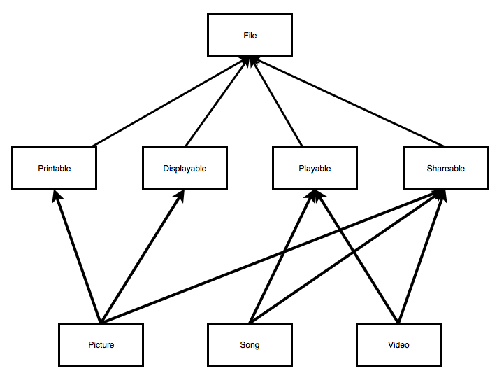

# Weeks 9 and 10 - Abstract Classes and Interfaces

## Corresponding Text

*Learn Java for Android Development*, pp. 167-169, 174-183

## Abstract Classes and Abstract Methods

Imagine that we wanted to create classes representing different kinds of
animals.  We could start with an *Animal* base class that contained all the
state and behavior shared by all animals and create subclasses to represent
specific animal species.  For example, we could write the following to
represent dogs and cats.

---

Animal.java

``` java
package com.myname.myapplication;

class Animal {
    private String name;
    private int age;

    Animal(String name, int age) {
        this.name = name;
        this.age = age;
    }
}

class Dog extends Animal {
    private String breed;

    Dog(String name, int age, String breed) {
        super(name, age);
        this.breed = breed;
    }
}

class Cat extends Animal {
    private String furColor;

    Cat(String name, int age, String furColor) {
        super(name, age);
        this.furColor = furColor;
    }
}
```

---

MainActivity.java

``` java
package com.myname.myapplication;

...

public class MainActivity extends AppCompatActivity {
    @Override
    protected void onCreate(Bundle savedInstanceState) {

        ...

        button.setOnClickListener(new View.OnClickListener() {
            @Override
            public void onClick(View view) {
                Dog odie = new Dog("Odie", 5, "beagle");
                Cat garfield = new Cat("Garfield", 6, "orange");
            }
        });
    }
}
```

---

Here, the *Animal* base class takes care of storing an animal's name and age;
the *Dog* and *Cat* derived classes manage a property unique to each class.
Because *Dog* and *Cat* extend *Animal*, instances of *Dog* and *Cat* have
*name* and *age* fields automatically.  What if we wanted to require that all
instances of subclasses of *Animal* have a *Speak()* method?  We could
implement the method in the *Animal* class and override it in each child class
but it might not make sense to provide an implementation in the base class
itself. One option we have it to declare the method and leave it's body
empty in the base class.

---

Animal.java

``` java
package com.myname.myapplication;

class Animal {
    private String name;
    private int age;

    Animal(String name, int age) {
        this.name = name;
        this.age = age;
    }

    public String speak() {}
}

class Dog extends Animal {
    private String breed;

    Dog(String name, int age, String breed) {
        super(name, age);
        this.breed = breed;
    }
}

class Cat extends Animal {
    private String furColor;

    Cat(String name, int age, String furColor) {
        super(name, age);
        this.furColor = furColor;
    }
}
```

---

While instances of *Dog* and *Cat* now have a *Speak()* method, there's nothing
that requires us to specify an implementation for those classes beyond the base
class's implementation.  What we might like to do is leave the implementation
undefined in the base class but require derived classes to provide an
implementation unique to the child class.

To do this, we can make use of an abstract method. **Abstract methods** are
declared methods lacking a body or implementation. Abstract methods are
declared by prefixing a method header with the `abstract` reserved word.
Abstract methods must be declared in abstract classes. **Abstract classes**
are classes that may or may not contain abstract methods and cannot be used
to create instances directly; in order to create an instance, a subclass must
be created that provides an implementation of any abstract methods.  Classes
are declared abstract by prefixing the class declaration with the `abstract`
reserved word.  We can declare the *Animal.speak()* method as abstract allowing
us to avoid providing an implementation in the *Animal* class but requiring
that non-abstract subclasses define an implementation for the method.  Once
we declare a method as abstract, we must declare the class containing the
method as abstract as well.

---

Animal.java

``` java
package com.myname.myapplication;

abstract class Animal {
    private String name;
    private int age;

    Animal(String name, int age) {
        this.name = name;
        this.age = age;
    }

    abstract public String speak();
}

class Dog extends Animal {
    private String breed;

    Dog(String name, int age, String breed) {
        super(name, age);
        this.breed = breed;
    }

    @Override
    public String speak() {
        return "Woof!";
    }
}

class Cat extends Animal {
    private String furColor;

    Cat(String name, int age, String furColor) {
        super(name, age);
        this.furColor = furColor;
    }

    @Override
    public String speak() {
        return "Meow!";
    }
}
```

---

MainActivity.java

``` java
package com.myname.myapplication;

import androidx.appcompat.app.AppCompatActivity;

import android.os.Bundle;
import android.view.View;
import android.widget.Button;
import android.widget.EditText;
import android.widget.TextView;

public class MainActivity extends AppCompatActivity {
    public void addText(StringBuilder builder, String text){
        builder.append(text);
        builder.append(System.lineSeparator());
    }

    @Override
    protected void onCreate(Bundle savedInstanceState) {
        super.onCreate(savedInstanceState);
        setContentView(R.layout.activity_main);

        final TextView output = (TextView) findViewById((R.id.output));
        final EditText input = (EditText) findViewById(R.id.input);
        final Button button = (Button) findViewById(R.id.button);
        final StringBuilder builder = new StringBuilder();

        button.setOnClickListener(new View.OnClickListener() {
            @Override
            public void onClick(View view) {
                Dog odie = new Dog("Odie", 5, "beagle");
                Cat garfield = new Cat("Garfield", 6, "orange");

                addText(builder, odie.speak());
                addText(builder, garfield.speak());

                output.setText(builder);
            }
        });
    }
}
```

---

Notice that after declaring an abstract method, we must terminate the statement
with a semicolon.  Neither the *Dog* nor the *Cat* class is abstract so both
must provide implementations of the *Speak()* method.

Suppose we wanted to add a *Bird* and a *Bat* class.  Both these types of
animals can fly so we might want to provide a *fly()* method.  We might
consider adding the *Fly()* method to the *Animal* class as an abstract method
but it doesn't really make sense for animals that can't fly.  One option we
have is to extend the *Animal* class with an abstract subclass.

---

Animal.java

``` java
package com.myname.myapplication;

abstract class Animal {
    private String name;
    private int age;

    Animal(String name, int age) {
        this.name = name;
        this.age = age;
    }

    abstract public String speak();
}

abstract class FlyingAnimal extends Animal {
    FlyingAnimal(String name, int age) {
        super(name, age);
    }

    abstract public String fly();
}

class Dog extends Animal {
    private String breed;

    Dog(String name, int age, String breed) {
        super(name, age);
        this.breed = breed;
    }

    @Override
    public String speak() {
        return "Woof!";
    }
}

class Cat extends Animal {
    private String furColor;

    Cat(String name, int age, String furColor) {
        super(name, age);
        this.furColor = furColor;
    }

    @Override
    public String speak() {
        return "Meow!";
    }
}

class Bird extends FlyingAnimal {
    private int wingspan;

    Bird(String name, int age, int wingspan) {
        super(name, age);
        this.wingspan = wingspan;
    }

    @Override
    public String fly() {
        return "Flying...";
    }

    @Override
    public String speak() {
        return "Chirp!";
    }
}

class Bat extends FlyingAnimal {
    private int weight;
    Bat(String name, int age, int weight) {
        super(name, age);
        this.weight = weight;
    }

    @Override
    public String fly() {
        return "Flying...";
    }

    @Override
    public String speak() {
        return "Bat sounds!";
    }
}

```

---

MainActivity.java

``` java
package com.myname.myapplication;

import androidx.appcompat.app.AppCompatActivity;

import android.os.Bundle;
import android.view.View;
import android.widget.Button;
import android.widget.EditText;
import android.widget.TextView;

public class MainActivity extends AppCompatActivity {
    public void addText(StringBuilder builder, String text){
        builder.append(text);
        builder.append(System.lineSeparator());
    }

    @Override
    protected void onCreate(Bundle savedInstanceState) {
        super.onCreate(savedInstanceState);
        setContentView(R.layout.activity_main);

        final TextView output = (TextView) findViewById((R.id.output));
        final EditText input = (EditText) findViewById(R.id.input);
        final Button button = (Button) findViewById(R.id.button);
        final StringBuilder builder = new StringBuilder();

        button.setOnClickListener(new View.OnClickListener() {
            @Override
            public void onClick(View view) {
                Dog odie = new Dog("Odie", 5, "beagle");
                Cat garfield = new Cat("Garfield", 6, "orange");
                Bird tweety = new Bird("Tweety", 2, 4);
                Bat batty = new Bat("Batty", 2, 1);

                addText(builder, odie.speak());
                addText(builder, garfield.speak());
                addText(builder, tweety.speak());

                addText(builder, batty.fly());

                output.setText(builder);
            }
        });
    }
}
```

## Interfaces

When we first started working with classes, we said that a class had both an
interface and an implementation.  The interface consists of methods and fields
that are available to other objects when creating or communicating with
objects of the class. The implementation is the code that provides
functionality to the interface.

Java allows us to formally define an interface type without an implementation
using the `interface` reserved word.

We'll first look at how we can create and use interfaces and then consider why
we should use them.

### Declaring Interface

An interface declaration is similar to a class declaration with a header
followed by a body.  Instead of using the reserved word `class` in the header,
an interface declaration header contains the reserved word `interface`.

Consider the previous example in which we wanted to add the ability to fly to
certain subclasses of the Animal class.  The solution we previously used relied
on an abstract class that declared a *fly()* method.  Instead of using an
abstract class, we could use an interface.  We'll see why using an interface
is advantageous later. First, let's declare an interface.  Often, you'll
see interface names end in "-able"; for example, interfaces in the standard
library include `Callable`, `Comparable`, and `Iterable` but there are others
without this suffix (`Collection`, `Map`, `List`, and `Set`, for example).

``` java
interface Flier {
    String takeoff();
    String fly();
    String land();
}
```

In this code, we've declared an interface named *Flier* that declares methods
related to flight: *takeoff()*, *fly()*, and *land()*. Note that because an
interface is what is exposed to other classes, methods declared in an interface
type are implicitly publicly accessible; prefixing the method declaration with
`private` or `protected` will result in an error.

Another important thing to note is that while we can define fields in an
interface, their values cannot change, that is, all interface fields are
constants.

Now that we've defined an interface, let's see how we can use it.

### Implementing Interfaces

Suppose we have two classes representing different things that are unrelated
except by the fact that each flies: an airplane and a bee.  Both the Airplane
and Bee class will have unique interfaces and implementations but they can
share the interface specified by the *Flier* interface.  We can make use of an
interface when defining a class using the `implements` reserved word.  When
implementing an interface in a class that isn't abstract, we must provide an
implementation for the methods declared in the interface.

---

Flier.java

``` java
package com.myname.myapplication;

public interface Flier {
    String takeoff();
    String fly();
    String land();
}

class Airplane implements Flier{
    int speed;
    String registration;

    Airplane(int speed, String registration) {
        this.speed = speed;
        this.registration = registration;
    }

    // a method unique to Airplane
    public void loadCargo() {
        // some code related to loading cargo
    }

    @Override
    public String takeoff() {
        // code related to take off
        return "Airplane taking off!";
    }

    @Override
    public String fly() {
        // code related to maintaining flight
        return "Airplane flying!";
    }

    @Override
    public String land() {
        // code related to landing
        return "Airplane landing!";
    }

}

class Bee implements Flier{
    int age;

    Bee(int age ){
        this.age = age;
    }

    // a method unique to Bee
    public void sting() {
        // some code related to stinging
    }

    @Override
    public String takeoff() {
        // code related to starting flight
        return "Bee starting to fly!";
    }

    @Override
    public String fly() {
        // code related to maintaining flight
        return "Bee flying!";
    }

    @Override
    public String land() {
        // code related to landing
        return "Bee landing!";
    }
}
```

---

MainActivity.java

``` java
package com.myname.myapplication;

import androidx.appcompat.app.AppCompatActivity;

import android.os.Bundle;
import android.view.View;
import android.widget.Button;
import android.widget.EditText;
import android.widget.TextView;

public class MainActivity extends AppCompatActivity {
    public void addText(StringBuilder builder, String text){
        builder.append(text);
        builder.append(System.lineSeparator());
    }

    @Override
    protected void onCreate(Bundle savedInstanceState) {
        super.onCreate(savedInstanceState);
        setContentView(R.layout.activity_main);

        final TextView output = (TextView) findViewById((R.id.output));
        final EditText input = (EditText) findViewById(R.id.input);
        final Button button = (Button) findViewById(R.id.button);
        final StringBuilder builder = new StringBuilder();

        button.setOnClickListener(new View.OnClickListener() {
            @Override
            public void onClick(View view) {
                Airplane plane = new Airplane(500, "A3X95");
                Bee bee = new Bee(1);

                addText(builder, plane.takeoff());
                addText(builder, bee.takeoff());

                output.setText(builder);
            }
        });
    }
}
```

In the *Airplane* and *Bee* classes, we make use of he *Flier* interface by
including `implements Flier` in the class declarations.  By implementing
*Flier*, we indicate that the class will provide the methods declared in the
interface (*fly()*, *takeoff()*, and *land()*) as well as implementations for
those methods.

This is an example of interface inheritance: *Airplane* and *Bee* "inherit" an
interface from the *Flier* interface type.  Anything that can interact with a
*Flier* will be able to interact with *Airplane* or *Bee* because they present
the public methods described by the *Flier* interface.  We'll look at an
example of this later.  Notice how this differs from implementation
inheritance: there is no code reuse between *Flier* and *Airplane* and *Flier*
and *Bee* other than method headers.

So far, the use of interfaces doesn't seem much different than using
implementation inheritance with base classes and derived classes except that
interfaces don't allow us to reuse code.

Let's consider a different example.  Suppose we are writing an app that
works with various media files: songs, pictures, and videos.  We'll want
our program to be able to play songs and videos, to display pictures,
and to be able to share files.  Without using interfaces, it might make
sense to start with a base class for files; create abstract classes for
displayable files, playable files, and shareable files which
all inherit from the base file class; and then create classes for pictures,
videos, and songs.  The inheritance diagram would look something like this:



Notice that the *Picture*, *Song*, and *Video* classes all inherit from more
than one class.  Java only supports single implementation inheritance so this
design will not work.  Java does, however, support multiple interface
inheritance so maybe we can use interfaces instead.

Let's stick with a *File* base class.  This class will will be responsible for
keeping track of the file's location and reading from the file if necessary.

Rather than passing strings around to show when a method has been called,
we'll use the logger.

---

File.java

``` java
package com.myname.myapplication;

import android.util.Log;

class File {
    private static final String TAG = File.class.getSimpleName();
    private String location;

    File(String location) {
        this.location = location;
    }

    byte[] read() {
        int fileLength = 10; // replaced by code to determine file size
        byte[] content = new byte[fileLength];
        Log.i(TAG, "Reading data from " + location);

        // code to open and read the file into the byte array
        // code to close the file
        return content;
    }
}
```

---

Our *File* class doesn't really do anything but in a real program, it would
open the file, load the content into a byte array, close the file, and return
the content when the *read()* method is called.

We know we want to make our pictures, song, and videos, displayable, playable,
and shareable.  Rather than create classes, let's create interfaces
that declare methods associated with each action. For convenience, we'll add
these to *File.java*.

---

File.java

``` java
...
package com.myname.myapplication;

import android.util.Log;

class File {
    private static final String TAG = File.class.getSimpleName();
    private String location;

    File(String location) {
        this.location = location;
    }

    byte[] read() {
        int fileLength = 10; // replaced by code to determine file size
        byte[] content = new byte[fileLength];
        Log.i(TAG, "Reading data from " + location);

        // code to open and read the file into the byte array
        // code to close the file
        return content;
    }
}

interface Displayable {
    void display();
}

interface Playable {
    void play();
}

interface Shareable {
    void postOnFacebook(String message);
    void tweet(String message);
    void email(String message, String destinationAddress);
}
```

---

Our interfaces include declarations for associated methods. Next, let's
create a class for pictures.  Each picture will be displayable on screen and
shareable. This means that it will implement two of the
three interfaces. To implement multiple interfaces, we list them in the
class declaration after the `implements` reserved word with each interface
separated by a comma.

---

Picture.java

``` java
package com.myname.myapplication;

import android.util.Log;

class Picture extends File implements Displayable, Shareable {
    private static final String TAG = Picture.class.getSimpleName();

    Picture(String location) {
        super(location);
    }

    @Override
    public void display() {
        //code to display the picture on screen
        Log.i(TAG, "Displaying a picture.");
    }

    @Override
    public void postOnFacebook(String message) {
        // code to post a picture on Facebook
        Log.i(TAG, "Posting a picture to Facebook.");
    }

    @Override
    public void tweet(String message) {
        //code to post a picture on Twitter
        Log.i(TAG, "Tweeting a picture.");
    }

    @Override
    public void email(String message, String destinationAddress) {
        //code to email a picture
        Log.i(TAG, "Sending an email with a picture to " + destinationAddress + ".");
    }
}
```

---

Because we are implementing *Displayable* and *Shareable* with
the *Picture* class, we have to provide implementations for methods declared in
both the interfaces.

We can do something similar for a song and a video class.

---

Song.java

``` java
package com.myname.myapplication;

import android.util.Log;

class Song extends File implements Playable, Shareable {
    private static final String TAG = Song.class.getSimpleName();

    Song(String location) {
        super(location);
    }

    @Override
    public void play() {
        // code to play a song
        Log.i(TAG, "Playing a song.");
    }

    @Override
    public void postOnFacebook(String message) {
        // code to post a song on Facebook
        Log.i(TAG, "Posting a song to Facebook.");
    }

    @Override
    public void tweet(String message) {
        //code to post a song on Twitter
        Log.i(TAG, "Tweeting a song.");
    }

    @Override
    public void email(String message, String destinationAddress) {
        //code to email a song
        Log.i(TAG, "Sending an email with a song to " + destinationAddress + ".");
    }
}
```

---

Video.java

```java
package com.myname.myapplication;

import android.util.Log;

class Video extends File implements Playable, Shareable {
    private static final String TAG = Video.class.getSimpleName();

    Video(String location) {
        super(location);
    }

    @Override
    public void play() {
        // code to play a video
        Log.i(TAG, "Playing a video.");
    }

    @Override
    public void postOnFacebook(String message) {
        // code to post a video on Facebook
        Log.i(TAG, "Posting a video to Facebook.");
    }

    @Override
    public void tweet(String message) {
        //code to post a video on Twitter
        Log.i(TAG, "Tweeting a video.");
    }

    @Override
    public void email(String message, String destinationAddress) {
        //code to email a video
        Log.i(TAG, "Sending an email with a video to " + destinationAddress + ".");
    }
}
```

---

We can update the *MainActivity* class to make use of the code we just wrote.

---

MainActivity.java

``` java
package com.myname.myapplication;

import androidx.appcompat.app.AppCompatActivity;

import android.os.Bundle;
import android.view.View;
import android.widget.Button;
import android.widget.EditText;
import android.widget.TextView;

public class MainActivity extends AppCompatActivity {
    public void addText(StringBuilder builder, String text){
        builder.append(text);
        builder.append(System.lineSeparator());
    }

    @Override
    protected void onCreate(Bundle savedInstanceState) {
        super.onCreate(savedInstanceState);
        setContentView(R.layout.activity_main);

        final TextView output = (TextView) findViewById((R.id.output));
        final EditText input = (EditText) findViewById(R.id.input);
        final Button button = (Button) findViewById(R.id.button);
        final StringBuilder builder = new StringBuilder();


        button.setOnClickListener(new View.OnClickListener() {
            @Override
            public void onClick(View view) {
                Song coolSong = new Song("song.mp3");
                Picture favoritePicture = new Picture("image.jpg");

                coolSong.play();
                coolSong.email("Check out this cool song", "aneuman1@cscc.edu");

                favoritePicture.display();
            }
        });
    }
}
```

---

When we run the app and tap the button, we should see something similar to the
following in the log messages.

``` text
2021-01-10 09:31:47.164 3123-3123/com.myname.myfirstapplication I/Song: Playing a song.
2021-01-10 09:31:47.165 3123-3123/com.myname.myfirstapplication I/Song: Sending an email with a song to aneuman1@cscc.edu.
2021-01-10 09:31:47.165 3123-3123/com.myname.myfirstapplication I/Picture: Displaying a picture.
```

### Decoupling Interface from Implementation

Now that you've seen how to use an interface, you might be wondering what the
advantage is besides being able to implement multiple interfaces in a class
over implementation inheritance.  After all, one advantage to implementation
inheritance is code reuse - we don't have to rewrite the same code over and
over again.

Interfaces give us flexibility in designing our programs by allowing us to
separate the publicly accessible methods, the interface, from the code that
drives it, the implementation.  We've seen examples of this idea when we
explored the Collections framework and worked with different types of Lists,
Sets, and Maps and when we talked about polymorphism.

Suppose that the program we are writing is a media player and it allows us to
create playlists.  We expect that a user will want to create a playlist of
songs so we might make a playlist class that looks like this:

---

Playlist.java

``` java
package com.myname.myapplication;

import java.util.ArrayList;

class Playlist {
    private String name;
    private ArrayList<Song> playlistItems = new ArrayList<>();
    private int currentIndex = 0;

    Playlist(String name) {
        this.name = name;
    }

    public String getName() {
        return this.name;
    }

    public void addItem(Song song) {
        playlistItems.add(song);
    }

    public void playNextItem() {
        // if there's nothing to play, don't do anything
        if (playlistItems.size() == 0) {
            return;
        }

        // play the item at currentIndex and update currentIndex for the next
        // song, if currentIndex points to the the last item, set it to 0
        Song currentItem = playlistItems.get(currentIndex);
        currentIndex = (currentIndex + 1) % playlistItems.size();
        currentItem.play();
    }
}
```

---

This playlist class has a name and a list of songs.  It's methods include one
to get the name; one to add to the playlist; and one to play the next song,
play the first song if we're at the end of the list, or to do nothing if
there are no items in the playlist.

This code makes use of the modulus operator, `%`, which you might not be
familiar with.  The modulus operator returns the remainder when dividing:
`a % b` returns the remainder when `a` is divided by `b`.  So `5 % 4` is `1`.
This operator can be useful when working with indices of lists as we do in the
playlist code.  If our playlist contains four songs and we're currently playing
the last one, `currentIndex` is 3, `currentIndex + 1` is 4, and
`(currentIndex + 1) % 4` is 0. An index of 0 corresponds to the first element
in the list.  Using the modulus operator allows us to "wrap" around the list.

Notice that our playlist relies heavily on the Song class.  What if we later
decide that users should also be able to have video playlists?  We could create
an additional class named *VideoPlaylist* but what if we want users to be able
to add both songs and videos to the playlists?  Rather than writing our
playlist to support only songs, we'd like to rewrite it to support both songs
and videos.  Notice that the only method we really depend on from the *Song*
class is the *play()* method.  Videos also have a *play()* method because the
*Video* class, like the *Song* class, implements the *Playable* interface.
Rather that writing the *Playlist* class to make use of a specific
implementation (the *Song* class), the class would be more flexible if we
wrote it to work with the *Playable* interface.

---

Playlist.java

``` java
package com.myname.myapplication;

import java.util.ArrayList;

class Playlist {
    private String name;
    private ArrayList<Playable> playlistItems = new ArrayList<>();
    private int currentIndex = 0;

    Playlist(String name) {
        this.name = name;
    }

    public String getName() {
        return this.name;
    }

    public void addItem(Playable playable) {
        playlistItems.add(playable);
    }

    public void playNextItem() {
        // if there's nothing to play, don't do anything
        if (playlistItems.size() == 0) {
            return;
        }

        // play the item at currentIndex and update currentIndex for the next
        // song, if currentIndex points to the the last item, set it to 0
        Playable currentItem = playlistItems.get(currentIndex);
        currentIndex = (currentIndex + 1) % playlistItems.size();
        currentItem.play();
    }
}
```

---

Now, instances of the *Playlist* class will allow both videos and songs to be
added.  If we later add code for an *AudioBook* class, we would be able to add
it to a playlist as long as the new class implemented the *Playable* interface;
we won't need to create a new playlist class for audio books.

Below is an example making use of the new *Playlist* class.

---

MainActivity.java

``` java
package com.myname.myapplication;

import androidx.appcompat.app.AppCompatActivity;

import android.os.Bundle;
import android.view.View;
import android.widget.Button;
import android.widget.EditText;
import android.widget.TextView;

public class MainActivity extends AppCompatActivity {
    public void addText(StringBuilder builder, String text){
        builder.append(text);
        builder.append(System.lineSeparator());
    }

    @Override
    protected void onCreate(Bundle savedInstanceState) {
        super.onCreate(savedInstanceState);
        setContentView(R.layout.activity_main);

        final TextView output = (TextView) findViewById((R.id.output));
        final EditText input = (EditText) findViewById(R.id.input);
        final Button button = (Button) findViewById(R.id.button);
        final StringBuilder builder = new StringBuilder();


        button.setOnClickListener(new View.OnClickListener() {
            @Override
            public void onClick(View view) {
                Song coolSong = new Song("song.mp3");
                Video coolVideo = new Video("video.avi");

                Playlist favorites = new Playlist("Favorites");
                favorites.addItem(coolSong);
                favorites.addItem(coolVideo);

                favorites.playNextItem();
                favorites.playNextItem();
                favorites.playNextItem();
            }
        });
    }
}
```

---

When we run the app and click the button, we should see output like this:

``` text
2021-01-10 09:45:23.467 5523-5523/com.myname.myfirstapplication I/Song: Playing a song.
2021-01-10 09:45:23.467 5523-5523/com.myname.myfirstapplication I/Video: Playing a video.
2021-01-10 09:45:23.467 5523-5523/com.myname.myfirstapplication I/Song: Playing a song.
```

### Extending Interfaces

Just like classes, we can extend interfaces and create subinterfaces.  This
is also a form of interface inheritance.  For example, suppose we want
to create an interface for things that can be printed.  We'll make the
assumption that anything that can be displayed can be printed.

``` java

interface Displayable {
    void display();
}

interface Printable extends Displayable {
    void print();
}
```

Any class that implemented the new *Printable* interface would have to
implement both the *display()* and *print()* methods.

Note that an interface cannot implement another interface since interfaces
don't provide an implementation.

### Examples from the Standard Library

The standard library contains many interfaces. We've already worked with some
of them including List, Set, and Map.  If we were creating our own lists, sets,
or maps, we might implement these interfaces.  In future classes, we'll
implement other interfaces from the standard library.  For now, let's look at
how we might implement the *Comparable* interface.  This interface will allow
us to so sort collections of objects that implement the interface.

Suppose we have a class for contact information and an ArrayList to store our
contacts.

---

Contact.java

``` java
package com.myname.myapplication;

class Contact {
    String name;
    String email;

    Contact(String name, String email) {
        this.name = name;
        this.email = email;
    }

    public String getDetails() {
        return "Name: " + name + ", Email: " + email;
    }
}
```

---

MainActivity.java

``` java
package com.myname.myapplication;

import androidx.appcompat.app.AppCompatActivity;

import android.os.Bundle;
import android.view.View;
import android.widget.Button;
import android.widget.EditText;
import android.widget.TextView;

import java.util.ArrayList;
import java.util.List;

public class MainActivity extends AppCompatActivity {
    public void addText(StringBuilder builder, String text){
        builder.append(text);
        builder.append(System.lineSeparator());
    }

    @Override
    protected void onCreate(Bundle savedInstanceState) {
        super.onCreate(savedInstanceState);
        setContentView(R.layout.activity_main);

        final TextView output = (TextView) findViewById((R.id.output));
        final EditText input = (EditText) findViewById(R.id.input);
        final Button button = (Button) findViewById(R.id.button);
        final StringBuilder builder = new StringBuilder();


        button.setOnClickListener(new View.OnClickListener() {
            @Override
            public void onClick(View view) {
                Contact bob = new Contact("Bob", "bob@bob.com");
                Contact arthur = new Contact("Arthur", "aneuman1@cscc.edu");

                List<Contact> contacts = new ArrayList<>();
                contacts.add(bob);
                contacts.add(arthur);

                for(Contact contact: contacts) {
                    addText(builder, contact.getDetails());
                }

                output.setText(builder);
            }
        });
    }
}
```

---

We'd like to be able to sort our contacts based on name and email address,
relying on an alphabetic ordering defined on the String class.  In order to
achieve this, the *Contact* class has to implement the *Comparable* interface.

---

Contact.java

``` java
package com.myname.myapplication;

class Contact implements Comparable<Contact>{
    String name;
    String email;

    Contact(String name, String email) {
        this.name = name;
        this.email = email;
    }

    public String getDetails() {
        return "Name: " + name + ", Email: " + email;
    }

    @Override
    public int compareTo(Contact otherCcontact) {
        if (!name.equals(otherCcontact.name)) {
            return name.compareTo(otherCcontact.name);
        }
        else {
            return email.compareTo(otherCcontact.email);
        }
    }
}
```

---

MainActivity.java

``` java
package com.myname.myapplication;

import androidx.appcompat.app.AppCompatActivity;

import android.os.Bundle;
import android.view.View;
import android.widget.Button;
import android.widget.EditText;
import android.widget.TextView;

import java.util.ArrayList;
import java.util.Collections;
import java.util.List;

public class MainActivity extends AppCompatActivity {
    public void addText(StringBuilder builder, String text){
        builder.append(text);
        builder.append(System.lineSeparator());
    }

    @Override
    protected void onCreate(Bundle savedInstanceState) {
        super.onCreate(savedInstanceState);
        setContentView(R.layout.activity_main);

        final TextView output = (TextView) findViewById((R.id.output));
        final EditText input = (EditText) findViewById(R.id.input);
        final Button button = (Button) findViewById(R.id.button);
        final StringBuilder builder = new StringBuilder();


        button.setOnClickListener(new View.OnClickListener() {
            @Override
            public void onClick(View view) {
                Contact bob = new Contact("Bob", "bob@bob.com");
                Contact arthur = new Contact("Arthur", "aneuman1@cscc.edu");

                List<Contact> contacts = new ArrayList<>();
                contacts.add(bob);
                contacts.add(arthur);

                Collections.sort(contacts);

                for(Contact contact: contacts) {
                    addText(builder, contact.getDetails());
                }

                output.setText(builder);
            }
        });
    }
}
```

---

When implementing the *Comparable* interface, we also have to specify the types
against which we will compare our objects. In this case, we'll only compare
contacts to other contacts so we implement *Comparable\<Contact\>*.

When implementing the *Comparable* interface, we must implement the
*compareTo()* method. The method takes a single parameter - the object we
are comparing with the current object.  The method returns an integer.  A
negative return value means the current object is "less than" the other object,
meaning the current object would appear before the other when sorted; a
positive return value means the current object is "greater than" the other
object, meaning that the current object would appear after the other object
when sorted; and a return value of 0 means the two objects could appear in
either order. Note that value returned by *compareTo()* is distinct from the
value returned by *equals()*; ideally these would be consistent. In this
example, we rely on the fact that the *String* class implements the
*Comparable* interface and use its *compareTo()* method to compare the name
string and the email string.

When the program is run the contact information for Arthur should be printed
before the contact information for Bob since the string "Arthur" is
alphabetically before the string "Bob" even though the *bob* contact object was
added to the list before the *arthur* contact object.

## Exercises

1. Create an abstract class for contacts that stores a contact's name and
defines an abstract method *contact()*.  Create one class that makes use of the
abstract contact class that stores an email address and implements the
*contact()* method using the email address and another class that stores a
phone number and implements the *contact()* method using the phone number. The
implementation of the *contact()* method should simply display a string
with the appropriate information like "Emailing aneuman1@cscc.edu" or
"Calling 123-456-7890".

2. Create a class to store contact information consisting of a name and
email address.  Additionally, create a class to store a collection of contacts
that implements the *Iterable* interface so that a for-each loop can be used
with the the collection class.  Demonstrate this functionality with a for-each
loop that displays contact information.
