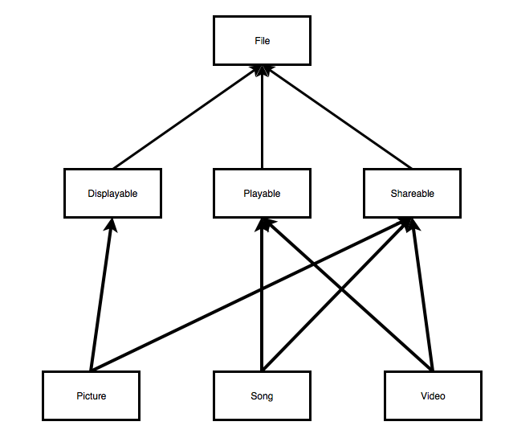

# Weeks 9 and 10 - Interfaces and Abstract Classes

## Corresponding Text
*Learn Java for Android Development*, pp. 167-169, 174-183

## Abstract Classes and Abstract Methods
Imaging that we wanted to create classes representing different kinds of
animals.  We could start with an *Animal* base class that contained all the
state and behavior shared by all animals and create subclasses to represent
specific animal species.  For example, we could write the following to
represent dogs and cats.

```java
package com.myname.week_09_10;

class Animal {
    private String name;
    private int age;

    Animal(String name, int age) {
        this.name = name;
        this.age = age;
    }
}

class Dog extends Animal {
    private String breed;

    Dog(String name, int age, String breed) {
        super(name, age);
        this.breed = breed;
    }
}

class Cat extends Animal {
    private String furColor;

    Cat(String name, int age, String furColor) {
        super(name, age);
        this.furColor = furColor;
    }
}

public class Main {
    public static void main(String[] args) {
        Dog odie = new Dog("Odie", 5, "beagle");
        Cat garfield = new Cat("Garfield", 6, "orange");
    }
}
```

Here, the *Animal* base class takes care of storing an animal's name and age;
the *Dog* and *Cat* derived classes manage a property unique to each class.  
Because *Dog* and *Cat* extend *Animal*, instances of *Dog* and *Cat* have
*name* and *age* fields automatically.  What if we wanted to require that all
instances of subclasses to *Animal* have a *Speak()* method?  We could
implement the method in the *Animal* class and override it in each child class
but it might not make sense to provide an implementation in the base class
itself. One option we have it to declare the method method and leave it's body
empty in the base class.  

```java
package com.myname.week_09_10;

class Animal {
    private String name;
    private int age;

    Animal(String name, int age) {
        this.name = name;
        this.age = age;
    }

    public void speak() {}
}

class Dog extends Animal {
    private String breed;

    Dog(String name, int age, String breed) {
        super(name, age);
        this.breed = breed;
    }
}

class Cat extends Animal {
    private String furColor;

    Cat(String name, int age, String furColor) {
        super(name, age);
        this.furColor = furColor;
    }
}

public class Main {
    public static void main(String[] args) {
        Dog odie = new Dog("Odie", 5, "beagle");
        Cat garfield = new Cat("Garfield", 6, "orange");

        odie.speak();
        garfield.speak();
    }
}
```

While instances of *Dog* and *Cat* now have a *Speak()* method, there's nothing
that requires us to specify an implementation for those classes beyond the base
class's implementation.  What we might like to do is leave the implementation
undefined in the base class but require derived classes to provide an
implementation unique to the child class.

To do this, we can make use of an abstract method.  **Abstract methods** are
declared methods lacking a body or implementation.  Abstract methods are
declared by prefixing a method header with the `abstract` reserved word.  
Abstract methods must be declared in abstract classes.  **Abstract classes**
are classes that may or may not contain abstract methods and cannot be used
to create instances directly; in order to create an instance, a subclass must
be created that provides an implementation of any abstract methods.  Classes
are declared abstract by prefixing the class declaration with the `abstract`
reserved word.  We can declare the *Animal.speak()* method as abstract allowing
us to avoid providing an implementation in the *Animal* class but requiring
that non-abstract subclasses define an implementation for the method.  Once
we declare a method as abstract, we must declare the class containing the
method as abstract as well.  

```java
package com.myname.week_09_10;

abstract class Animal {
    private String name;
    private int age;

    Animal(String name, int age) {
        this.name = name;
        this.age = age;
    }

    abstract public void speak();
}

class Dog extends Animal {
    private String breed;

    Dog(String name, int age, String breed) {
        super(name, age);
        this.breed = breed;
    }

    @Override
    public void speak() {
        System.out.println("Woof!");
    }
}

class Cat extends Animal {
    private String furColor;

    Cat(String name, int age, String furColor) {
        super(name, age);
        this.furColor = furColor;
    }

    @Override
    public void speak() {
        System.out.println("Meow!");
    }
}

public class Main {
    public static void main(String[] args) {
        Dog odie = new Dog("Odie", 5, "beagle");
        Cat garfield = new Cat("Garfield", 6, "orange");

        odie.speak();
        garfield.speak();
    }
}
```

Notice that after declaring an abstract method, we must terminate the statement
with a semicolon.  Neither the *Dog* nor the *Cat* class is abstract so both
must provide implementations of the *Speak()* method.  

Suppose we wanted to add a *Bird* and a *Bat* class.  Both these types of
animals can fly so we might want to provide a *fly()* method.  We might
consider adding the *Fly()* method to the *Animal* class as an abstract method
but it doesn't really make sense for animals that can't fly.  One option we
have is to extend the *Animal* class with an abstract subclass.  

```java
package com.myname.week_09_10;

abstract class Animal {
    private String name;
    private int age;

    Animal(String name, int age) {
        this.name = name;
        this.age = age;
    }

    abstract public void speak();
}

abstract class FlyingAnimal extends Animal {
    FlyingAnimal(String name, int age) {
        super(name, age);
    }

    abstract public void fly();
}

class Dog extends Animal {
    private String breed;

    Dog(String name, int age, String breed) {
        super(name, age);
        this.breed = breed;
    }

    @Override
    public void speak() {
        System.out.println("Woof!");
    }
}

class Cat extends Animal {
    private String furColor;

    Cat(String name, int age, String furColor) {
        super(name, age);
        this.furColor = furColor;
    }

    @Override
    public void speak() {
        System.out.println("Meow!");
    }
}

class Bird extends FlyingAnimal {
    private int wingspan;

    Bird(String name, int age, int wingspan) {
        super(name, age);
        this.wingspan = wingspan;
    }

    @Override
    public void speak() {
        System.out.println("Chirp!");
    }

    @Override
    public void fly() {
        System.out.println("Flying...");
    }
}

class Bat extends FlyingAnimal {
    private int weight;
    Bat(String name, int age, int weight) {
        super(name, age);
        this.weight = weight;
    }

    @Override
    public void fly() {
        System.out.println("Flying...");
    }

    @Override
    public void speak() {
        System.out.println("Bat sounds!");
    }
}

public class Main {
    public static void main(String[] args) {
        Dog odie = new Dog("Odie", 5, "beagle");
        Cat garfield = new Cat("Garfield", 6, "orange");
        Bird tweety = new Bird("Tweety", 2, 4);
        Bat batty = new Bat("Batty", 2, 1);

        odie.speak();
        garfield.speak();
        tweety.speak();

        batty.fly();
    }
}
```

## Interfaces
When we first started working with classes, we said that a class had both an
interface and an implementation.  The interface consists of methods and fields
that are available to other objects when creating or communicating with
objects of the class. The implementation is the code that provides
functionality to the interface.

Java allows us to formally define an interface type without an implementation
using the `interface` reserved word.

We'll first look at how we can create and use interfaces and then consider why
we should use them.

### Declaring Interface
An interface declaration is similar to a class declaration with a header
followed by a body.  Instead of using the reserved word `class` in the header,
an interface declaration header contains the reserved word `interface`.  

Consider the previous example in which we wanted to add the ability to fly to
certain subclasses of the Animal class.  The solution we previously used relied
on an abstract class that declared a *fly()* method.  Instead of using an
abstract class, we could use an interface.  We'll see why using an interface
is advantageous later. First, let's declare an interface.  Often, you'll
see interface names end in "-able"; for example, interfaces in the standard
library include `Callable`, `Comparable`, and `Iterable` but there are others
without this suffix (`Collection`, `Map`, `List`, and `Set`, for example).

```java
interface Flier {
    void takeoff();
    void fly();
    void land();
}
```

In this code, we've declared an interface named *Flier* that declares methods
related to flight: *takeoff()*, *fly()*, and *land()*. Note that because an
interface is what is exposed to other classes, methods declared in an interface
type are implicitly publicly accessible; prefixing the method declaration with
`private` or `protected` will result in an error.

Another important thing to note is that while we can define fields in an
interface, their values cannot change, that is, all interface fields are
constants.

Now that we've defined an interface, let's see how we can use it.

### Implementing Interfaces
Suppose we have two classes representing different things that are unrelated
except by the fact that each flies: an airplane and a bee.  Both the Airplane
and Bee class will have unique interfaces and implementations but they can
share the interface specified by the *Flier* interface.  We can make use of an
interface when defining a class using the `implements` reserved word.  When
implementing an interface in a class that isn't abstract, we must provide an
implementation for the methods declared in the interface.

```Java
package com.myname.week_09_10;

interface Flier {
    void takeoff();
    void fly();
    void land();
}

class Airplane implements Flier{
    int speed;
    String registration;

    Airplane(int speed, String registration) {
        this.speed = speed;
        this.registration = registration;
    }

    // a method unique to Airplane
    public void loadCargo() {
        // some code related to loading cargo
    }

    @Override
    public void takeoff() {
        System.out.println("Airplane taking off!");
        // code related to take off
    }

    @Override
    public void fly() {
        System.out.println("Airplane flying!");
        // code related to maintaining flight
    }

    @Override
    public void land() {
        System.out.println("Airplane landing!");
        // code related to landing
    }

}

class Bee implements Flier{
    int age;

    Bee(int age ){
        this.age = age;
    }

    // a method unique to Bee
    public void sting() {
        // some code related to stinging
    }

    @Override
    public void takeoff() {
        System.out.println("Bee starting to fly!");
        // code related to starting flight
    }

    @Override
    public void fly() {
        System.out.println("Bee flying!");
        // code related to maintaining flight
    }

    @Override
    public void land() {
        System.out.println("Bee landing!");
        // code related to landing
    }
}

public class Main {
    public static void main(String[] args) {
        Airplane plane = new Airplane(500, "A3X95");
        Bee bee = new Bee(1);

        plane.takeoff();
        bee.takeoff();
    }
}
```

In the *Airplane* and *Bee* classes, we make use of he *Flier* interface by
including `implements Flier` in the class declarations.  By implementing
*Flier*, we indicate that the class will provide the methods declared in the
interface (*fly()*, *takeoff()*, and *land()*) as well as implementations for
those methods.  

This is an example of interface inheritance: *Airplane* and *Bee* "inherit" an
interface from the *Flier* interface type.  Anything that can interact with a
*Flier* will be able to interact with *Airplane* or *Bee* because they present
the public methods described by the *Flier* interface.  We'll look at an
example of this later.  Notice how this differs from implementation
inheritance: there is no code reuse between *Flier* and *Airplane* and *Flier*
and *Bee* other than method headers.  

So far, the use of interfaces doesn't seem much different than using
implementation inheritance with base classes and derived classes except that
interfaces don't allow us to reuse code.  

Let's consider a different example.  Suppose we are writing a program for
working with various media files: songs, pictures, and videos.  We'll want
our program to be able to play songs and videos, to display and print pictures,
and to be able to share files.  Without using interfaces, it might make
sense to start with a base class for files; create abstract classes for
printable files, displayable files, playable files, and shareable files which
all inherit from the base file class; and then create classes for pictures,
videos, and songs.  The inheritance diagram would look something like this:



Notice that the *Picture*, *Song*, and *Video* classes all inherit from more
than one class.  Java only supports single implementation inheritance so this
design will not work.  Java does, however, support multiple interface
inheritance so maybe we can use interfaces instead.  

Let's stick with a *File* base class.  This class will will be responsible for
keeping track of the file's location and reading from the file if necessary.  

```java
class File {
    private String location;

    File(String location) {
        this.location = location;
    }

    byte[] read() {
        int fileLength = 10; // replaced by code to determine file size
        byte[] content = new byte[fileLength];
        System.out.println("Reading data from " + location);
        // code to open and read the file into the byte array
        // code to close the file
        return content;
    }
}
```

Our *File* class doesn't really do anything but in a real program, it would
open the file, load the content into a byte array, close the file, and return
the content when the *read()* method is called.

We know we want to make our pictures, song, and videos, displayable, playable,
printable, and shareable.  Rather than create classes, let's create interfaces
that declare methods associated with each action.  

```java
interface Displayable {
    void display();
}

interface Playable {
    void play();
}

interface Printable {
    void print(String printerName);
}

interface Shareable {
    void postOnFacebook(String message);
    void tweet(String message);
    void email(String message, String destinationAddress);
}
```

Our interfaces include declarations for associated methods.  Next, let's
create a class for pictures.  Each picture will be displayable on screen,
printable, and shareable.  This means that it will implement three of the
four interfaces.  To implement multiple interfaces, we list them in the
class declaration after the `implements` reserved word with each interface
separated by a comma.

```java
class Picture extends File implements Displayable, Printable, Shareable {
    Picture(String location) {
        super(location);
    }

    @Override
    public void display() {
        //code to display the picture on screen
        System.out.println("Displaying a picture.");
    }

    @Override
    public void print(String printerName) {
        //code to print a picture
        System.out.println("Printing a picture to " + printerName +".");
    }

    @Override
    public void postOnFacebook(String message) {
        // code to post a picture on Facebook
        System.out.printf("Posting a picture to Facebook.");        
    }

    @Override
    public void tweet(String message) {
        //code to post a picture on Twitter
        System.out.println("Tweeting a picture.");
    }

    @Override
    public void email(String message, String destinationAddress) {
        //code to email a picture
        System.out.println("Sending an email with a picture to " + destinationAddress + ".");
    }
}
```

Because we are implementing *Displayable*, *Printable*, and *Shareable* with
the *Picture* class, we have to provide implementations for methods declared in
all three of the interfaces.  

We can do something similar for a song and a video class.

```java
class Song extends File implements Playable, Shareable {
    Song(String location) {
        super(location);
    }

    @Override
    public void play() {
        // code to play a song
        System.out.println("Playing a song.");
    }

    @Override
    public void postOnFacebook(String message) {
        // code to post a song on Facebook
        System.out.printf("Posting a song to Facebook.");
    }

    @Override
    public void tweet(String message) {
        //code to post a song on Twitter
        System.out.println("Tweeting a song.");
    }

    @Override
    public void email(String message, String destinationAddress) {
        //code to email a song
        System.out.println("Sending an email with a song to " + destinationAddress + ".");
    }
}

class Video extends File implements Playable, Shareable {
    Video(String location) {
        super(location);
    }

    @Override
    public void play() {
        // code to play a video
        System.out.println("Playing a video.");
    }

    @Override
    public void postOnFacebook(String message) {
        // code to post a video on Facebook
        System.out.printf("Posting a video to Facebook.");
    }

    @Override
    public void tweet(String message) {
        //code to post a video on Twitter
        System.out.println("Tweeting a video.");
    }

    @Override
    public void email(String message, String destinationAddress) {
        //code to email a video
        System.out.println("Sending an email with a video to " + destinationAddress + ".");
    }
}
```

Here's code that includes the base *File* class, the interfaces, and the
*Picture*, *Song*, and *Video* classes that extend the *File* class and
implement the *Printable*, *Displayable*, *Playable*, and *Shareable*
interfaces.

```java
package com.myname.week_09_10;

class File {
    private String location;

    File(String location) {
        this.location = location;
    }

    byte[] read() {
        int fileLength = 10; // replaced by code to determine file size
        byte[] content = new byte[fileLength];
        System.out.println("Reading data from " + location);
        // code to open and read the file into the byte array
        // code to close the file
        return content;
    }
}

interface Displayable {
    void display();
}

interface Playable {
    void play();
}

interface Printable {
    void print(String printerName);
}

interface Shareable {
    void postOnFacebook(String message);
    void tweet(String message);
    void email(String message, String destinationAddress);
}

class Picture extends File implements Displayable, Printable, Shareable {
    Picture(String location) {
        super(location);
    }

    @Override
    public void display() {
        //code to display the picture on screen
        System.out.println("Displaying a picture.");
    }

    @Override
    public void print(String printerName) {
        //code to print a picture
        System.out.println("Printing a picture to " + printerName +".");
    }

    @Override
    public void postOnFacebook(String message) {
        // code to post a picture on Facebook
        System.out.printf("Posting a picture to Facebook.");
    }

    @Override
    public void tweet(String message) {
        //code to post a picture on Twitter
        System.out.println("Tweeting a picture.");
    }

    @Override
    public void email(String message, String destinationAddress) {
        //code to email a picture
        System.out.println("Sending an email with a picture to " + destinationAddress + ".");
    }
}

class Song extends File implements Playable, Shareable {
    Song(String location) {
        super(location);
    }

    @Override
    public void play() {
        // code to play a song
        System.out.println("Playing a song.");
    }

    @Override
    public void postOnFacebook(String message) {
        // code to post a song on Facebook
        System.out.printf("Posting a song to Facebook.");
    }

    @Override
    public void tweet(String message) {
        //code to post a song on Twitter
        System.out.println("Tweeting a song.");
    }

    @Override
    public void email(String message, String destinationAddress) {
        //code to email a song
        System.out.println("Sending an email with a song to " + destinationAddress + ".");
    }
}

class Video extends File implements Playable, Shareable {
    Video(String location) {
        super(location);
    }

    @Override
    public void play() {
        // code to play a video
        System.out.println("Playing a video.");
    }

    @Override
    public void postOnFacebook(String message) {
        // code to post a video on Facebook
        System.out.printf("Posting a video to Facebook.");
    }

    @Override
    public void tweet(String message) {
        //code to post a video on Twitter
        System.out.println("Tweeting a video.");
    }

    @Override
    public void email(String message, String destinationAddress) {
        //code to email a video
        System.out.println("Sending an email with a video to " + destinationAddress + ".");
    }
}

public class Main {
    public static void main(String[] args) {
        Song coolSong = new Song("song.mp3");
        Picture favoritePicture = new Picture("image.jpg");

        coolSong.play();
        coolSong.email("Check out this cool song", "aneuman1@cscc.edu");

        favoritePicture.display();
        favoritePicture.print("myPrinter");
    }
}
```


### Extending Interfaces
### Examples from the Standard Library
Implement the Comparable interface.
### Decoupling Interface from Implementation

## Exercises
1.
2. Implement the Iterable interface.  
