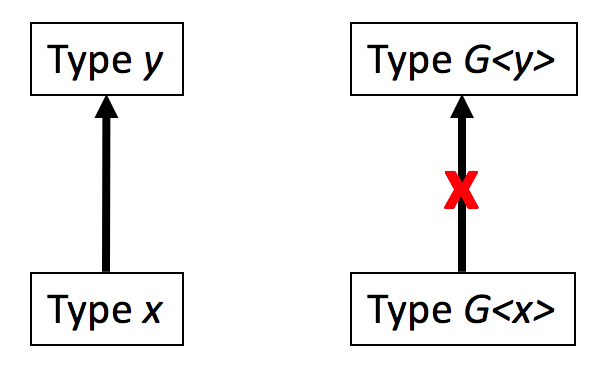

# Week 12 - Generics

## Corresponding Text

*Learn Java for Android Development*, pp. 255-273

## Collections Example

Recall that when we started working with Lists, Sets, and Maps, we specified
the types of elements contained in instances of ArrayList, HashMap, and so on.
For example, if we were planning on storing Strings in an array list, we might
have written code like this

``` java
List<Sting> StringList = new ArrayList<>();
```

Here, the type appearing between the angle brackets (`<` and `>`) is known as
the *type parameter* and, in this case, it is used to specify the types of
elements stored in the list.  In general, we can use type parameters to create
both flexible and type-safe classes.  To understand what that means and why
it's a good thing, let's look at an example.

Prior to Java 5, the Collections framework didn't allow us to specify a type
parameter.  Suppose we had a *Contact* class that stored a contact's name and
email address and we wanted to store a collection of contacts in a list.

---

Contact.java

``` java
package com.myname.myapplication;

class Contact {
    private String name;
    private String email;

    Contact(String name, String email) {
        this.name = name;
        this.email = email;
    }

    public String getInfo() {
        return "Name: " + name + ", Email: " + email;
    }
}
```

---

MainActivity.java

``` java
package com.myname.myapplication;

import androidx.appcompat.app.AppCompatActivity;

import android.os.Bundle;
import android.view.View;
import android.widget.Button;
import android.widget.EditText;
import android.widget.TextView;

import java.util.ArrayList;
import java.util.Collections;
import java.util.List;

public class MainActivity extends AppCompatActivity {
    public void addText(StringBuilder builder, String text){
        builder.append(text);
        builder.append(System.lineSeparator());
    }

    @Override
    protected void onCreate(Bundle savedInstanceState) {
        super.onCreate(savedInstanceState);
        setContentView(R.layout.activity_main);

        final TextView output = (TextView) findViewById((R.id.output));
        final EditText input = (EditText) findViewById(R.id.input);
        final Button button = (Button) findViewById(R.id.button);
        final StringBuilder builder = new StringBuilder();


        button.setOnClickListener(new View.OnClickListener() {
            @Override
            public void onClick(View view) {
                List contacts = new ArrayList();
                contacts.add(new Contact("bob", "bob@bob.com"));
                contacts.add("sue");

                for (Object o: contacts) {
                    Contact c = (Contact) o;
                    addText(builder, c.getInfo());
                }

                output.setText(builder);
            }
        });
    }
}
```

---

Here, we create a *Contact* class and an instance of *ArrayList* without
specifying the types of elements stored in the instance.  Without specifying a
type for the elements, Java has no information about their type when we iterate
through the list.  In the for-each loop, we have to declare each element as an
*Object*.  If we want to access a method unique to *Contact*, we have to cast
the *Object* instance to *Contact* then access the method.  If we've only added
instances of the *Contact* class to our list, this wouldn't be a problem.  But
if we add an instance of another class that isn't a subclass of *Contact*, like
*String*, we'll encounter a *ClassCastException*.  One solution is to check if
each *Object* instance is an instance of *Contact* before casting but it would
be nice to restrict our list to only allow instances of *Contact* as elements -
then Java would know the list only contains *Contact* instances when iterating
through the list. We can accomplish this using generic types.

Notice also that the program above will actually compile and start running but
only crashes when we press the button. It would be nice if Java could indicate
that there is a problem at compile time, before the program is ever run.  The
ability to detect type safety violations like this at compile time rather than
at runtime is the primary benefit of using generics.

## Generic Types

A **generic type** is a class or interface that declares a family of types
using a **formal type parameter list**, a comma-separated list of type
parameters between angle brackets.  The syntax of a generic type is:

``` java
class identifier<formal_type_parameter_list> {}
interface identifier<formal_type_parameter_list> {}
```

Examples of generic types are `List<E>` and `Map<K, V>`.  In the `List<E>`
generic type, *List* is an interface and *E* is the type parameter which, in
this case, specifies the list's elements' type.  Similarly in the `Map<K, V>`
generic type, *Map* is an interface and *K* and *V* are type parameters
specifying the map's key and value types.

By convention, a single uppercase letter is used for a type parameter name.
These names should be meaningful such as *E* for element, *T* for type, *K* for
key, and *V* for value.

Parameterized types are instances of generic types and are created by
specifying a type or types to replace the generic type's type parameter or
parameters.  For example, `List<Contact>` is a parameterized type based
on `List<E>`.  Similarly, `Map<String, Double>` is a parameterized type based
on `Map<K, V>`.

The type name that replaces the type parameter is known as the **actual type
argument**.  There are five kinds of actual type arguments supported by
generics.

1. **Concrete Type** The name of a class or interface is used as the type
   parameter.  `List<Contact>` is an example using concrete type.

2. **Concrete Parameterized Type** Another parameterized type is used as the
   type parameter.  `List<Map<String, Double>>` is an example using a concrete
   parameterized type, `Map<String, Double>` as the actual type argument.

3. **Array Type** An array type is passed to the type parameter.
   `List<String []>` is an example using an array type; here, the elements of
   the list are arrays of strings.

4. **Type Parameter** Another type parameter is used as the type parameter.
   Consider `class X<E> { List<E> internalList; }`.  The class *X* has a type
   parameter, *E*, that is used as a type parameter for `List<E>` when
   declaring an instance field.

5. **Wildcard** A wildcard, `?`, is used to indicate that the type is not
   known. For example, `List<?> aList;` indicates that the type of the list
   elements is unknown.

Every generic type also identifies a raw type.  A *raw type* is specified using
a generic type without its type parameters.  Raw types are not generic types
themselves and can be used as if `Object` were specified as the type parameter
but without any type safety checks.

### Declaring and Using Generic Types

In order to declare and use generic types, we must specify a formal type
parameter list when declaring a class or interface and make use of the type
parameters in the implementation.  Suppose we wanted to create a stack, a
collection of elements supporting two operations: *push* to add an element
and *pop* to remove the most recently added element.

---

Stack.java

``` java
package com.myname.myapplication;

class StackFullException extends Exception {}

class StackEmptyException extends Exception {}

class Stack<E> {
    private E[] elements;
    private int index = 0;
    private int size;

    Stack(int size) {
        elements = (E[]) new Object[size];
        this.size = size;
    }

    void push(E element ) throws StackFullException {
        if (index >= size) {
            throw new StackFullException();
        }

        elements[index] = element;
        index++;
    }

    E pop () throws StackEmptyException {
        if (index == 0) {
            throw new StackEmptyException();
        }

        E returnElement = elements[index - 1];
        index--;
        return returnElement;
    }
}
```

---

MainActivity.java

``` java
package com.myname.myapplication;

import androidx.appcompat.app.AppCompatActivity;

import android.os.Bundle;
import android.view.View;
import android.widget.Button;
import android.widget.EditText;
import android.widget.TextView;

import java.util.ArrayList;
import java.util.Collections;
import java.util.List;

public class MainActivity extends AppCompatActivity {
    public void addText(StringBuilder builder, String text){
        builder.append(text);
        builder.append(System.lineSeparator());
    }

    @Override
    protected void onCreate(Bundle savedInstanceState) {
        super.onCreate(savedInstanceState);
        setContentView(R.layout.activity_main);

        final TextView output = (TextView) findViewById((R.id.output));
        final EditText input = (EditText) findViewById(R.id.input);
        final Button button = (Button) findViewById(R.id.button);
        final StringBuilder builder = new StringBuilder();


        button.setOnClickListener(new View.OnClickListener() {
            @Override
            public void onClick(View view) {
                Stack<String> strings = new Stack<>(2);

                try {
                    strings.push("Hello");
                    strings.push("World");
                    addText(builder, strings.pop());
                    addText(builder, strings.pop());
                } catch (StackFullException | StackEmptyException e) {
                    addText(builder, e.getMessage());
                }

                output.setText(builder);
            }
        });
    }
}
```

---

In this example, we create a generic class *Stack\<E\>* that can store elements
of type *E* on a stack. When we create an instance of the class, we'll specify
an actual type argument. The actual type argument will be used to create an
array that will be used to store elements. Notice that we can't write
`new E[size]` in the constructor. This is due to how arrays and generics are
handled by the Java compiler.  See the *Arrays and Generics* section of the
assigned reading for a detailed explanation. We can, however, cast the array at
runtime.  We can suppress the warning by adding a
`@SuppressWarnings("unchecked")` annotation to the constructor but it's not
really necessary since *Object* instances can always be cast to *E* in this
case. The class has two methods: *push()* and *pop()*.  The *push()* method
takes a single parameter of type *E* and adds it to the array. The *pop()*
method returns the most recently added *E* instance.  Both methods throw
checked exceptions (since they inherit from *Exception* and not
*RuntimeException*) to indicate that elements cannot be added or there are not
elements to pop from the stack.

In *MainActivity.onCreate()*, we specify and actual type argument of *String*
when creating an instance of the generic class.

Beyond type safety, this example demonstrates another reason to use generic
types.  Rather than creating a class to represent a stack of strings, another
to represent a stack of doubles, etc., we can define a generic class once that
can be use to store any type.

### Wildcards

Suppose we were writing a program that kept a list of strings, maybe a list of
names, and we wanted to write a method to take the list and add the elements to
a string builder. While there are better ways of doing this, let's say we
wrote something like this:

---

MainActivity.java

``` java
package com.myname.myapplication;

import androidx.appcompat.app.AppCompatActivity;

import android.os.Bundle;
import android.view.View;
import android.widget.Button;
import android.widget.EditText;
import android.widget.TextView;

import java.util.ArrayList;
import java.util.Collections;
import java.util.List;

public class MainActivity extends AppCompatActivity {
    public void addText(StringBuilder builder, String text){
        builder.append(text);
        builder.append(System.lineSeparator());
    }

    public static void listToBuilder(StringBuilder builder, List<Object> list) {
        for (Object o: list) {
            builder.append(o);
        }
    }

    @Override
    protected void onCreate(Bundle savedInstanceState) {
        super.onCreate(savedInstanceState);
        setContentView(R.layout.activity_main);

        final TextView output = (TextView) findViewById((R.id.output));
        final EditText input = (EditText) findViewById(R.id.input);
        final Button button = (Button) findViewById(R.id.button);
        final StringBuilder builder = new StringBuilder();


        button.setOnClickListener(new View.OnClickListener() {
            @Override
            public void onClick(View view) {
                List<String> names = new ArrayList<>();
                names.add("bob");
                names.add("sue");
                listToBuilder(builder, names);

                output.setText(builder);
            }
        });
    }
}
```

---

While this seems reasonable, if you type this code in Android Studio, you'll
encounter an error with a message about the inability of converting a
List\<String\> to a List\<Object\>.  In general, for a given subtype *x* of type
*y* and a given raw type *G*, *G\<x\>* is not a subtype of *G\<y\>*.



While *String* is a subtype of *Object*, the polymorphic behavior doesn't apply
to parameterized types so *List\<String\>* is not a subtype of *List\<Object\>*.
However, *List\<String\>* is a subtype of *Collection\<String\>* since the raw
type *List* is a subtype of *Collection*.

Despite this, we would still like our *listToBuilder* method to work.  We can
achieve this using the `?` wildcard which represents any type.

``` java
package com.myname.myapplication;

import androidx.appcompat.app.AppCompatActivity;

import android.os.Bundle;
import android.view.View;
import android.widget.Button;
import android.widget.EditText;
import android.widget.TextView;

import java.util.ArrayList;
import java.util.Collections;
import java.util.List;

public class MainActivity extends AppCompatActivity {
    public void addText(StringBuilder builder, String text){
        builder.append(text);
        builder.append(System.lineSeparator());
    }

    public static void listToBuilder(StringBuilder builder, List<?> list) {
        for (Object o: list) {
            builder.append(o);
        }
    }

    @Override
    protected void onCreate(Bundle savedInstanceState) {
        super.onCreate(savedInstanceState);
        setContentView(R.layout.activity_main);

        final TextView output = (TextView) findViewById((R.id.output));
        final EditText input = (EditText) findViewById(R.id.input);
        final Button button = (Button) findViewById(R.id.button);
        final StringBuilder builder = new StringBuilder();


        button.setOnClickListener(new View.OnClickListener() {
            @Override
            public void onClick(View view) {
                List<String> names = new ArrayList<>();
                names.add("bob");
                names.add("sue");
                listToBuilder(builder, names);

                output.setText(builder);
            }
        });
    }
}
```

### Generic Methods

Suppose we wanted to write a method to copy the elements of one list to another
list.  We could write a method similar to the following but it would be very
limited.

``` java
public static void copyList(List<Object> source, List<Object> destination) {
    for (Object o: source) {
        destination.add(o);
    }
}
```

Its limitation is that it can only be used to copy lists of objects and not
lists of other element types.  The reason it is limited is because of the
inheritance issue we encountered when discussing wildcards: if *x* is a subtype
of *y*, *G\<x\>* is not necessarily a subtype of *G\<y\>*.  We might consider
using wildcards to address the problem.

``` java
public static void copyList(List<? extends String> source, List<? super String> destination) {
    for (String s: source) {
        destination.add(s);
    }
}
```

Here, the elements of *source* are of any type that is a subtype of *String* or
*String* itself (*String* is an upper bound) and the elements of *destination*
are of any type which is a supertype of *String* is or *String* itself
(*String* is a lower bound).  Note that we cannot specify lower bounds as
formal type parameters when creating generic classes.  While this code will
work to copy lists of strings, it is limited to lists of strings and lists of
*Object* elements.  We'd like to create a copy method that is more robust. To do this, we can create a generic method.  Note that the methods above are not
generic methods but simply methods that take parameters of generic types.  A
*generic method* is a class or instance method with a type-generalized
implementation.  Generic methods are declared using the following syntax:

``` java
<formal_type_parameter_list> return_type identifier(parameter_list)
```

The formal type parameter list is the same as when specifying a generic type.
The type parameter can appear as both the method's return type as well as the
type of parameters in the parameter list.  Java infers the actual type
arguments from the context in which the method is called.  Here is the list
copying method as a generic method as well as code to demonstrate it's use.

---

MainActivity.java

``` java
package com.myname.myapplication;

import androidx.appcompat.app.AppCompatActivity;

import android.os.Bundle;
import android.view.View;
import android.widget.Button;
import android.widget.EditText;
import android.widget.TextView;

import java.util.ArrayList;
import java.util.Collections;
import java.util.List;

public class MainActivity extends AppCompatActivity {
    public void addText(StringBuilder builder, String text){
        builder.append(text);
        builder.append(System.lineSeparator());
    }

    public static <T> void copyList(List<T> source, List<T> destination) {
        for (T object: source) {
            destination.add(object);
        }
    }

    @Override
    protected void onCreate(Bundle savedInstanceState) {
        super.onCreate(savedInstanceState);
        setContentView(R.layout.activity_main);

        final TextView output = (TextView) findViewById((R.id.output));
        final EditText input = (EditText) findViewById(R.id.input);
        final Button button = (Button) findViewById(R.id.button);
        final StringBuilder builder = new StringBuilder();


        button.setOnClickListener(new View.OnClickListener() {
            @Override
            public void onClick(View view) {
                List<String> names = new ArrayList<>();
                names.add("bob");
                names.add("sue");

                List<String> namesCopy = new ArrayList<>();
                copyList(names, namesCopy);

                for (String name: namesCopy) {
                    addText(builder, name);
                }

                output.setText(builder);
            }
        });
    }
}
```

---

The biggest advantage here is that we are no longer limited by the type of the
elements in the list like we were when we tried to use a method relying on
generic types with wildcards.

## Exercise

Implement a *Queue\<E\>* generic type similar to the *Stack\<E\>* type but with
*enqueue()* and *dequeue()* methods.  The *enqueue()* method adds an element to
the queue and the *dequeue()* method removes the first/oldest element from the
queue.  Stacks are often described as being "last-in, first-out" whereas queues
represent a "first-in, first-out" behavior.
