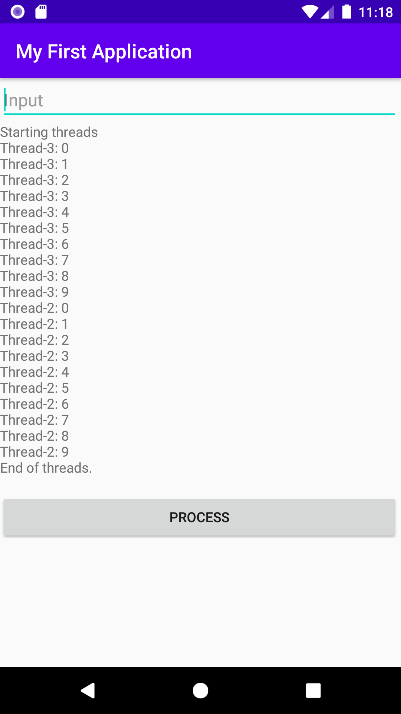
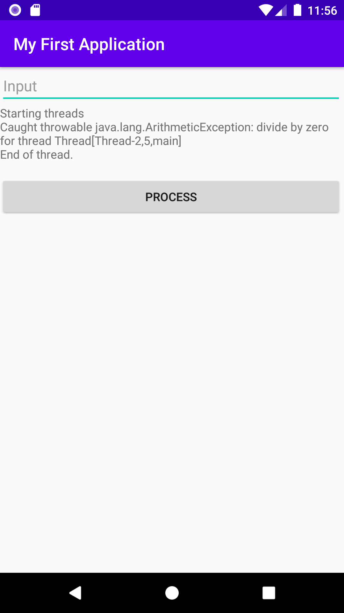

# Week 13 - Concurrency and Threading

## Corresponding Text

*Learn Java for Android Development*, pp. 324-354, 487-536

## Threads

A **thread** is a path of execution through a program's code.  So far, all our
programs have executed following one path in a single thread, the main thread.
While this is fine for a lot of programs, it is sometimes necessary to allow
multiple threads to execute simultaneously.  For example, if we had a lot of
different, independent tasks to perform, we could executive them at the same
time in different threads.  Another example is if we had a
computationally-intensive task that we wanted to perform in the background
without interfering with the user interface, we might execute that task in a
thread separate from the one handling the UI.

Since Java 5, Java has included a collection of concurrency utilities that are
typically preferred for working with threads.  Before we look that those
utilities, it's important to understand some low-level concepts.

### Runnable and Thread

The *Runnable* interface is used to supply code for threads to execute.  The
interface declares a single method, `void run()`, that takes no parameters and
returns no value.  The following is an example of an creating a *Runnable*
instance:

``` java
Runnable r = new Runnable() {
  @Override
  public void run() {
    // code to execute
  }
};
```

The *Thread* class provides a method of interfacing with the underlying
operating system's thread management.  A single operating system thread is
associated with a *Thread* instance.  The *Thread* class has a variety of
constructors, some of which take an instance of *Runnable* and some that do not;
if we do not plan on providing an instance of *Runnable* we must extend
*Thread* and override its *run()* method, providing code to execute.

The following is a simple example of a multi-threaded program.  In addition to
the main thread, the two threads we create both execute code specified by the
*Runnable* instance.  Note that we have to explicitly start a thread by calling
its *start()* method.

``` java
package com.myname.myapplication;

import androidx.appcompat.app.AppCompatActivity;

import android.os.Bundle;
import android.view.View;
import android.widget.Button;
import android.widget.EditText;
import android.widget.TextView;

public class MainActivity extends AppCompatActivity {
    public void addText(StringBuilder builder, String text){
        builder.append(text);
        builder.append(System.lineSeparator());
    }

    @Override
    protected void onCreate(Bundle savedInstanceState) {
        super.onCreate(savedInstanceState);
        setContentView(R.layout.activity_main);

        final TextView output = (TextView) findViewById((R.id.output));
        final EditText input = (EditText) findViewById(R.id.input);
        final Button button = (Button) findViewById(R.id.button);
        final StringBuilder builder = new StringBuilder();


        button.setOnClickListener(new View.OnClickListener() {
            @Override
            public void onClick(View view) {
                executeExample(builder, output, input);
                output.setText(builder);
            }
        });
    }

    void executeExample(final StringBuilder builder, TextView output, EditText input) {
        Runnable runnable = new Runnable()
        {
            @Override
            public void run() {
                String name = Thread.currentThread().getName();
                int count = 0;
                while (count < 10)
                    addText(builder, name + ": " + count++);
            }
        };

        Thread threadA = new Thread(runnable);
        Thread threadB = new Thread(runnable);
        addText(builder, "Starting threads");
        threadA.start();
        threadB.start();
        try {
            threadA.join();
            threadB.join();
        } catch (InterruptedException e) {
            e.printStackTrace();
        }
        addText(builder, "End of threads.");
    }
}
```



Here we've created a new method named *executeExample()* for our code. We
had to declare the *builder* parameter `final` to indicate that once a value
is assigned, it will not change; this is required since we will be using the
variable in different threads.  We'll learn about alternatives later in this
class.

Notice that while the threads doing the calculations terminate, the main thread
continues execution.  We can specify uncaught exception handlers by
implementing the *UncaughtExceptionHandler* interface and associating with
all threads or with specific threads individually.  The following code creates
an uncaught exception handler and uses the
*Thread.setDefaultUncaughtExceptionHandler()* method to associate it with all
instances of the *Thread* class.  Java offers finer control of setting
uncaught exception handlers, for example we could have used the
*setUncaughtExceptionHandler()* method on the thread instance.

``` java
package com.myname.myapplication;

import androidx.appcompat.app.AppCompatActivity;

import android.os.Bundle;
import android.view.View;
import android.widget.Button;
import android.widget.EditText;
import android.widget.TextView;

public class MainActivity extends AppCompatActivity {
    public void addText(StringBuilder builder, String text){
        builder.append(text);
        builder.append(System.lineSeparator());
    }

    @Override
    protected void onCreate(Bundle savedInstanceState) {
        super.onCreate(savedInstanceState);
        setContentView(R.layout.activity_main);

        final TextView output = (TextView) findViewById((R.id.output));
        final EditText input = (EditText) findViewById(R.id.input);
        final Button button = (Button) findViewById(R.id.button);
        final StringBuilder builder = new StringBuilder();


        button.setOnClickListener(new View.OnClickListener() {
            @Override
            public void onClick(View view) {
                executeExample(builder, output, input);
                output.setText(builder);
            }
        });
    }

    void executeExample(final StringBuilder builder, TextView output, EditText input) {
        Runnable runnable = new Runnable()
        {
            @Override
            public void run() {
                int quotient = 1 / 0;
            }
        };

        Thread.setDefaultUncaughtExceptionHandler(
                new Thread.UncaughtExceptionHandler() {
                    @Override
                    public void uncaughtException(Thread t, Throwable e) {
                        addText(
                            builder,
                        "Caught throwable " + e + " for thread " + t
                        );
                    }
                });

        Thread threadA = new Thread(runnable);

        addText(builder, "Starting threads");
        threadA.start();
        try {
            threadA.join();
        } catch (InterruptedException e) {
            e.printStackTrace();
        }
        addText(builder, "End of thread.");
    }
}
```

The output is similar to the following:



### Synchronization

While threads can execute independently from other other threads, they may not
be completely isolated.  Often threads will access and modify shared data. Care
must be taken to avoid problems due to this sharing of data.  The following
example demonstrates a shared checking account form which two people are both
withdrawing funds.

``` java
package com.myname.week_13;

class CheckingAccount
{
    private int balance;

    public CheckingAccount(int initialBalance)
    {
        balance = initialBalance;
    }

    public int withdraw(int amount)
    {
        if (amount <= balance)
        {
            try {
                Thread.sleep((int) (Math.random() * 200));
            }
            catch (InterruptedException ie) {
            }

            balance -= amount;
        }
        return balance;
    }
}

public class Main {
    public static void main(String[] args) {
        CheckingAccount account = new CheckingAccount(100);

        Runnable r = new Runnable() {
            @Override
            public void run() {
                String name = Thread.currentThread().getName();
                for (int i = 0; i < 10; i++) {
                    System.out.println(name + " tries to withdraw $10, balance: " +
                            account.withdraw(10));
                }
            }
        };

        Thread thdHusband = new Thread(r);
        thdHusband.setName("Husband");

        Thread thdWife = new Thread(r);
        thdWife.setName("Wife");

        thdHusband.start();
        thdWife.start();
    }
}
```

Running this program will generate code that includes something similar to the
following:

```
Wife withdraws $10, balance: 0
Husband withdraws $10, balance: -10
```

While the code checks to make sure that the amount to be withdrawn doesn't
exceed the available balance, a problem arises when when both threads are
attempting to withdraw money at nearly the same time: both threads check the
balance unaware that the other thread is about decrease the available balance
so the `amount <= balance` condition is true in both threads and both
threads decrease the balance below the available amount. This is an example of
a race condition.  A **race condition** is a scenario in which multiple threads
are accessing data and the final result is dependent on the timing of how
the threads are executed.  The race condition exists in this example because
checking the account balance and decreasing it are not atomic.  An
*atomic operation* is an operation that appears to the system to occur
instantaneously and appears to be indivisible.  Note that the call to the
*sleep()* method in the example serves to exaggerate the problem. Because the
comparison between the balance and the withdraw amount and the action of
decreasing the balance would normally execute so quickly, we might have to run
the program many times before seeing the effect of the race condition.

A solution to this problem is to synchronize access to the *withdraw()* method.
**Synchronized access** to a method allows only one thread to execute the
method at a time; other threads must wait for the executing thread to complete
before they can access the method.  To synchronize access, we can prefix the
method header with `synchronized`.  This modified code will not allow the
balance in the account to fall below zero.

``` java
package com.myname.week_13;

class CheckingAccount {
    private int balance;

    public CheckingAccount(int initialBalance)
    {
        balance = initialBalance;
    }

    synchronized public int withdraw(int amount)
    {
        if (amount <= balance)
        {
            try {
                Thread.sleep((int) (Math.random() * 200));
            }
            catch (InterruptedException ie) {
            }

            balance -= amount;
        }
        return balance;
    }
}

public class Main {
    public static void main(String[] args) {
        CheckingAccount account = new CheckingAccount(100);

        Runnable r = new Runnable() {
            @Override
            public void run() {
                String name = Thread.currentThread().getName();
                for (int i = 0; i < 10; i++) {
                    System.out.println(name + " tries to withdraw $10, balance: " +
                            account.withdraw(10));
                }
            }
        };

        Thread thdHusband = new Thread(r);
        thdHusband.setName("Husband");

        Thread thdWife = new Thread(r);
        thdWife.setName("Wife");

        thdHusband.start();
        thdWife.start();
    }
}
```

## Concurrency Utilities
Working with the Threads API and *Thread* objects gives us a a low-level way of
creating code that will execute in multiple threads.  The Concurrency Utilities
framework provides a higher-level framework that can be used to address
problems often encountered when working with the Threads API.  We'll briefly
examine some of the features of the Concurrency Utilities framework.

### Executors
An *Executor* is an objet that implements the *java.util.concurrent.Executor*
interface and decouples task submission from task execution.  When working with
*Thread* objects, the same object is responsible for thread creation and
running the task.  *Executor* alone isn't all that useful - it doesn't provide
a way to track running tasks, it can't execute a collection of tasks (like
*Thread*), and there's no easy way to get a return value from any code executed
in a thread (also like *Thread*).  For these features, we can instead use an
instance of *ExecutorService*.  The *java.util.concurrent.Executors* class
provides methods for creating instances of *ExecutorService*.

Executors also allow us to represent our tasks by classes that implement the
*Callable\<V\>* generic interface where *V* represents the type of a result
returned by the *call()* method used to represent a task.  This is different
than the *Runnable* interface and its *run()* method that doesn't allow us to
return a value.

When working with an instance of *ExecutorService*, results will often be
wrapped in *Future* objects. The *Future* interface represents results that
will not be available until some time in the future. Instances of *Future* have
methods such as *isDone()* and *get()* to check if a value has been assigned
and to get a value.

As an example of working with executors, suppose we want to retrieve data from
several websites.  We can create a thread pool, a collection of threads to
which tasks are assigned, to collect the data.  While this example won't
actually get data from the internet, code in a future lecture will.

``` java
package com.myname.week_13;


import java.util.*;
import java.util.concurrent.*;

// a class to simulate data retrieval
class SiteDownloader {

    // a method to retrieve
    static String get(String URL) {
        switch (URL) {
            case "http://www.weather.gov":
                return "Weather forecast";
            case "http://www.espn.com":
                return "Sports scores";
            case "http://www.marketwatch.com":
                return "Stock market date";
            case "http://www.fandango.com":
                return "Movie showtimes";
        }
        return "";    }
}

public class Main {
    public static void main(String[] args) {
        ExecutorService executor = Executors.newFixedThreadPool(2);
        List<Future<String>> results = new ArrayList<>();
        String[] urls = {"http://www.weather.gov", "http://www.espn.com",
                "http://www.marketwatch.com", "http://www.fandango.com"};

        //submit tasks to executor service
        for (String url : urls) {
            Callable callable = new Callable<String>() {
                @Override
                public String call() throws Exception {
                    System.out.println("Retrieving URL: " + url);
                    return SiteDownloader.get(url);
                }
            };

            System.out.println("Submitting task for " + url);
            results.add(executor.submit(callable));
        }

        // wait for tasks to finish
        boolean done = false;
        while (!done) {
            System.out.println("Still getting data...");
            done = true;
            for (Future<String> result : results) {
                if (!result.isDone()) {
                    done = false;
                }
            }
            try {
                Thread.sleep(1000);
            } catch (InterruptedException e) {
                e.printStackTrace();
            }
        }
        try {
            for (Future<String> result : results) {
                System.out.println("Site data: " + result.get());
            }
        } catch (InterruptedException | ExecutionException e) {
            e.printStackTrace();
        }
    }
}
```

Here, the *SiteDownloader* class presents a way of getting simulated website
data.  In *main()*, we start by creating an *ExecutorService* instance using
one of the methods available in the *Executors* class. The new
*ExecutorService* will represent a pool of two threads to which tasks can be
submitted.

Next, we create an empty list with which we will store instances of *Future*
that will store the results of our  tasks when the tasks complete.  Next, we
iterate through a list of URLs and create a callable that retrieves data for
each URL.  We then submit the *Callable* instance to the thread pool and
add the *submit()* method's return value to our list of results.  Note that
we probably wouldn't create the *callable* variable but use an anonymous class
with the *submit()* method instead.  Because the thread pool was created to
include two threads, only two tasks will execute simultaneously.

As the tasks execute, we wait and continuously check for completion in a while
loop using the *Future.isDone()* method.  Once all the tasks are complete,
we display the results.  Throughout the code, we use try-catch blocks to print
any exceptions that might occur.

### Synchronizers
The Threads API provides features that enable synchronization beyond specifying
a method as `synchronized`. However, it can sometimes be difficult to use these
features correctly or efficiently in complicated code.  The Concurrency
Utilities framework includes **synchronizers**, classes that facilitate common
forms of synchronization.  Commonly used synchronizers include:

1. **Countdown Latches**: cause one or more threads to wait until another
   thread allows the waiting threads to continue,
2. **Cyclic Barriers**: force a set of threads to reach a common point before
   any thread in the set can continue,
3. **Exchangers**: provide a point where threads can swap data, and
4. **Semaphores**: limits the number of threads that can access a resource.

We'll look at semaphores.  Semaphores maintain a set of permits; a thread
must acquire a permit in order to continue and return its permit when done.  If
no permit is available, the thread must wait for one to become available.
Semaphores that allow only one thread to execute at a time are known as
**binary semaphores** or **mutexes**. There is also a concept of fairness
associated with semaphores.  A "fair" semaphore will ensure that threads are
given permits in the order in which the threads request permits.  An "unfair"
semaphore allows a thread to acquire a permit before other threads that might
have been waiting longer for a permit.

The following example is a modified version of the checking account example
from earlier using an executor service and a semaphore.

``` java
package com.myname.week_13;

import java.util.concurrent.ExecutorService;
import java.util.concurrent.Executors;
import java.util.concurrent.Semaphore;

class CheckingAccount {
    // create a fair mutex
    private Semaphore permits = new Semaphore(1, true);
    private int balance;

    public CheckingAccount(int initialBalance)
    {
        balance = initialBalance;
    }

    public int withdraw(int amount)
    {
        try {
            permits.acquire();
        } catch (InterruptedException e) {
            // exception prevented acquiring a permit
            return balance;
        }
        if (amount <= balance)
        {
            try {
                Thread.sleep((int) (Math.random() * 200));
            }
            catch (InterruptedException ie) {
            }

            balance -= amount;
        }

        permits.release();
        return balance;
    }
}

class AccountHolder implements Runnable {
    private String name;
    private CheckingAccount account;

    AccountHolder(String name, CheckingAccount account) {
        this.name = name;
        this.account = account;
    }

    @Override
    public void run() {
        for (int i = 0; i < 10; i++) {
            System.out.println(name + " tries to withdraw $10, balance: " +
                    account.withdraw(10));
        }

    }
}

public class Main {
    public static void main(String[] args) {
        CheckingAccount account = new CheckingAccount(100);

        ExecutorService executor = Executors.newFixedThreadPool(2);
        executor.submit(new AccountHolder("Wife", account));
        executor.submit(new AccountHolder("Husband", account));

    }
}
```

In this example, the checking account is treated like a limited resource and
keeps a mutex.  When a thread enters the *withdraw()* method, it must first
acquire a permit.  If no permit is available, the thread will wait until one is
available.  If a permit is available, the remaining code in the method is
executed and the permit is released so the next thread can execute the method.
Notice that we don't have to declare the method as synchronized, multiple
threads can execute the method simultaneously but all but one will wait until
a permit lets them past the *permits.acquire()* statement.

### Concurrent Collections
The interfaces and classes we've been using from the Collections framework such
as *List*, *Set*, *Map*, *ArrayList*, *HashSet*, and *HashMap* are not
thread-safe.  An object or code is *thread-safe* when it is guaranteed to be
free of race conditions and functions correctly when accessed by multiple
threads.

One solution to this problem is to use wrapper methods on the
*java.util.Collections* class to create thread-safe collection objects.  For
example,

```
List<String> syncList = Collections.synchronizedList(new ArrayList<String>());
```

could be used to create a thread-safe array list.  One problem with these
wrapped solutions is that it is often necessary to use semaphores when
iterating through a collection to prevent modification.  Another problem is
that performance suffers when synchronized collections are access frequently
by multiple threads.

The Concurrency Utilities framework provides performant collections with
weakly-consistent iterators which have the following properties:

1. If an element has been removed from the collection after iteration has
   begun but hasn't been returned via the iterator's *next()* method, the
   element will not be returned,
2. No element is returned more than once during iteration regardless of changes
   made to the collection.
3. If an element is added to the collection after iteration starts, the element
   may or may not be returned.

As an example we'll look at the *BlockingQueue* interface and the
*ArrayBlockingQueue* class.  *BlockingQueue* is a subinterface of the *Queue*
interface in the Collections framework.

``` java
package com.myname.week_13;

import java.util.concurrent.ArrayBlockingQueue;
import java.util.concurrent.BlockingQueue;
import java.util.concurrent.ExecutorService;
import java.util.concurrent.Executors;

public class Main {
    public static void main(String[] args)
    {
        final BlockingQueue<Character> queue = new ArrayBlockingQueue<Character>(5);
        final ExecutorService executor = Executors.newFixedThreadPool(2);
        executor.execute(new Runnable() {
            @Override
            public void run() {
                for (char ch = 'A'; ch <= 'Z'; ch++) {
                    try {
                        queue.put(ch);
                        System.out.println(ch + " produced by producer.");
                        // ensures console output is consistent
                        Thread.sleep(200);
                    }
                    catch (InterruptedException ie) {
                        ie.printStackTrace();
                    }
                }
            }
        });

        executor.execute(new Runnable() {
            @Override
            public void run() {
                char ch = '\0';
                do {
                    try {
                        ch = queue.take();
                        System.out.println(ch + " consumed by consumer.");
                    }
                    catch (InterruptedException ie) {
                        ie.printStackTrace();
                    }
                } while (ch != 'Z');
                executor.shutdown();
            }
        });
    }
}
```

In this example, we create two instances of *Runnable()*: one that produces
characters and stores them in a queue and another that consumes characters
from the queue.  If we had created a third thread that iterated through the
queue, the iteration would weakly-consistent as described above.  If we compare
the *Queue* interface to the *BlockingQueue* interface, we notice that the
*BlockingQueue* has the additional *put()* and *take()* methods that are
advantageous in concurrent situations.  The *put()* methods waits for space
to be available on the queue before proceeding and the *take()* method waits
for an element to be available; both will pause a thread's execution.

## Exercise
In the checking account example, we addressed the race condition though
synchronization, first by declaring the *withdraw()* method as synchronized
and second by using a synchronizer.  An alternative method is to use a
synchronize statement like this:

``` java
//some code
synchronize(object) {
  // code that uses object but only allows one thread to access it at a time
}
```

This creates an intrinsic lock on *object*.  Rewrite the checking account
example to use an intrinsic lock on the *account* object created *Main.main()*.
