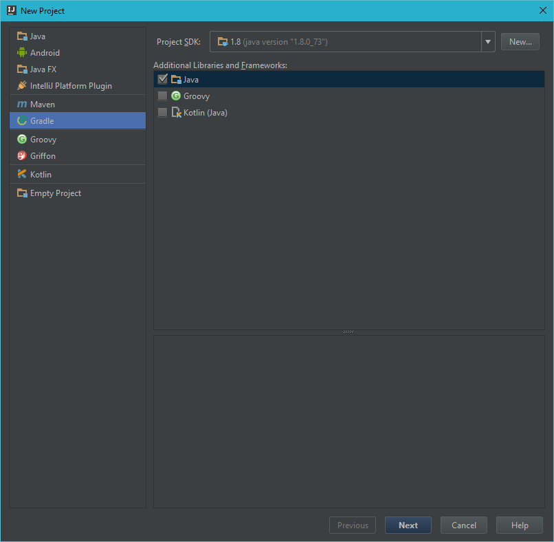
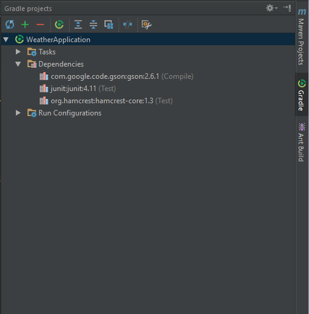
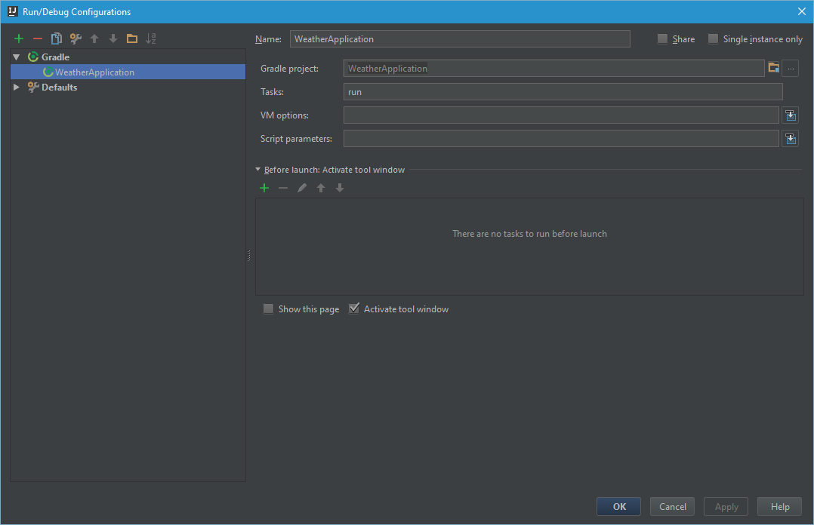

# Week 14 - JSON and Objects

## Corresponding Text
*Learn Java for Android Development*, pp. 205-217

## Using External Libraries with Gradle
Often when we want our programs to perform a complicated task, it's useful to
use a library or framework developed by someone else.  A **library** is a
collection of code implementing related behavior with a well defined interface
that is accessible to other code using the library.  

Many tools exist for managing the libraries we might want to use in our Java
code.  Among these are tools like Apache Maven and Gradle.  We'll use Gradle
to manage our programs' dependencies. In addition to managing dependencies,
Gradle is also manages how projects are built and packaged.

For the next two weeks topics, we'll work with a new IntelliJ project separate
from our other weekly code. When creating a new project IntelliJ, we can choose
to use Gradle by selecting *Gradle* as shown below. When specifying the
*Groupid* and *Artifactid*, you can use something similar to a package name
and project name, respectively.  



After creating the new project, you should see many Gradle-related files. We
can specify our program's dependencies by modifying *build.gradle*.  For the
work we'll be doing this week, we'll want to use the Gson library so your
*build.gradle* file will look similar to the following. Note that you can find 
the latest Gson library version at 
https://mvnrepository.com/artifact/com.google.code.gson/gson

```
group 'com.myname'
version '1.0-SNAPSHOT'

apply plugin: 'java'
apply plugin: 'application'
apply plugin: 'idea'

mainClassName = 'com.myname.Main'

repositories {
    mavenCentral()
}

dependencies {
    compile 'com.google.code.gson:gson:2.6.1'
    testCompile group: 'junit', name: 'junit', version: '4.11'
}

```

After updating the Gradle settings, refresh the Gradle project settings by
choosing *Gradle* from the right-hand toolbar and then clicking the refresh
icon.



If IntelliJ prompts you to enable refreshing the Gradle wrapper with sources,
enable the feature. If prompted to index remote repositories, click *Open
Repositories List"*, click the URL containing *http://repo1.maven.org*, and
click the *Update* button.

We'll have to create a folder to store our code.  Until now, we've been placing
all our code in a module or in a package inside a module.  The standard Java
directory structure that you'll often see, has source code appearing in
`src/main/java` - a *src* folder within the project, a *main* folder within
the *src* folder, and a *java* folder in the *main* folder.  Once we create
those folders, we can create a package and class files like usual.

If we create a run configuration for our project, rather than create a
new application configuration, we'll create a Gradle configuration with
settings similar to those below.



Now, if we create a *Main* class file and add the following code, we should be
able to run the project.

```java
package com.myname;


public class Main {
    public static void main(String[] args) {
        System.out.println("Hello, world!");
    }
}
```

The output will be something similar to the following:

```
9:22:41 AM: Executing external task 'run'...
:compileJava UP-TO-DATE
:processResources UP-TO-DATE
:classes UP-TO-DATE
:run
Hello, world!

BUILD SUCCESSFUL

Total time: 0.286 secs
9:22:42 AM: External task execution finished 'run'.
```

The output includes information related to Gradle's build process but we can
see the output of our program as well.

## JSON

**JSON** is a language-independent data format used to exchange data using
human-readable text. JSON is based on JavaScript but can be used with any
language.  Often, JSON is used to send and receive data to/from another
program including a web server.

There are six basic data types that are representable in JSON:

1. *Number*: a signed, decimal number that may contain a fractional part,
2. *String*: a sequence of zero or more Unicode characters enclosed in double 
   quotes,
3. *Boolean*: either *true* or *false*,
4. *Array*: an ordered list of zero or more values each of which can be of
   any type,
5. *Object*: an unordered collection of key/value pairs where the keys are
   strings, and
6. *null*: an empty value.

The following is an example of a JSON array containing both strings and
numbers:

```json
[10, "Hello", -4.32, "😀"]
```

Note that arrays are enclosed in square brackets (`[` and `]`) and elements
are separated by commas.

The following is an example of a JSON object:

```json
{
  "name": "columbus",
  "temperature": 70,
  "forecast": [70, 65, 82, 54, 60]
}
```

JSON objects are enclosed in curly brackets (`{` and `}`), names are strings
enclosed in double quotes, values are any JSON type, a key is separated from
a value using a colon, and key/value pairs are separated from one another using
commas.

## JSON in Java
Now that we've been introduced to JSON, we'd like to be able to use it in
Java.  For example, the next lecture will include examples of retrieving and
sending data from/to a website; we'll use JSON to to facilitate the transfer.

When working with JSON and other similar formats, we often describe the
process of converting data in our program to JSON as **serialization**. 
The process of converting JSON data into a data structure our
program can work with is known as **deserialization**. We'll look at
deserialization first.

For the following examples, we'll be working with the following JSON data or
some subset:

```json
[
    {
        "name":"columbus",
        "forecast":[40, 50, 65, 60, 70]
    },
    {
        "name":"cleveland",
        "forecast":[35, 55, 60, 45, 65]
    },
    {
        "name":"cincinnati",
        "forecast":[35, 60, 65, 45, 65]
    }
]
```

This data consists of a single JSON array where each element is a JSON object.
Each of the three JSON objects have two key/value pairs.  The first key/value
pair has a "name" key and a string value.  The second key/value pair has a
"forecast" key and an array of numbers as the corresponding value.  

### Deserialization
To start, let's consider this subset of the JSON data from above:

```json
{
    "name":"columbus",
    "forecast":[40, 50, 65, 60, 70]
}
```

For our examples, we'll store the JSON data in a string and use the Gson
library to convert between JSON and Java data.

```java
package com.myname.week_14;

import com.google.gson.JsonArray;
import com.google.gson.JsonElement;
import com.google.gson.JsonObject;
import com.google.gson.JsonParser;

import java.util.Map;

public class Main {
    public static void main(String[] args) {
        String jsonData = "{\"name\": \"columbus\", \"forecast\": " +
                "[40, 50, 65, 60, 70]}";

        JsonParser parser = new JsonParser();

        // parse the JSON data and return a JSON object for the top-level data
        JsonObject jsonObject = parser.parse(jsonData).getAsJsonObject();

        // Iterate through the JSON object
        // Each key/value in the object can be represented as a
        // String/JSON element pair
        for (Map.Entry<String, JsonElement> entry: jsonObject.entrySet() ) {

            // if the value is a JSON array, convert the JSON element to
            // JSON array and iterate
            if (entry.getValue().isJsonArray()) {
                System.out.println(entry.getKey() + ":");

                JsonArray jsonArray = entry.getValue().getAsJsonArray();
                for (JsonElement element : jsonArray) {
                    System.out.println("\t" + element);
                }
            }

            // if the value is not a JSON array, get it's value
            else {
                System.out.println(entry.getKey() + ": " + entry.getValue());
            }
        }

    }
}
```

In this example, we start by creating a string representing JSON data.  Note
that because both Java and JSON strings are enclosed in double quotes, we must
use a backslash character within the Java string to "escape" the quotes used
for JSON strings.  Next, we create an instance of *JsonParser* from the Gson
library and use it to begin processing the JSON data contained in the
*jsonData* string.  We know that that the outer-most data type in the JSON data
is an object, so we can ask the parser to return a *JsonObject* using the
*getAsJsonObject()* method.  Because JSON objects consist of key/value pairs,
we can iterate through the object, one key/value pair at a time.  Instance
of *JsonObject* have a method, *entrySet()* that returns a *Map.Entry<>*
object we can use for iteration.  *Map.Entry<>* requires that we specify the
key and value types; the keys are Java strings and the values are instances of
*JsonElement* which is used to represent JSON data of any JSON type.  In this
case, We know that the values are either JSON arrays or strings.  We can check
if the value is an array using the *isJsonArray()* array method.  If
it is an array, we use the *getAsJsonArray()* method to create a *JsonArray*
object that we can use to further iterate.  In this example, we know that the
inner array contains numbers.  If we want to display the numbers, we can rely
on the *JsonElement.toString()* implementation to display the appropriate
value.  Similarly, if the value in the key/vale pair was not an array, we can
rely on the *JsonElement.toString()* method to display the value.

While this example shows how we can iterate through JSON data, it doesn't show
us how to use the data to create a Java object based on the data.

To do that, we can create a class representing forecast data and use it's
methods to set it's properties using the JSON data.

```java
import com.google.gson.JsonArray;
import com.google.gson.JsonElement;
import com.google.gson.JsonObject;
import com.google.gson.JsonParser;

import java.util.ArrayList;
import java.util.List;
import java.util.Map;

// a class representing a city's forecast
class Forecast {
    private String name;
    private List<Double> forecast;

    public String getName() {
        return name;
    }

    public void setName(String name) {
        this.name = name;
    }

    public List<Double> getForecast() {
        return new ArrayList<>(forecast);
    }

    public void setForecast(List<Double> forecast) {
        this.forecast = forecast;
    }

    public String toString() {
        List<String> forecastStrings = new ArrayList<>();
        for (Double temp: forecast) {
            forecastStrings.add(temp.toString());
        }
        String forecastString = String.join(", ", forecastStrings);
        return String.format("The forecast for %s: is %s", name, forecastString);
    }
}

public class Main {
    public static void main(String[] args) {
        String jsonData = "{\"name\": \"columbus\", \"forecast\": " +
                "[40, 50, 65, 60, 70]}";

        JsonParser parser = new JsonParser();

        // a Forecast object
        Forecast forecast = new Forecast();

        JsonObject jsonObject = parser.parse(jsonData).getAsJsonObject();

        for (Map.Entry<String, JsonElement> entry: jsonObject.entrySet() ) {

            // if the value is a JSON array, create a list of values and
            // assign it to the forecast
            if (entry.getValue().isJsonArray()) {
                List<Double> forecastData = new ArrayList<>();
                JsonArray jsonArray = entry.getValue().getAsJsonArray();
                for (JsonElement element : jsonArray) {
                    forecastData.add(element.getAsDouble());
                }
                forecast.setForecast(forecastData);
            }

            // if the value is not a JSON array, it's the forecast's name
            else {
                forecast.setName(entry.getValue().getAsString());
            }
        }

        //display forecast
        System.out.println(forecast);
    }
}
```

Here, we've created a class *Forecast* to represent a city's forecast by
storing the city's name and a list of temperatures corresponding to the
forecast.  Now, while iterating through the JSON data, we can use the data to
assign values to the *Forecast* instance's fields rather than simply displaying
the values at the console.

While these two examples, help us understand how to process JSON data
layer-by-layer, this approach can be tedious and we are likely to accidentally
introduce errors.  Fortunately, the Gson library provides us with another
way of creating instances of objects using JSON data.

```java
package com.myname.week_14;


import com.google.gson.Gson;

import java.util.ArrayList;
import java.util.List;
import java.util.Map;

// a class representing a city's forecast
class Forecast {
    private String name;
    private List<Double> forecast;

    public String getName() {
        return name;
    }

    public void setName(String name) {
        this.name = name;
    }

    public List<Double> getForecast() {
        return new ArrayList<>(forecast);
    }

    public void setForecast(List<Double> forecast) {
        this.forecast = forecast;
    }

    public String toString() {
        List<String> forecastStrings = new ArrayList<>();
        for (Double temp: forecast) {
            forecastStrings.add(temp.toString());
        }
        String forecastString = String.join(", ", forecastStrings);
        return String.format("The forecast for %s: is %s", name, forecastString);
    }
}

public class Main {
    public static void main(String[] args) {
        String jsonData = "{\"name\": \"columbus\", \"forecast\": " +
                "[40, 50, 65, 60, 70]}";

        Gson gson = new Gson();
        Forecast forecast = gson.fromJson(jsonData, Forecast.class);
        System.out.println(forecast);
    }
}
```

Using the *Gson* class, we can easily create instances of other classes from
JSON data.  In this example, the *Gson.fromJson()* method takes two parameters:
a string containing JSON data and an instance of the generic class *Class<T>*
used to determine the type of object to create from the JSON data.  

The Gson deserializer relies on field names and types to be able to match JSON
data with the appropriate fields in the class. While we don't have to provide
getters and setters for the Gson serializer to work properly, we do have to
use the JSON object's keys' names as field names in order for the deserializer
to work properly.  

So far, we've been working with a single JSON object representing the forecast
for one city.  What if we wanted to work with our the JSON array above that
contains three JSON objects?  One solution is to simply use a Java array and
rely on Gson to create the array elements and add them to the array.

```java
package com.myname.week_14;


import com.google.gson.Gson;

import java.util.ArrayList;
import java.util.List;
import java.util.Map;

// a class representing a city's forecast
class Forecast {
    private String name;
    private List<Double> forecast;

    public String getName() {
        return name;
    }

    public void setName(String name) {
        this.name = name;
    }

    public List<Double> getForecast() {
        return new ArrayList<>(forecast);
    }

    public void setForecast(List<Double> forecast) {
        this.forecast = forecast;
    }

    public String toString() {
        List<String> forecastStrings = new ArrayList<>();
        for (Double temp: forecast) {
            forecastStrings.add(temp.toString());
        }
        String forecastString = String.join(", ", forecastStrings);
        return String.format("The forecast for %s: is %s", name, forecastString);
    }
}

public class Main {
    public static void main(String[] args) {
        String jsonData = "[{\"name\": \"columbus\", \"forecast\": [40, 50, 65, 60, 70]},"
                + "{\"name\": \"cleveland\", \"forecast\": [35, 55, 60, 45, 65]},"
                + "{\"name\": \"cincinnati\", \"forecast\": [35, 60, 65, 45, 65]}]";

        Gson gson = new Gson();
        // create an array of Forecast elements
        Forecast[] forecasts = gson.fromJson(jsonData, Forecast[].class);

        for (Forecast forecast: forecasts) {
            System.out.println(forecast);
        }
    }
}
```

The main difference between this code and the previous example is the line

```java
Forecast[] forecasts = gson.fromJson(jsonData, Forecast[].class);
```

which creates an array of *Forecast* objects.  Notice that we have to use
`Forecast[].class` to specify the type of object to produce from the JSON
data.  Of course, if our JSON data doesn't match this form, we'll encounters
an error.

If we'd rather store forecasts in a List instead of an array, we can.  When
working with generic classes, we can't simply rely on the *.class* property.  
Instead, we must use the Gson *TypeToken* class.  

```java
import com.google.gson.Gson;
import com.google.gson.reflect.TypeToken;

import java.lang.reflect.Array;
import java.lang.reflect.Type;
import java.util.ArrayList;
import java.util.List;
import java.util.Map;

// a class representing a city's forecast
class Forecast {
    private String name;
    private List<Double> forecast;

    public String getName() {
        return name;
    }

    public void setName(String name) {
        this.name = name;
    }

    public List<Double> getForecast() {
        return new ArrayList<>(forecast);
    }

    public void setForecast(List<Double> forecast) {
        this.forecast = forecast;
    }

    public String toString() {
        List<String> forecastStrings = new ArrayList<>();
        for (Double temp: forecast) {
            forecastStrings.add(temp.toString());
        }
        String forecastString = String.join(", ", forecastStrings);
        return String.format("The forecast for %s: is %s", name, forecastString);
    }
}

public class Main {
    public static void main(String[] args) {
        String jsonData = "[{\"name\": \"columbus\", \"forecast\": [40, 50, 65, 60, 70]},"
                + "{\"name\": \"cleveland\", \"forecast\": [35, 55, 60, 45, 65]},"
                + "{\"name\": \"cincinnati\", \"forecast\": [35, 60, 65, 45, 65]}]";

        Gson gson = new Gson();

        // use TypeToken to dermine List type
        Type forecastListType = new TypeToken<ArrayList<Forecast>>(){}.getType();
        List<Forecast> forecasts = gson.fromJson(jsonData, forecastListType);

        for (Forecast forecast: forecasts) {
            System.out.println(forecast);
        }
    }
}
```

*TypeToken* is a generic class that allows us to specify the type of list we'll
be working with as the type parameter.  Note that the *TypeToken* constructor
is protected so we have to create an anonymous subclass to use it.  

Yet another alternative is to create a custom class to represent a list of
*Forecast* objects like this:

```java
class ForecastCollection extends ArrayList<Forecast> {}
```

With this subclass, we can again rely on the *.class* property.

```java
package com.myname.week_14;


import com.google.gson.Gson;
import com.google.gson.reflect.TypeToken;

import java.lang.reflect.Array;
import java.lang.reflect.Type;
import java.util.ArrayList;
import java.util.List;
import java.util.Map;

// a class representing a city's forecast
class Forecast {
    private String name;
    private List<Double> forecast;

    public String getName() {
        return name;
    }

    public void setName(String name) {
        this.name = name;
    }

    public List<Double> getForecast() {
        return new ArrayList<>(forecast);
    }

    public void setForecast(List<Double> forecast) {
        this.forecast = forecast;
    }

    public String toString() {
        List<String> forecastStrings = new ArrayList<>();
        for (Double temp: forecast) {
            forecastStrings.add(temp.toString());
        }
        String forecastString = String.join(", ", forecastStrings);
        return String.format("The forecast for %s: is %s", name, forecastString);
    }
}

class ForecastCollection extends ArrayList<Forecast> {}


public class Main {
    public static void main(String[] args) {
        String jsonData = "[{\"name\": \"columbus\", \"forecast\": [40, 50, 65, 60, 70]},"
                + "{\"name\": \"cleveland\", \"forecast\": [35, 55, 60, 45, 65]},"
                + "{\"name\": \"cincinnati\", \"forecast\": [35, 60, 65, 45, 65]}]";

        Gson gson = new Gson();

        // use ForecastCollection
        ForecastCollection forecasts = gson.fromJson(jsonData, ForecastCollection.class);

        for (Forecast forecast: forecasts) {
            System.out.println(forecast);
        }
    }
}
```

When writing a program that will create Java objects from JSON data, it's
important to first examine the structure of the JSON data you'll be working
with so the deserializer is able to properly create objects from the data.

### Serialziation
Serialization is the conversation from a Java object to JSON.  One reason for
needing to serialize our objects is when sending data to a web server.  Some
web application program interfaces (APIs) support sending complicated data;
this data is often sent in the form of JSON. Typically,  the code for
serialization is simpler than the code for deserialization since we already
know about the structure of the object we're trying to convert. Often
serialization is as simple as using the *toJson()* method of a *Gson* instance.

The following is an example of serializing an object created by deserializing
JSON data.  While the example relies on the *ForecastCollection* class,
serializing a list of *Forecast* elements is just as straightforward.  

```java
import com.google.gson.Gson;
import com.google.gson.reflect.TypeToken;

import java.lang.reflect.Array;
import java.lang.reflect.Type;
import java.util.ArrayList;
import java.util.List;
import java.util.Map;

// a class representing a city's forecast
class Forecast {
    private String name;
    private List<Double> forecast;

    public String getName() {
        return name;
    }

    public void setName(String name) {
        this.name = name;
    }

    public List<Double> getForecast() {
        return new ArrayList<>(forecast);
    }

    public void setForecast(List<Double> forecast) {
        this.forecast = forecast;
    }

    public String toString() {
        List<String> forecastStrings = new ArrayList<>();
        for (Double temp: forecast) {
            forecastStrings.add(temp.toString());
        }
        String forecastString = String.join(", ", forecastStrings);
        return String.format("The forecast for %s: is %s", name, forecastString);
    }
}

class ForecastCollection extends ArrayList<Forecast> {}


public class Main {
    public static void main(String[] args) {
        String jsonData = "[{\"name\": \"columbus\", \"forecast\": [40, 50, 65, 60, 70]},"
                + "{\"name\": \"cleveland\", \"forecast\": [35, 55, 60, 45, 65]},"
                + "{\"name\": \"cincinnati\", \"forecast\": [35, 60, 65, 45, 65]}]";

        Gson gson = new Gson();

        ForecastCollection forecasts = gson.fromJson(jsonData, ForecastCollection.class);

        for (Forecast forecast: forecasts) {
            System.out.println(forecast);
        }

        // create a string with JSON data
        System.out.println(gson.toJson(forecasts));
    }
}
```

### Saving and Loading Data
Now that we have a convenient way of converting a Java object to what is 
basically a string and a way of converting back, we can easily store data in 
files.  To see how we can do this, let's update our forecast code from the last 
example to first read JSON data from a file then convert it and display the 
information.  Before the program exits, we'll add another city to our 
collection of forecasts and save all the data to the file.

In addition to accepting a string as its first parameter, the *Gson.fromJson()* 
method is overloaded to also accept instances of the *Reader* class including 
instances of *FileReader*, a class used for reading data from a file.  
Similarly, the *Gson.toJson()* method is overloaded to take a *FileWriter* 
parameter.  

Consider the following code.  Here, we assume that a data file named 
`data.json` is stored in the project's root (or top-level) folder and contains 
valid JSON data.  

```java
import com.google.gson.Gson;

import java.io.FileReader;
import java.io.FileWriter;
import java.io.IOException;
import java.util.ArrayList;
import java.util.List;

// a class representing a city's forecast
class Forecast {
    private String name;
    private List<Double> forecast;

    public String getName() {
        return name;
    }

    public void setName(String name) {
        this.name = name;
    }

    public List<Double> getForecast() {
        return new ArrayList<>(forecast);
    }

    public void setForecast(List<Double> forecast) {
        this.forecast = forecast;
    }

    public String toString() {
        List<String> forecastStrings = new ArrayList<>();
        for (Double temp: forecast) {
            forecastStrings.add(temp.toString());
        }
        String forecastString = String.join(", ", forecastStrings);
        return String.format("The forecast for %s: is %s", name, forecastString);
    }
}

class ForecastCollection extends ArrayList<Forecast> {}


public class Main {
    static final String FILENAME = "data.json";

    public static ForecastCollection load(String filename) throws IOException {
        Gson gson = new Gson();
        FileReader reader = new FileReader(filename);
        try {
            return gson.fromJson(reader, ForecastCollection.class);
        }
        finally {
            reader.close();
        }
    }


    public static void save(String filename, ForecastCollection data) throws IOException {
        Gson gson = new Gson();
        FileWriter writer = new FileWriter(filename);
        try {
            gson.toJson(data, writer);
        }
        finally {
            writer.close();
        }
    }

    public static void main(String[] args) {
        try {

            // load forecasts from file
            ForecastCollection forecasts = load(FILENAME);

            // print each forecast from the file
            for (Forecast f: forecasts) {
                System.out.println(f);
            }

            // create new forecast
            Forecast dayton = new Forecast();
            dayton.setName("Dayton");

            List<Double> daytonForecast = new ArrayList<>();
            daytonForecast.add(70.0);
            daytonForecast.add(75.0);
            daytonForecast.add(80.0);
            daytonForecast.add(72.5);
            daytonForecast.add(70.0);

            dayton.setForecast(daytonForecast);

            forecasts.add(dayton);

            // save the data to a file
            save(FILENAME, forecasts);

        } catch (IOException e) {
            e.printStackTrace();
        }
    }
}
```

In the *Main* class, we've added two new methods: *load()* and *save()*.  The 
*load()* method takes a String parameter specifying the filename.  It then 
creates a new *FileReader* instance to to use with *Gson.fromJson()*.  The 
*Gson* library handles reading data from the file and converting the JSON data
to Java objects.  The method returns an instance of *ForecastCollection*. 
Notice that we use a try-finally block to ensure that the file is closed 
after we read the data from it.

Similarly, the *save()* method uses a *FileWriter* to save the specified 
data to a file given by the specified filename*.  Again, *Gson* handles 
opening the file, converting the Java objects to JSON, and writing the data to 
the file.  We should make sure to close the underlying file using a try-finally 
block.

In the *Main.main()* method, we load data from a file, display information 
based on the data, add to the data, then save the updated data back to the 
original file.  We can confirm that new data has been written to the file by 
opening it.

## Exercise
Write the necessary code and supporting classes to deserialize the following
JSON data representing a collection of tasks.  Serialize the resulting objects
and confirm that the serialization looks similar to the original JSON data.

```jSON
{
  "todos": [
    {
      "body": "Walk the dog",
      "done": false,
      "id": 0,
      "priority": 3,
      "title": "dog"
    },
    {
      "body": "Pay the bills",
      "done": false,
      "id": 1,
      "priority": 1,
      "title": "bills"
    }
  ]
}
```
